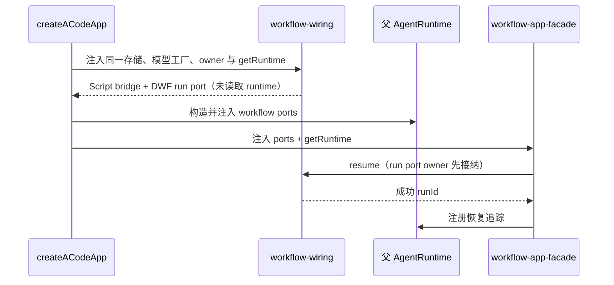

# bootstrap 包边界与 workflow 应用层独立计划

状态：边界规则已冻结并有守护测试（2026-10-05，深度审查 P2「bootstrap 杂物间化」第一批）；物理拆包为登记的后续里程碑。
守护测试：`tests/bootstrap-boundary.test.mjs`（跨包深导入即红）。

## 现状（2026-10-05 实证）

`@acode/bootstrap`（约 66k 行）内混合三类职责：

| 层                     | 位置                                                                                                                                           | 规模                  | 说明                                                               |
| ---------------------- | ---------------------------------------------------------------------------------------------------------------------------------------------- | --------------------- | ------------------------------------------------------------------ |
| 协议服务器（legacy）   | `src/acode-protocol/`                                                                                                                          | 48 文件 / 约 14.7k 行 | 删除边界见 `docs/legacy-protocol-convergence-plan.md` M3           |
| 协议服务器（v4）+ 投影 | `src/acode-protocol-v4/`                                                                                                                       | 51 文件 / 约 21.7k 行 | 目标形态                                                           |
| **workflow 应用层**    | `src/app/`（dynamic-workflow-run-_ ×20+、workflow-driver ×16、script-workflow-_、workspace-hook-review-\*、session-facade、plugin-runtime 等） | 约 24.9k 行           | 完整的 application service 层，「bootstrap（装配）」名不副实的主因 |
| 装配与杂物             | `src/index.ts`、`src/create-app` 接线、auth-login、custom-commands、sessions、skills 等                                                        | 约 5k 行              | 真正的 bootstrap 职责                                              |

**跨包边界当下是干净的（本批验证）**：其他 CLI 包对 bootstrap 的引用全部经包名公共导出（`"."`、`"./v4-replay"`，见 package.json exports）；`packages/{cli,adapters,core,dynamic-workflow}` 里出现的 `bootstrap/src/...` 字样全部是注释里的实现位置引用，不是 import。

## 边界规则（本批冻结，守护测试强制）

1. bootstrap 之外任何包不得深导入 `@acode/bootstrap/<内部路径>`（`./v4-replay` 是唯一豁免子路径，与 package.json exports 一致）。
2. 不得以相对路径（`../bootstrap/src/...`）直达 bootstrap 源码。
3. 注释中引用 bootstrap 实现位置时写 `bootstrap/src/<file>`（反引号内），不得写成可解析的 import 说明符形态。
4. `src/app/` 内 workflow 引擎核心（`dynamic-workflow-run-*`、`workflow-driver`）的新增消费方必须经 `src/app/` 内的既有 facade/入口，不得新增从协议层直接 reach-in 的路径。

## 里程碑：workflow 应用层独立成包（后续批次）

### W0：先分离装配与应用 facade（2026-10-09）

- `workflow-wiring.ts` 唯一构造父会话 workflow progress sink、Script bridge 与 DWF
  run port；通过惰性 `getRuntime` 注入，构造期不得访问尚未建好的 runtime。
  三者复用同一 modelFactory、sessionStore、artifactStore 与父会话身份，不另建 run 表。
- `workflow-app-facade.ts` 拥有 workflow 的枚举、冷回放、恢复与用户启动/修订规则，
  仅返回 ACodeApp 中声明的 workflow 能力。协议层通过 ACodeApp 调用，不能 reach-in。
- DWF journal 缺席只移除 DWF run 能力；瞬态 snippet 与 Script 枚举/回放仍各自可用。
  两源枚举按 updatedAt 归并后限量；回放保持每 run 的独立序号。
- resume 成功先由 run port 替换 owner，再经父 runtime 注册追踪；失败不追踪。
  start/amend 先准备统一用户执行边界。关闭只经既有 app close handler，不新增路径。
- 验收以真实 factory/facade 配合内存 journal/桩端口测试懒装配、能力缺席、两源排序、
  resume 追踪顺序、start/amend 边界，并运行原有 App/Workflow 回归。

W0 分离职责与生命周期，不等于 W1 的完整物理拆包；后续 W1 不得重新复制这些规则。

### W1-R1：run 读模型最小完整 bounded context（2026-10-09）

W1 先迁移一个能独立理解、测试和发布的读面 bounded context，详见
`specs/workflow-run-read-model-boundary.md`。`@acode/workflow-run-read` 收拢
`dynamic-workflow-run-journal` 的 capability 窄化，以及 label、lineage、elapsed 三个
不拥有生命周期的派生面。bootstrap 的 observation/service 只经包名公开入口读取；新包不
反向依赖 bootstrap，也不创建第二份 journal 或 run registry。launch/submit/lifecycle/
replay/roster 等有状态应用服务留在 bootstrap，作为后续 W1-R2/R3，不把本批冒充完整 W1。

验收：新包和 bootstrap 各自独立 typecheck/lint/build；读模型行为测试覆盖能力缺席、环路/64
跳、UTF-16 边界；删除原四个 bootstrap 实现文件后所有生产引用仍通过公开包入口，守护测试拒绝
深导入；架构检查保持 baseline 不变且无 new/regrown。

- **W1**：把 `src/app/` 的 workflow 引擎族（dynamic-workflow-run-_、workflow-driver、script-workflow-_）迁出为 `@acode/cli-workflow`（或并入既有 `@acode/dynamic-workflow`/`@acode/dynamic-workflow-runtime` 的分工面），bootstrap 保留装配接线。验收：新包 typecheck/lint/test 独立绿；bootstrap 行数下降约 20k；守护测试扩展为「workflow 引擎只能被 bootstrap 装配层与 cli 入口经包名引用」。
- **W1-R2（2026-10-09）**：先抽取 `@acode/workflow-run-command` 的最小应用上下文，冻结
  launch/submit/resume 的边界顺序，见 `specs/workflow-run-command-boundary.md`。它只编排
  `port → runtime tracking` 和 `prepare boundary → runtime command`，不复制 run/journal/owner
  状态；bootstrap facade 继续负责能力门控。验收：新包独立 typecheck/lint/build，行为测试覆盖
  成功/拒绝/边界失败和参数传递，bootstrap 回归保持绿；完整 engine 迁移留待 W1-R3。
- **W1-R3（2026-10-09，已落地）**：workflow 引擎族（59 文件 / 约 14.9k 行）物理迁入
  `@acode/cli-workflow`（`apps/acode-cli/packages/cli-workflow`，扁平 `src/`，公开面唯一
  `contract.ts`），登记为受管模块 `acode-cli-workflow`。bootstrap `src/app/` 只保留五个装配
  接缝（workflow-wiring / workflow-app-facade / workflow-facade / workflow-methods /
  script-workflow-methods），一律经包名入口消费引擎；宿主类型按五条规则解耦
  （PrepareUserExecutionBoundary / ScriptWorkflowHostOptions / DYNAMIC_WORKFLOW_SKILL_NAME /
  parseProviderQualifiedModelSelection 下沉 shared / collectDisabledPaths 整体移入新包），
  两处类型迁移解环（dynamic-workflow-run-deps.ts、ActorSessionQuiescence）。守护测试扩展为
  「引擎族文件不在 bootstrap + 跨包不得深导入 cli-workflow」。目标形态、所有权与验收见
  `specs/cli-workflow-package-boundary.md`。
- **W2**：legacy 协议 server 随 `docs/legacy-protocol-convergence-plan.md` M3 删除后，bootstrap 收敛为「v4 协议服务器 + 装配」，届时评估改名（bootstrap 名实相符）或并入 cli。
- 顺序约束：W1 依赖 M3 之前也可先行（app 层与 legacy 协议 server 的耦合点仅在 v4-bridge 过渡钩子，迁移时以 facade 隔离）；W2 依赖 M3。

## 为什么本批不做物理拆包

约 24.9k 行、数百个相对 import 的迁移在缺少 CLI 全量 E2E 的当前门禁下无法充分验证（typecheck + 980 单测不能覆盖装配顺序/循环初始化风险）；先用守护测试冻结边界防止进一步耦合，物理迁移作为独立批次带完整验证执行。
