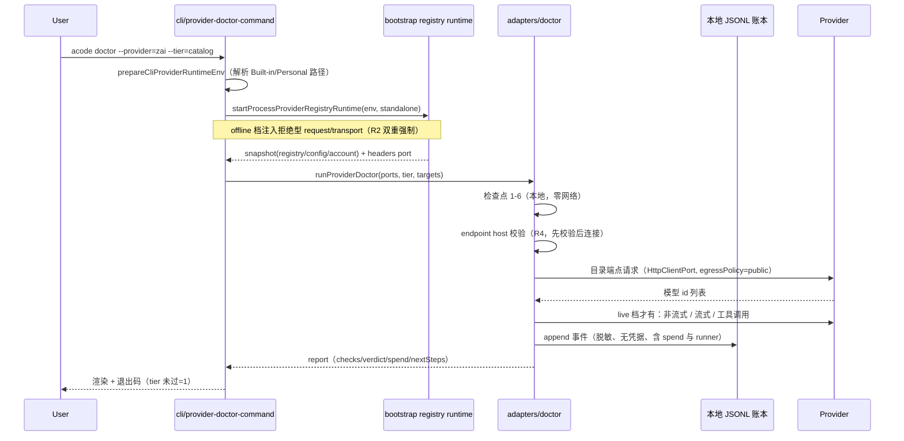

# Provider Doctor 分档诊断 + 覆盖账本（J3-1）

`acode doctor --provider` 回答一个问题：**「我的 provider / 模型选择为什么不可用？」**
它把 ACode 已有的 provider 装配事实（Built-in + Personal 配置、凭据库、Registry 快照、
AI SDK 模型客户端）串成一条固定顺序的检查流水线，按三档 tier 决定「跑多远」，把每次
运行落进**本地**覆盖账本，并对每个未通过项给出可直接粘贴的下一步命令。

机制参照 jcode (MIT) `crates/jcode-provider-doctor`（`provider_e2e.rs:44-244` 的
tier/check/report/spend 模型）与 `crates/jcode-base/src/live_tests.rs:11-32,405-520,661-681`
（检查点常量、账本事件 schema、JSONL 追加），以及 `docs/PROVIDER_DOCTOR.md`；本仓为自撰
TypeScript 实现，不拷贝任何 jcode 文件。

## 背景

### 已核实的现状（基线 8b95943）

- `cli/src/run.ts:191-234` 的 `runDoctor` 只输出 cli/runtime/packaging 三段静态信息，
  与 provider 无关；`--json` 亦同。
- provider 事实的所有者是 Registry：`packages/provider/src/registry.ts:37-40`
  （`ProviderRegistryView { revision, providers }`）、`resolver.ts:169-178`
  （`Provider { providerId, providerName, templateId, config, models[] }`）；模型档位校验
  `registry.ts:129-159`。
- BYO API Key 的凭据面：`packages/provider/src/provider-api-key-vault.ts:17-37`
  （`load` 返回 `null`=引用悬空、抛错=凭据库不可用），CLI 实现
  `adapters/src/auth/provider-api-key-vault.ts:12-29`，落盘位置
  `adapters/src/auth/shared-credentials.ts:292-301`
  （`ACODE_DATA_BASE_DIR`/homedir → `.acode/v2/credentials.json`，值加密）。
- 真实模型调用只能经既有客户端：`adapters/src/model/runner.ts:138-287`
  （`AiSdkModelAdapter.createModel`），请求档位由 `adapters/src/model/model.ts:106-130`
  强校验（`maxOutputTokens`/`reasoningLevel` 必填且须在 spec 内）。账号型 provider 的
  请求级鉴权有两条既有路径：off-peak 走 `requestDependencies.requestAuth.source`
  （`runner.ts:163-180`），其余账号模型走 invocation context 的
  `refreshRuntimeHeadersBeforeAttempt`（`runner.ts:181-189` +
  `contracts/src/model/invocation-context.ts:78-102`）。
- 出网能力已有受控入口：`adapters/src/http/index.ts:53-140`（`egressPolicy:"public"` →
  建连前 DNS 预检 + 过检解析建连；代理缺省拒绝），`:214-227` 只允许 http/https；
  策略实现 `adapters/src/http/public-egress-policy.ts:26-32,79-119,125-139`。
  明文 http 端点告警判定 `packages/provider/src/config/provider-endpoint-security.ts:19-28`。
- CLI 侧 provider runtime 装配：`cli/src/provider-runtime-env.ts:53-130`
  （解析 Built-in/Personal 配置路径；`requiresProviderRuntime` 目前不含 `doctor`）、
  `bootstrap/src/app/process-provider-registry-runtime.ts:46-206`
  （`standalone` 模式自带账号解析与 CDN 刷新；`:92` 的 `standalone.request` 是 fetch 注入点；
  `:181-188` 返回 `providerRuntimeHeadersPort`）。
- **offline 档零网络不是免费的**：`packages/provider-node/src/provider-config-runtime.ts:117-140`
  的 `start()` 会触发 `#checkBackground()` → `refreshACodeBuiltin()`（TTL 命中时下载 CDN
  release）。因此「零网络」必须由诊断自己**强制**，不能指望上游不联网。
- 硬约束：`specs/no-telemetry.md`——CLI 不产生遥测网络请求；本 spec 的账本同理，只落本地。

### 与 jcode 的差异（有意为之）

| 维度 | jcode | ACode 本项 |
| --- | --- | --- |
| provider 面 | 十余个 openai-compatible profile | 三种 api type（`anthropic-messages` / `openai-chat-completions` / `openai-responses`）+ 智谱系账号 |
| 模型目录 | live `GET /models` 是唯一目录来源 | 目录来自 Built-in(CDN 缓存)+Personal+账号 overlay 的 Registry 快照；live 目录端点是**补充证据**，不是目录所有者 |
| 凭据证据 | `fingerprint_secret` 摘要入账本 | **不落任何密钥派生值**（含摘要）：只记来源类型 + 可解密布尔（见 R5） |
| 最高档名 | `full` | `live`（与命令面 `--tier=offline\|catalog\|live` 一致） |
| 缺省档 | `catalog` | `offline`：未显式给 `--tier` 绝不触网、绝不花费 |

## 产品规则

### R1 命令面与缺省档

```
acode doctor --provider[=<providerId>] [--model=<modelId>] [--tier=offline|catalog|live] [--coverage] [--json] [--no-color] [--verbose]
```

- `--provider` 裸标志 = 诊断 Registry 快照里的**全部** provider；`--provider=<id>` = 只诊断
  该 provider（未知 id → 报错并列出可用 id）。
- `--tier` 缺省 `offline`。**缺省档零网络、零花费**是本命令的核心承诺：不显式要求就不触网。
- `--model=<id>` 指定目标模型；缺省顺序为「已配置的默认模型选择（若属于该 provider）→
  Registry 顺序里的第一个模型」。
- `--coverage` 只渲染既有账本（不运行任何检查、不触网、不花费）。
- 退出码：所选 tier 通过 → 0；未通过或运行出错 → 1（可作 CI 门禁）。
- `--json` 输出结构化报告（含账本路径、spend、逐检查点状态、下一步命令）。

### R2 三档 tier 的边界（只增不减，逐档累加）

| tier | 需要凭据 | 触网 | 花费 | 追加验证 |
| --- | --- | --- | --- | --- |
| `offline` | 否 | **否** | 否 | ACode 自身接线：配置源可加载、schema 准入、端点形态、凭据可解密、目录已声明模型、模型路由可解析 |
| `catalog` | 是 | 是（约零花费） | 否 | 端点公网出口校验 + 实时模型目录端点 + 目标模型在实时目录内 |
| `live` | 是 | 是 | **是** | 一次非流式补全 + 一次流式补全 + 一次工具调用解析 |

- 未达档位要求的检查点记 `skipped`（带明确原因，如「catalog 档不花费余额」），
  **绝不计入通过**——轻档不能给重档背书（jcode 的 no-over-credit 语义）。
- 只有 `live` 档全 12 点通过才判 `ready`（READY）；`offline`/`catalog` 全过判 `tier-passed`。
- offline 档的零网络由**双重强制**：① 诊断注入 blocked transport（任何 HTTP 调用即失败并
  计数）；② CLI 接线给 registry runtime 注入拒绝型 `standalone.request`，使 CDN 刷新
  在 offline 档不可能发出请求。编排层的 tier guard（对抗复核 F7 后）同时包裹**全部三类
  网络出口**——http transport、models port（live 探针的 AI SDK transport 自带解析与建连）
  与 dnsLookup（#7 出口校验入口）：offline 档触到任一出口都计数（`blockedNetworkCalls`）
  并抛错，不放行、不静默；非 offline 档原样透传。

### R3 12 个检查点（固定顺序，账本与输出共用同一 id）

| # | checkpoint id | 最低档 | 判定 |
| --- | --- | --- | --- |
| 1 | `config_sources_loaded` | offline | Built-in / Personal 配置文件路径已解析且可读；记录 revision 与来源文件名（不记内容） |
| 2 | `provider_schema_valid` | offline | 该 provider 的生效配置通过完整 schema 准入（无阻断级 issue）；只输出 issue code + path |
| 3 | `endpoint_shape_valid` | offline | `api.type` 属三种已知类型；`baseUrl` 可解析且协议为 http/https；明文 http 记 warning（不失败） |
| 4 | `credential_available` | offline | 凭据存在且可解密（见 R5）；`zhipu-account` 且 `entitled=false` → `failed`（未登录/无权益）。账号型 provider 的可解密判定经 `accountAuth` 端口，且**必须随请求下发请求身份** `accountAccess`（= registry 的 `providerConfig.access`，与真实模型路径 runner.ts:151/216/242/254 同源）：接线的 standalone headers port 在缺该事实时直接抛「请求身份无效」（bootstrap/src/app/standalone-account-provider-runtime.ts:180-183），于是「已登录且凭据可解密」会被误报成 `blocked`（解密失败）并连带 skip 掉 #8-#12 |
| 5 | `catalog_models_declared` | offline | Registry 快照为该 provider 发布了 ≥1 个模型 |
| 6 | `model_route_resolved` | offline | 目标模型存在且 `reasoningLevel` 档位合法（复用 Registry 的选择校验语义） |
| 7 | `endpoint_public_egress` | catalog | `baseUrl` 主机通过公网出口校验：拒绝 localhost/环回/私网/保留地址与单标签主机名 |
| 8 | `catalog_live_endpoint` | catalog | 带凭据请求实时目录端点（openai-* → `{base}/models`；anthropic → `{base}/v1/models`）返回 2xx 且解析出 ≥1 个模型 id |
| 9 | `catalog_model_listed` | catalog | 目标模型出现在实时目录中；端点不支持目录（404/405）→ `skipped` 并说明 |
| 10 | `non_streaming_chat_completion` | live | 一次 `generateText` 返回非空文本或工具调用，且带回 `finishReason` |
| 11 | `streaming_chat_completion` | live | 一次 `streamText` 至少产出一个文本/工具事件并以 `finish` 收尾 |
| 12 | `tool_call_parse` | live | 带一个探针工具的 `generateText` 得到可解析的工具调用（工具名匹配、`input` 为对象） |

- 检查点 10-12 的请求刻意最小化：单轮 user 消息、`maxOutputTokens` 取 64（且不超过模型
  spec 上限）、`reasoningLevel` 取 spec 的第一个合法档位；探针工具无副作用、不执行。
- 模型不支持工具调用（`properties.supportsToolCall=false`）时，12 记 `skipped` 而非失败。
- 任一检查点抛错都收敛为 `failed` + 归一化后的原因（复用 `adapters/src/model` 的失败分类
  产物文案，不新造错误体系）。

### R4 端点与出网安全（硬约束）

- 任何由本模块直接构造的 HTTP 请求：**只允许 http/https**；发请求前校验 host，拒绝
  localhost、`*.localhost`、`*.local`、单标签主机名、环回/私网/链路本地/保留地址
  （复用 `contracts` 的 `getPublicEgressIpBlockReason` 与 `adapters/src/http/public-egress-policy.ts`，
  不自写 IP 表）。保留地址清单包含 IPv6 过渡/保留段：`64:ff9b::/96`（NAT64 WKP，RFC 6052）、
  `2002::/16`（6to4）、`2001::/32`（Teredo）——这些段会把内网/保留 IPv4 地址编码进
  IPv6 字面量（如 `64:ff9b::a9fe:a9fe` 内嵌 169.254.169.254 云元数据地址），对抗复核 F1
  曾实测其被判公网并带凭据建连。该表是本模块 endpoint-policy 与 core WebFetch egress
  guard 的共享事实源，补段两侧同时收紧（specs/webfetch-public-egress.md R1 同步）。
- 传输层复用既有 `HttpClientPort`（`createNodeHttpClientAdapter`，`egressPolicy:"public"`），
  **不写裸 fetch**；因此代理缺省拒绝、DNS 预检与过检建连的既有语义原样继承。
- 模型调用一律经 `AiSdkModelAdapter.createModel`，不绕过既有 provider 客户端。
- 端点被判定为内网/环回 → `endpoint_public_egress` 失败，且**不发出任何请求**（先校验后连接）。
  这条硬约束覆盖本模块触发的**全部**出网：#8/#9 的目录请求，以及 #10-#12 的 live 模型探针。
  因此 live 探针的前置 = `credential_available` + `model_route_resolved` +
  `endpoint_shape_valid`(#3) + `endpoint_public_egress`(#7)：端点已被本模块判为环回/内网或
  协议/URL 不合法时，绝不带着真实凭据去建连，也不产生 `spend.billableCalls`
  （评审 J3 修复：此前 #10-#12 的前置只有前两项，内网端点上仍会打 3 次真实调用并计花费）。
  明文 http 端点只在 #3 记 warning、仍是 `passed`，因此不受这条前置影响（知情不禁止）。
- **已知限制（诚实边界）**：出口校验与 WebFetch 共用同一套公网判定
  （`getPublicEgressIpBlockReason`）。在代理 / TUN 的 fake-IP 模式下，本地 DNS 会把公网
  provider 域名解析成 `198.18.0.0/15` 之类保留段地址，#7 会如实失败，于是 catalog/live 档
  在该环境不可用（#8-#12 全 skipped、全程零请求、零花费）；而 TUI 的正常模型请求走 AI SDK
  的代理 transport、不经诊断的这道校验，因此会出现「TUI 能正常聊天、doctor 说端点被拒」的
  组合。这是刻意取舍：诊断不为自己开一个比 WebFetch 更宽的出口口径，也不为了「让 live 档
  在 fake-IP 下出结果」而把真实凭据送到一个自己已经判为内网的地址。缓解写进产品面——#7 的
  下一步建议明确列出 fake-IP 情形与 `--tier=offline` 退路。实测证据：2026-09-30 本机
  （fake-IP 代理）`open.bigmodel.cn → 198.18.0.46`，#7 失败、#8/#9 skipped、全程零请求。
- **已知限制（live 探针传输层残余窗口，对抗复核 F2 如实登记）**：
  ① #7 的出口校验是**时点门控**（请求发起前一次性判定），不是 per-connection 校验——
  判定通过后的建连不受持续监视；#8 目录路径因适配器的 `createPublicEgressLookup`
  连接期复验（连接复用已过检解析结果）已闭合该窗口，但 **#10-#12 的模型调用走 AI SDK
  transport，没有等价物**，存在 DNS rebinding TOCTOU 窗口（#7 通过后、模型 transport
  真正解析时 DNS 可变）；② 模型 transport 基于 undici，缺省跟随重定向，跨源重定向只剥
  `Authorization`——`x-api-key` 与账号自定义头不剥，理论上 provider 302 到第三方时可能
  带走这些头。**修复选项（登记为后续加固项，本轮不改代码）**：为 live 探针注入带连接期
  复验的自定义 fetch + `redirect: "manual"`，使模型 transport 与目录路径享有同等的
  per-connection 出口保证；代价是与 AI SDK transport 的兼容面需要单独验证。

### R5 凭据与账本的隐私边界（no-telemetry 硬约束）

- 账本与输出**绝不**包含：API Key / access token / refresh token / JWT 的明文、前缀、后缀、
  长度或任何派生摘要（有意偏离 jcode 的 `fingerprint_secret`：摘要也是密钥派生值）。
- 凭据检查只落三类事实：来源类型（`credential-ref` / `inline-config` / `account-credential` /
  `none`）、可解密布尔、凭据库文件路径（路径不是秘密）。解密只验成功与否，解密结果立刻丢弃。
- 账本落**用户数据目录**：`<ACODE_DATA_BASE_DIR|homedir>/.acode/cli/provider-doctor/coverage.jsonl`
  （与 CLI 既有本地数据同域：`adapters/src/logging/index.ts:223`、
  `adapters/src/storage/session-store/paths.ts:7`），可用 `ACODE_PROVIDER_DOCTOR_LEDGER`
  覆盖。JSONL 追加写，损坏行跳过并计数，不整文件失败。
- **绝不上传**：账本模块不得出现任何网络出口；诊断不产生遥测请求（`specs/no-telemetry.md`）。
- 详情文本（stdout 与账本里的失败原因）统一过脱敏：先剔除本次运行内存中出现过的任何凭据
  真值，再剔除常见密钥字面量形态（`sk-…`、`Bearer …`、`apiKey=…` 等），最后截断。
  截断上限分两档（对抗复核 F6 登记，刻意不统一）：stdout/detail 上限 **200** 字符；
  账本 detail 上限 **160** 字符——账本是证据索引不是日志转储，更紧凑的上限让单条 JSONL
  事件在覆盖视图里可读，两档同走「先单行化再截断（尾字符为 `…`）」。
  真值剔除有门槛 `MIN_SECRET_LENGTH_FOR_SCRUB = 6`：短于 6 的真值不参与逐字剔除（短串
  如 `zai` 会把正常文案打成筛子，误伤可读性；且这类短串本就极少具备凭据熵）。
  形态清单与 core 反射门审计脱敏（`packages/core/src/permission/bash-confirm-reflex-gate.ts`
  的 `AUDIT_REDACTION_PATTERNS`）是同一份清单的两处落地，**必须同步**（对抗复核 F2，
  详见 bash-confirm-reflexive-gate.md R6）：任一侧新增/修正形态必须同步另一侧；两处注释
  互相指向。对抗复核 F3 对齐完成（2026-09-30）：JSON 引号键补 `x-api-key` /
  `anthropic-auth-token`、JWT 第三段改 optional（两三段皆认）、Bearer 裸值类改 core 同款
  `[^\s"\[]+`（`<8` 字符与含 `!@#` 特殊字符 token 不再放行）。剩余有意差异（非漂移）：
  替换标记本模块为 `[redacted]`、core 为 `[REDACTED:<类别>]`（账本输出最小化，不引入
  类别枚举）；Bearer 形态本模块多一个 `\[redacted\]` 分支（本模块先做已知真值逐字替换，
  替换后的残片仍需吃掉，core 无这层预处理）。
- 端点只记 host（不含 query、不含 header、不含凭据）。

### R6 花费跟踪与覆盖账本

- 每次运行统计：`billableCalls`（真实模型调用次数）、`catalogCalls`（目录端点请求次数）、
  `promptTokens`/`outputTokens`/`totalTokens`、`hasTokenData`。token 只取 provider 返回的
  usage，不估算、不编造。
- 账本事件字段：`schemaVersion`、`eventId`、`recordedAt`、`tier`、`providerId`、
  `providerLabel`、`modelId`、`endpointHost`、`result`（`ready`/`tier-passed`/`failed`）、
  `checks[{id,status,detail?}]`（detail 仅非通过项、已脱敏）、`firstFailure{id,hint}`、
  `spend{...}`、`runner{actor,cliVersion,platform,arch,node,sea,pid}`、`retestAfter`
  （默认 14 天，用于新鲜度判定）。
- `runner.actor`：release 构建记 `user`，dev/dirty 构建记 `developer`（由 CLI 接线按
  `getRuntimeInfo()`/版本事实提供，adapters 不反向依赖 core）。
- 覆盖视图（`--coverage` 与运行尾部 footer）按 provider×model 渲染最新一次证据：
  `READY` 或 `N/12`、首个阻塞点 + 推进命令、新鲜度（多久前 / 绝对日期 / 谁 / 构建档），
  以及累计 recorded spend（各 pair 最新一次之和）。

### R7 下一步命令建议（诊断即产品）

- 每个失败/阻塞检查点必须给出**可粘贴执行**的下一步命令或明确动作，而不是只报错。
  例：`credential_available` 失败 → `acode login`（智谱系账号）或在桌面设置里填 API Key；
  `catalog_model_listed` 失败 → `acode doctor --provider=<id> --model=<目录内模型> --tier=catalog`；
  `tool_call_parse` 失败 → 换 `supportsToolCall` 的模型后重跑 `--tier=live`。
- **「可粘贴执行」承诺限定为白名单 id**（对抗复核 F4）：拼入命令的 provider / model id
  只允许字符集 `[A-Za-z0-9._-]+`——id 来自用户配置与实时目录响应，都是不可信输入，裸拼
  即 shell 注入面（对抗复核实证：目录 id ``evil`touch pwned` `` 裸拼进建议命令，粘贴即
  命令替换；`my provider; rm -rf /tmp/x` 分号分段）。合规 id 逐字拼入；不合规 id 一律
  退化成占位符（`--model=<模型 id（手动输入）>` / `--provider=<provider id（手动输入）>`）。
  占位符与 POSIX 引号转义二选一，**定案采用占位符**：更简单、更可审计，不引入转义分支。
  双重把关：目录解析层（`catalog-probe.parseCatalogModelIds`）过滤含控制字符/反引号/
  空白的 id 并把过滤计数写进 #8 的 detail；替代模型建议（`suggestAlternativeModelId`）
  只在白名单 id 中挑选；命令构造（`providerDoctorCommand`）做最终白名单兜底。
- tier 通过但非 `live` 时，输出必须提示升档命令与其花费含义
  （`acode doctor --provider=<id> --tier=live`，会花费余额）。
- 建议文案由检查点目录集中持有（单一所有者），不在渲染层散落 if/else。

## 状态所有者

```
adapters/src/doctor/types.ts             tier/checkpoint/report/spend/账本事件类型 + 全部 Port 定义（唯一契约面）
adapters/src/doctor/checkpoints.ts       12 检查点目录：id/label/最低档/是否花费/下一步建议（R3+R7 单一所有者）
adapters/src/doctor/check-recorder.ts    检查点顺序 + 初始 skipped + 详情脱敏入口（唯一的 detail 写入点）
adapters/src/doctor/redaction.ts         详情与账本脱敏 + 凭据字段名自检（R5）
adapters/src/doctor/spend.ts             花费累计与汇总（R6）
adapters/src/doctor/endpoint-policy.ts   端点协议 + host 校验 + 目录端点/鉴权头构造（R4，复用既有 egress 策略）
adapters/src/doctor/credential-probe.ts  凭据可解密探测（R5，只回布尔/来源）+ 运行期 Key 读取点
adapters/src/doctor/catalog-probe.ts     实时目录端点探测（R3 #8-9，走 HttpClientPort）
adapters/src/doctor/live-probe.ts        非流式/流式/工具调用探针（R3 #10-12，走既有 Model）
adapters/src/doctor/offline-checks.ts    R3 #1-#6 的判定与文案装配（零网络）
adapters/src/doctor/live-checks.ts       R3 #10-#12 的档位门控与花费计数
adapters/src/doctor/diagnose-provider.ts 单 provider 流水线：#1-#9 编排 + verdict/报告装配
adapters/src/doctor/report-assembly.ts   verdict/下一步/账本事件装配（R2+R6+R7）
adapters/src/doctor/ledger.ts            本地 JSONL 覆盖账本：路径解析/追加/读取/覆盖汇总（R5+R6）
adapters/src/doctor/run-provider-doctor.ts  顶层编排：取快照、选目标、按档强制网络边界、汇总
adapters/src/doctor/format-report.ts     text/json 渲染（含下一步建议与 coverage footer）
adapters/src/doctor/defaults.ts          Port 默认实现装配（AiSdk 模型客户端 / NodeHttpClient / blocked transport / Registry 投影）
adapters/src/doctor/internal.ts          计时与错误摘要（无判定语义）
cli/src/provider-doctor-command.ts       CLI 薄接线：argv 解析、provider runtime env、registry runtime、Port 装配、退出码
cli/src/run.ts                           `doctor --provider` 早分支（parseGlobalArgs 之前，与 hooks 同构）
cli/src/provider-runtime-env.ts          `doctor --provider*` 纳入 requiresProviderRuntime
adapters/package.json                    新增 `./doctor` subpath export（不进根 barrel）
```

事实所有者不变：provider 配置与模型目录仍归 Registry（`@acode/provider`），凭据仍归
`credentials.json` + vault，模型调用仍归 `AiSdkModelAdapter`。诊断只**读取与验证**，
不新增第二条 provider 配置写入路径，也不缓存 provider 事实。

## 事件顺序



## 接口

`@acode/adapters/doctor`（新增 subpath export；不进 adapters 根 barrel，避免把诊断依赖
塞进所有适配器消费者）：

```ts
export type ProviderDoctorTier = "offline" | "catalog" | "live";
export type ProviderDoctorCheckStatus = "passed" | "failed" | "skipped" | "blocked";

export interface ProviderDoctorRegistryPort {
  loadLocalSnapshot(): Promise<ProviderDoctorRegistrySnapshot>;   // 零网络
  refreshSnapshot?(): Promise<ProviderDoctorRegistrySnapshot>;    // catalog/live 档可用
}
export interface ProviderDoctorCredentialPort {
  // accountAccess = 账号型 provider 的请求身份（取自 registry 的 providerConfig.access，
  // 与真实模型路径 runner.ts:151 同源）；探测端口把它交给 accountAuth，见下。
  probe(input: {
    providerId: string;
    access: ProviderDoctorAccessFacts;
    modelId?: string;
    accountAccess?: ACodeProviderAccountAccess;
  }): Promise<ProviderDoctorCredentialProbe>;
}
export interface ProviderDoctorAccountAuthPort {
  resolve(input: {
    providerId: string;
    modelId?: string;
    accountAccess?: ACodeProviderAccountAccess;   // 必填事实：缺它接线端口会直接抛
    abortSignal?: AbortSignal;
  }): Promise<{ apiKey?: string; headers?: Record<string, string> } | undefined>;
}
export interface ProviderDoctorHttpPort {
  request(input: { url: string; headers?: Record<string, string>; timeoutMs?: number }):
    Promise<{ status: number; bodyText: string }>;
}
export interface ProviderDoctorModelPort {
  createModel(input: { providerId: string; modelId: string }): Model;   // 内部持 registry 事实
}
export interface ProviderDoctorLedgerPort {
  record(event: ProviderDoctorLedgerEvent): Promise<void>;
  read(): Promise<readonly ProviderDoctorLedgerEvent[]>;
}

export function runProviderDoctor(input: {
  tier: ProviderDoctorTier;
  registry: ProviderDoctorRegistryPort;
  credentials: ProviderDoctorCredentialPort;
  http: ProviderDoctorHttpPort;
  models: ProviderDoctorModelPort;
  ledger?: ProviderDoctorLedgerPort;
  providerId?: string;          // 缺省 = 全部 provider
  modelId?: string;
  defaultModelSelection?: ModelSelection;
  runner?: ProviderDoctorRunnerInfo;
  dnsLookup?: DnsLookup;
  now?: () => Date;
  logger?: Logger;
  signal?: AbortSignal;
}): Promise<ProviderDoctorRunResult>;   // { reports, coverage, ledgerPath, blockedNetworkCalls }
```

- Port 全部可注入：默认实现由 `defaults.ts` 装配（真实客户端/HTTP/凭据库/账本），
  测试与 offline 档用 blocked transport 与 fake registry。
- `ProviderDoctorRegistrySnapshot` 内含 Registry 原始 `providerConfig`/`modelConfig`
  （live 档构造 Model 必需）；这些对象**只在内存流转**，报告与账本仅取白名单字段。

## 验收场景

见 `apps/acode-cli/tests/provider-doctor.test.mjs`：

1. **offline 档零网络**：blocked HTTP transport + fake registry，跑完 12 检查点后
   `blockedNetworkCalls === 0` 且 transport 未被调用；检查点 7-12 全为 `skipped`，
   verdict 为 `tier-passed` 而非 `ready`。
2. **三档输出结构**：同一 fake registry 下 offline/catalog/live 三档的检查点数量恒为 12、
   顺序恒定；catalog 档 7-9 参与判定、10-12 skipped；live 档全参与且可判 `ready`。
3. **凭据与账本隐私**：fake vault 返回明文 key，运行后账本 JSONL 文本不含该明文、不含
   `apiKey`/`token`/`authorization` 字样、不含密钥派生摘要字段；`credential_available`
   通过且 detail 只含来源与布尔。
4. **host 校验**：`baseUrl` 为 `http://127.0.0.1:8080/v1`、`https://10.0.0.5`、
   `https://localhost`、`https://169.254.169.254`、`ftp://example.com` 时，
   `endpoint_shape_valid`/`endpoint_public_egress` 失败且 HTTP port 未被调用；
   域名解析到私网 IP（注入 fake DNS）同样拒绝。
5. **未通过项给下一步**：`credential_available` 失败与 `catalog_model_listed` 失败的报告里，
   `nextSteps` 含可执行命令（`acode login` / `acode doctor --provider=… --model=…`）。
6. **覆盖账本与新鲜度**：追加两条事件后 `--coverage` 汇总给出 `READY`/`N/12`、首个阻塞点、
   推进命令与累计 spend；损坏行被跳过且不抛错。
7. **接线钉住**（源断言，仓库既有惯例）：`cli/src/run.ts` 含 `doctor --provider` 早分支；
   `cli/src/provider-runtime-env.ts` 把该形态纳入 provider runtime；doctor 模块内不出现
   `globalThis.fetch`/裸 `fetch(` 与遥测导出。
8. **账号型 provider 的请求身份**（评审 J3 修复，对应 R3 #4）：用**真实**的
   `createStandaloneProviderRuntimeHeadersPort`（凭据库桩件返回可用身份与 key）按 CLI 同款
   方式包成 `accountAuth` → offline 档 `credential_available=passed`、detail 含「可解密」、
   `tierPassed=true`、`nextSteps` 不再出现 `acode login`；spy 端口断言 #4 探测与 #8 目录
   鉴权两次 `resolve` 都带 `accountAccess`（= `providerConfig.access`），且解析出的真值只
   出现在请求头（`x-api-key`）里、报告与账本中零出现（R5）；反向钉住：接线不透传
   `accountAccess` 时真实端口抛「请求身份无效」→ `blocked` + 建议重新登录（修复前的形态）。
9. **live 档不向内网端点发请求**（评审 J3 修复，对应 R4 硬约束）：`baseUrl` 为
   `http://127.0.0.1:8080/v1`（#3/#7 failed）或域名解析到环回（#7 failed）时，live 档
   #10-#12 全 `skipped`、模型端口调用数 0、HTTP 调用数 0、`spend.billableCalls=0`；
   对照公网端点仍打满三次并计入花费。

## 不在本项范围

- 桌面/Web 设置面的 provider 连通检查（`packages/services/src/model/provider/providerSettingsConnectivity.ts`
  只作思路参照，CLI 不跨仓导入 root 侧 services 包）。
- `acode doctor`（无 `--provider`）的既有输出语义不变。
- 账号 OAuth 登录/刷新流程本身（只诊断其结果，不触发登录）。
- 检查点 10-12 之外的模型能力矩阵（多模态、原生 web search、成本配额）与自动化重试策略调优。
- 账本的清理/轮转策略（先积累，后续按体量再定；文件为 JSONL，用户可直接删除）。
