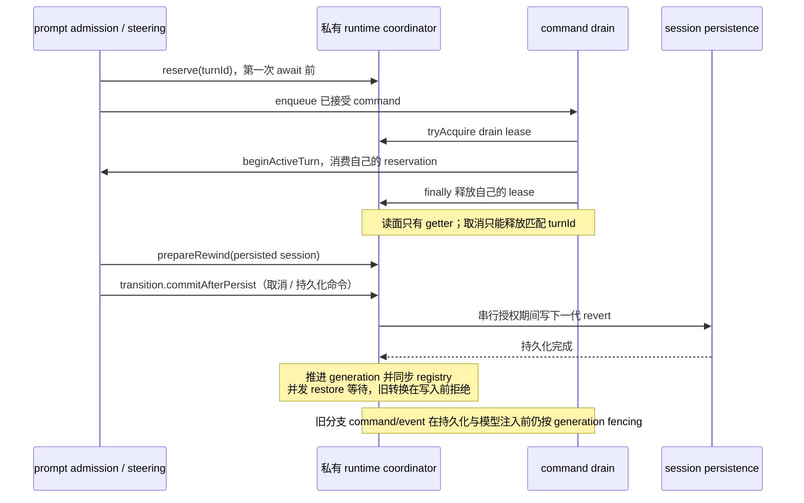
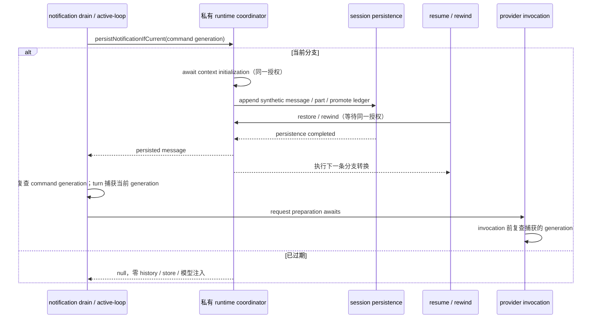

# AgentRuntime 状态所有权分簇与不变量登记

状态：类型级分簇已实施；CLI-05 本批进一步封装 reservation、command drain 与 branch generation 的实际写权限（2026-10-09）。其余状态仍为分簇登记，不宣称整体 runtime 已隔离。
同日增补（2026-10-09 批次）：`RuntimeSessionLifecycleState` 最后四个扁平可变字段（`shuttingDown` / `permissionFullAccessPending` / `lastPermissionGrantId` / `pendingModelChangeTimeline`）收敛到 owner 只读 getter + 有限写端口，该簇不再保留任何扁平可写字段。
代码：`packages/core/src/runtime/internal.ts`（分簇子接口 + 组合）；`packages/core/src/runtime/agent-runtime.ts`（构造与原型安装）；`packages/core/src/runtime/turn-coordination.ts`（关键状态 owner）。

## 背景

当前 methods/ 下 102 个 TS 文件、270 处 `this: AgentRuntimeInternal` 共享 93 个 property，此前字段以扁平列表堆放：任何新模块都能悄悄读写任意字段，并发时序不变量只存在于散落注释。第一批把字段按所有权分为 7 簇（`RuntimeIdentityConfig` / `RuntimeInjectedDeps` / `RuntimeContextMemoryState` / `RuntimeTurnState` / `RuntimeMessageProjectionState` / `RuntimeCacheDiagnosticsState` / `RuntimeSessionLifecycleState`）。这些计数是本批开工前测量，后续按源码复测，不作为固定产品契约。

第一批分簇是纯类型级重组。本批保留未迁移字段的扁平访问；三个关键字段改为 readonly getter，类型和真实运行时均不提供 setter。有限写端口仅供对应 reservation、drain、恢复/rewind 与通知持久化路径使用，不向 `@acode/core` 公共入口导出，不迁移其余 methods 文件。

## CLI-05：关键状态写权限封口

`turn-coordination.ts` 的私有 owner 是三项状态的唯一保存方；它以 WeakMap 绑定 runtime 生命周期，构造时安装只读 getter，没有第二份 accepted queue 或业务状态。`AgentRuntimeInternal` 不含该 owner，也不含任意 `setState`/`setGeneration` 方法。

I4 的首个封口切片同步落地：`runtime-lifecycle.ts` 的 `RuntimeLifecycleOwner` 以
`WeakMap` 持有 `runtimeRestartReminderEmitted`，runtime 只暴露不可替换的只读 getter；
turn-loop 通过 `getRuntimeLifecyclePort(this).consumeRuntimeRestartReminder()` 原子地
「评估即消费」。本批继续把 `sessionTitleGenerationAttempted` 收敛到同一个 owner：
标题 sidecar 在通过配置、会话和首轮输入门槛，且没有 provider headers 延迟时，调用
`consumeSessionTitleGenerationAttempted()`；method 不再读取或写回布尔字段。两个消费端口
都只有一次性消费操作，没有 `set`、`reset` 或布尔值回写路径；重复调用返回 `false`，
因此同一 runtime 实例不会重复启动孤立的标题 sidecar。其余一次性 flag 仍按本节 I4
规则逐项迁移，不能因为本切片已封口而视为整体完成。

Plan 退出提醒也归入同一个 lifecycle owner。它不是由 runtime method 直接写回的普通
布尔字段，而是一个可重新 arm、每次 arm 只能消费一次的 pending token：
`armPlanModeExitReminder()` 只在已提交的 `planEnabled: true → false` 转换完成后调用；
`consumePlanModeExitReminder()` 在非 output-token recovery 的 turn 请求边界原子消费，
重复消费返回 `false`。同一 pending token 消费后，普通 mode/config 更新不会重新 arm；
只有新的 `true → false` 转换才能再次 arm。`false → false`、`false → true`、mode-only
变更及失败/未提交的转换都不能 arm，也不能清除一个已 arm 但尚未消费的 token。该 owner
同时提供只读 `needsPlanModeExitReminder` view，禁止 `AgentRuntimeInternal`、execution-state、
config 或 turn-loop 直接赋值。

`sessionStartHookRan` 也由同一个 owner 保存，并采用显式的 claim → activate/run →
commit 协议。`tryClaimSessionStartHook()` 在成功结果或已有进行中领取时返回 `false`，
因此并发的 resume/startup 不会重复调用 workspace admission 或 Hook runner；只有领取者
可以在 activate 与 Hook runner 都成功后调用 `commitSessionStartHook()`。activate、模型选择
或 Hook runner 抛错时必须调用 `releaseSessionStartHookClaim()`，保持 `sessionStartHookRan`
为 `false` 并允许后续调用重试。领取期间的其他调用直接返回空 Hook 结果，不取得第二个
领取；成功提交后所有后续调用也返回空结果。该旗标同样只读、不可替换，不提供布尔 setter。

后台 Bash 通知封口（I5）也由独立的 `RuntimeNotificationSealOwner` 保存。它只对
`taskType === "subagent_child"` 生效；父 runtime 或普通 runtime 调用 seal 入口时不改变
状态。child 第一次 `sealBackgroundTaskNotifications(reason)` 将 `sealed` 从 `false` 提交
为 `true` 并冻结 `reason`，后续调用是幂等 no-op，不能把 `subagent_terminal` 改回
`subagent_cancelled`（或反之）。`background-notifications` 与 `runtime-tools` 只能通过
只读 view 判断是否封口及读取原因；任何 method 都不能给两个 getter 或 reason 写回。
封口提交是同步的，不等待 registry、store 或子进程，因此不会用超时掩盖状态竞态。

```text
subagent child terminal/cancel path
  → seal port (first commit only)
  → readonly suppression checks
  → Bash/local_bash notification dropped after the seal
```

会话模型选择（I6）由独立的 `RuntimeModelSelectionOwner` 保存。
`sessionModelSelection` 是 resume、配置模型更新、首条持久化和模型准备共同读取的会话
事实；调用方只能通过 `getSessionModelSelection()` 取得防御性副本，或通过
`setSessionModelSelection(selection)` 提交替换/清除。execution-scope 的临时模型只传给
当前 turn，不得写入该 owner。owner 不负责 session store 写入；持久化仍由现有
model-selection service 在 set 成功后执行，因此内存选择与 durable selection 的顺序保持
`set → persist → ModelSelected`。

```text
resume/config/constructor → model-selection owner (clone + commit)
                         → get defensive copy → model preparation / persistence
execution-scope model ────────────────────────┘ (no session mutation)
```

本批（2026-10-09）把 `RuntimeSessionLifecycleState` 的四个剩余扁平字段收敛进 owner：

`shuttingDown` 归入既有 `RuntimeLifecycleOwner`（与其余单调生命周期旗标同一所有者）。
`beginShutdown()` 通过 `commitShutdown()` 提交一次，false → true 幂等，重复调用是
no-op，不存在写回 false 的端口；memory 提取调度、后台通知抑制与 runtime-tools 的读面
只经不可替换的 readonly getter 观察，property 名保持不变，读点无需改动。

完全访问授权（I7）由独立的 `RuntimePermissionGrantOwner` 保存。
`permissionFullAccessPending` 不是一次性旗标，而是 in-flight 互斥 guard：授权路径在
任何队列/模式变更前通过 `tryBeginPermissionFullAccess()` 原子预约，已 pending 时返回
`false`，调用方沿既有语义抛 "Queue mutation is busy; retry approval"；
`pendingInputReservations` / `pendingInputDrains` 的 busy 检查与顺序保持不变。预约发生
在 unpublished grant 的 recover 之后，因此重入的 recover 授权不会被外层自己预约的
guard 拒绝（与迁移前的时序一致）。`endPermissionFullAccess()` 只在授权 finally 中释
放；没有预约时释放是安全 no-op，不引入租约或超时。`lastPermissionGrantId` 归同一个
owner：`setLastPermissionGrantId(id)` 是 replace/clear 语义，调用方不得读-改-写；唯一
写方是 permission-full-access 事务提交后的 applied-grant dedupe 块（写入）与
permission-grant-resume 的恢复/重置路径。v4 bridge 等读面只经 readonly getter 读取。

```text
grant request → busy check（pending / reservations / drains，原顺序）
             → recover unpublished grant（重入授权在此完成）
             → tryBeginPermissionFullAccess()（false → 原 busy 拒绝）
             → 事务提交 → setLastPermissionGrantId（仅首次 applied）
             → finally endPermissionFullAccess()
```

模型切换 timeline（I8）由独立的 `RuntimeModelChangeTimelineOwner` 保存；不并入
lifecycle owner，因为它不是单调旗标而是可替换、可清除的 pending 记录，消费语义
（set/consume）与 I4 的一次性消费不同。`recordPendingModelChange` 同步计算既有的
replace-or-clear 规则后经 `setPendingModelChangeTimeline(timeline | undefined)` 提交；
`persistPendingModelChangeTimeline` 通过 `consumePendingModelChangeTimeline()` 原子地
取出并清空，空时得到 `undefined`。owner 在入库时浅冻结记录：现有路径从不原地修改
存储对象，冻结不改变行为，只阻止未来读面反向改写。

| 状态                                         | 有限写端口                                                         | 唯一调用方与规则                                                                                                                                                             |
| -------------------------------------------- | ------------------------------------------------------------------ | ---------------------------------------------------------------------------------------------------------------------------------------------------------------------------- |
| `activeTurnStartReservation`                 | reserve / release                                                  | `steering.ts`；首次 await 前同步预约；已有 active turn 或 reservation 拒绝；释放只能匹配 turnId，reservation 本体冻结                                                        |
| `runtimeCommandDrainActive`                  | tryAcquire → lease.release                                         | `runtime-command-queue.ts`；同一 runtime 一次只允许一个 drain lease；finally 释放自己持有的 lease，旧 lease 不能释放后来者                                                   |
| `branchGeneration`                           | restoreFromSession / prepareRewind → transition.commitAfterPersist | `resume.ts` 从持久 session 恢复；`rewind-message.ts` 取得下一代转换；串行授权覆盖取消与持久化，成功后推进；不接受任意数字 setter，不回退当前代际，registry 由同一 owner 同步 |
| `backgroundTaskNotificationsSealed` + reason | `RuntimeNotificationSealOwner.seal(reason)`（首次提交）            | `subagent.ts` 的 child terminal/cancel finally；只允许 false → true 一次，reason 首次提交后冻结；读取面只能观察 readonly view                                                |
| `sessionModelSelection`                      | `RuntimeModelSelectionOwner.set(selection)`                        | constructor/resume/config 通过公开 set 入口提交；owner 保存 clone，get 返回 clone；execution-scope 不得写入；store persistence 由调用方负责                          |
| `shuttingDown`                               | `RuntimeLifecycleOwner.commitShutdown()`                           | 仅 `agent-runtime.beginShutdown()`；false → true 幂等提交一次，无写回 false 的端口；memory 提取 / 后台通知 / runtime-tools 读面只经 readonly getter                       |
| `permissionFullAccessPending`                | `RuntimePermissionGrantOwner.tryBeginPermissionFullAccess()` → `endPermissionFullAccess()` | 仅 `permission-full-access.ts`；变更前原子预约，已 pending 时 tryBegin 返回 false 并沿用既有 busy 拒绝；只在 finally 释放，无预约的释放是 no-op                          |
| `lastPermissionGrantId`                      | `RuntimePermissionGrantOwner.setLastPermissionGrantId(id)`         | 仅两处写方：`permission-full-access.ts` 事务提交后的 applied-grant dedupe 块与 `helpers/permission-grant-resume.ts` 的重置/恢复；replace/clear 语义，读面（含 v4 bridge）只读 getter |
| `pendingModelChangeTimeline`                 | `RuntimeModelChangeTimelineOwner.setPendingModelChangeTimeline` / `consumePendingModelChangeTimeline` | 仅 `methods/timeline-persistence.ts`；set 实现 replace-or-clear，consume 原子取出并清空、空时返回 undefined；存储记录浅冻结，读面不能改写                              |



分支恢复、rewind 与通知初始化/持久化共用串行写授权。旧 rewind 转换必须在取消任务或写入 revert 前拒绝；授权期间的 restore 等待，避免先把持久行回退、事后才发现内存 generation 已推进。`commitAfterPersist(persist, afterCommit)` 持久成功后先推进 owner/registry，再持有同一授权执行历史重建与 RewindTriggered；重建失败保留已落盘代际，不回滚。`restoreAndHydrate(load, hydrate)` 在授权内读取 session 与 messages，更新 owner 后执行完整恢复与 SessionResumed/hooks；过期 session 快照在重建前拒绝。回调不能重复获取分支授权。

该变更不改变 Desktop continuous / Web replayable 的消息语义，也不移动 Host owner/lease、CommandInbox admission 或任务终态。I4 生命周期一次性旗标与其余字段写权限继续按独立批次治理。

通知持久化规则：background batch 与 subagent message 由同一 owner 的 `persistNotificationIfCurrent(expectedGeneration, persist)` 在取得授权后重新校验代际。通过后，context 初始化、history append、synthetic message/part 与 notification ledger promotion 均处于同一次分支写授权；restore/rewind 在等待期间排队，避免初始化本身越代覆写 context。拒绝返回 null，外层 drain 与 active-loop 不启动模型、不登记消费条目，并沿现有 info 日志留痕。先获授权的通知允许作为旧分支事实完成持久化；排队的分支转换完成后，外层复查仍禁止其启动新模型轮。任务自身终态不被改写。外层恢复的通知批次必须同代际，不能把首项代际当作混合批次授权。

模型注入规则：普通 turn 在首次 await 前捕获当前 generation，传入 loop 与 model request。active-loop 持久化返回后再次检查该 command 代际；实际 `generateText` / `streamText` 调用前（媒体路径投影 await 之后）核对 turn 捕获的代际。分支已变化则按现有 turn cancellation 类型拒绝模型请求，并以 info 记录旧代际丢弃。通知触发的 goal loop 继续携带原 command generation；目标读取、验证模型调用/重试与验证结果返回后仍需复查，禁止重捕获新代际后续跑。验证通过的目标完成写入由同一 owner 的有限提交端口授权，读/写/TargetChanged 在同一分支授权内；旧验证结果不能完成新分支目标。此规则封闭 context、synthetic persistence 和 provider request preparation 的已确认窗口。

恢复快照规则：调用方提供的 `ResumeSessionOptions.persistedMessages` 未绑定代际或消息修订，不能作为重建事实；恢复在分支授权内从 store 重新读取，并返回 `persistedMessagesReloadRequired` 让复用旧数组的上层刷新。该兼容字段保留，代价是这类恢复增加一次权威读取。

目标状态写入规则：`commitTargetStateIfCurrent` 仅授权当前代际的 verifier 完成或取消暂停；包含目标 read/write/event。取消事件的异步发布期间发生换代时，旧 verifier 不得暂停新目标，允许保留旧验证生命周期事件。成功模型用量事实先记录一次，旧代际结果不能再次进入完成/续跑路径。

重入契约：分支授权内会等待 `appendEvent` 的外部 `onSessionEvent` 回调。回调不得 await 同一 runtime 的 resume/rewind/通知持久化或目标状态提交，否则会等待自己持有的授权；当前内置 sink 不执行此重入，不引入超时兜底。



边界：本批保护通知初始化/持久化、resume/rewind 重建和普通 turn 的 provider 调用；没有把整个普通 turn、任意工具内部/compact 模型调用或 adapter 鉴权/重试后的 HTTP 发送纳入全程事务。已经发出的 provider 请求、旧任务终态与已有持久历史仍遵循原有取消和恢复语义，不宣称所有 runtime 状态均已封装。

## 簇 → 唯一写入方

| 簇                            | 写入方                                                                             | 可变性                                                   |
| ----------------------------- | ---------------------------------------------------------------------------------- | -------------------------------------------------------- |
| RuntimeIdentityConfig         | 构造函数                                                                           | 不可变                                                   |
| RuntimeInjectedDeps           | 构造函数（deps 注入，无 late binding）                                             | 不可变（Set/Map 容器内容除外，容器所有者见各 port 契约） |
| RuntimeContextMemoryState     | methods/context-\*、memory 提取/召回 helpers、MCP 启动路径                         | 会话内可变                                               |
| RuntimeTurnState              | turn 编排路径（methods/turn.ts、methods/prompt-admission.ts、command-queue drain） | turn 内高频可变——**时序不变量最密集**                    |
| RuntimeMessageProjectionState | 事件发布/reducer 路径                                                              | 派生游标                                                 |
| RuntimeCacheDiagnosticsState  | 模型请求路径                                                                       | 进程内累计，resume/rewind 后重置                         |
| RuntimeSessionLifecycleState  | 各一次性 flag 的消费点（评估即消费）                                               | 单调旗标                                                 |

新增字段必须归入一个簇并写明唯一写入方；无法归簇 = 所有权不清，先对齐再落码（根 AGENTS.md「明确唯一所有者」）。

## 不变量登记（当前为注释/测试钉住，断言化候选）

| #   | 不变量                                                                                                                                                                                                     | 现状载体                                                                           | 断言化落点（后续批次）                                                                                                                                                                                                                                                 |
| --- | ---------------------------------------------------------------------------------------------------------------------------------------------------------------------------------------------------------- | ---------------------------------------------------------------------------------- | ---------------------------------------------------------------------------------------------------------------------------------------------------------------------------------------------------------------------------------------------------------------------- |
| I1  | `activeTurnStartReservation` 建立前不得出现第二条 turn（reservation 建立前的异步窗口会产生双 turn）                                                                                                        | 私有 owner 的同步 reserve / turnId release                                         | 真实 runtime 的并发 admission、取消后再次 admission；getter 与 reservation 不可写                                                                                                                                                                                      |
| I2  | `runtimeCommandDrainActive` 期间不得重入 drain                                                                                                                                                             | 私有 owner 的 drain lease                                                          | 真正 drain 等待期间并发 drain 不重复执行；释放后队列继续；迟到 release 不释放新 lease                                                                                                                                                                                  |
| I3  | `branchGeneration` 单调递增；resume/rewind 后旧分支写入必须被拒                                                                                                                                            | 私有 owner 的持久恢复与下一代 transition                                           | 持久恢复/rewind 更新 registry；旧 branch 通知拒绝、任务自身终态仍可观察                                                                                                                                                                                                |
| I4  | 一次性/单调 flag（`runtimeRestartReminderEmitted`、`sessionTitleGenerationAttempted`、`sessionStartHookRan`、`shuttingDown` 等）只能由 owner 消费/提交，不得回写 false；`shuttingDown` 只经 `commitShutdown()` false→true 幂等提交一次；进行中的 session-start claim 只能有一个，失败必须可重试 | `runtime-lifecycle.ts` owner + 各 flag spec（runtime-restart-task-reminder R3 等） | 已完成：重启提醒与 session title 使用不可替换消费 port；session-start 使用 claim/commit/release port，并由并发与失败重试测试钉住；Plan 退出提醒使用 `true→false` arm + 一次性 consume，重复/并发消费和再次转换由行为测试钉住；`shuttingDown` 由 `beginShutdown()` 提交、重复 commit 与直接赋值由行为测试钉住；其余 flag 继续按相同 owner/port 规则迁移 |
| I5  | subagent child 的后台 Bash 通知只能在 terminal/cancel 后封口一次；reason 与封口状态保持一致，普通 runtime 不受影响                                                                                         | `runtime-notification-seal.ts` 的 `RuntimeNotificationSealOwner` + seal port       | child 首次 seal 提交并冻结 reason；重复 seal、非 child seal、readonly getter/直接赋值和 Bash/local_bash suppression 按行为测试钉住                                                                                                                                     |
| I6  | session model selection 只能由 owner 通过 clone-safe set/get 访问；execution-scope 模型不覆盖 session 事实，直接 writer 必须被拒                                                                                     | `runtime-model-selection.ts` 的 `RuntimeModelSelectionOwner` + model selection port | constructor/resume/config set/get 与输入变更行为；输入/读取副本不可反向修改；execution-scope 和 clear 语义；TypeScript readonly 负例                                                                                                                                    |
| I7  | 完全访问授权必须先经 `tryBeginPermissionFullAccess()` 原子预约再变更队列/模式；busy 拒绝语义与检查顺序（pending / reservations / drains）不变；释放只在授权 finally（`endPermissionFullAccess()`），无预约释放是 no-op；`lastPermissionGrantId` 只能由 permission-full-access 与 permission-grant-resume 两处写方经 `setLastPermissionGrantId` 替换/清除 | `runtime-permission-grant.ts` 的 `RuntimePermissionGrantOwner` + grant port | 双并发授权只预约一个、第二个得到既有 busy 拒绝；重入 recover 不被外层预约拒绝；tryBegin/end 配对与无预约 end 的 no-op、set/clear 与 readonly getter 由行为测试钉住；TypeScript readonly 负例 |
| I8  | `pendingModelChangeTimeline` 只能经 set/consume 端口写入；consume 即取出并清空，空时返回 `undefined`；replace-or-clear 规则保持在 `recordPendingModelChange`；存储记录浅冻结，读面不能改写 | `runtime-model-change-timeline.ts` 的 `RuntimeModelChangeTimelineOwner` + timeline port | 二次 consume 返回 undefined；from/to 相同的记录被清除；直接赋值在 TypeScript 与运行时 getter 上均被拒 |

后续断言化批次要求：每条断言先有对应的不变量测试（真实 runtime + 桩端口），再上 dev-only 断言（生产路径不抛），避免把时序 bug 变成线上崩溃。本批 getter 和有限端口是结构性写权限收窄，复用已有 reservation 拒绝，不增加轮询或超时同步。

## 验收（本批次）

- 非 owner 的 `AgentRuntimeInternal` writer 在 TypeScript 编译中不能赋值三个字段，也不能改 reservation.turnId；负例由真实 TypeScript checker 验证。
- 真实 AgentRuntime 的 getter 不能被赋值或替换；并发 admission、取消释放、drain lease、分支恢复与旧通知 fencing 按上表行为验证。
- session-start hook 的并发调用只允许一次 activate/runner；activate 失败释放 claim，下一次调用可以重试，成功后 commit 并永久跳过。
- child runtime 首次 seal 后，Bash 与 `local_bash` 通知被抑制，重复 seal 不改变首次 reason；非 child runtime 的 seal 调用不改变 sealed/reason；非 owner writer 在 TypeScript 与运行时 getter 上均被拒绝。
- session model selection 的 owner 在 set/get 时复制 selection；修改调用方或 getter 返回值不会改变 owner；execution-scope model preparation 不调用 set；clear 后 getter 为 `undefined`，直接 writer 在 TypeScript 与运行时 getter 上均被拒绝。
- `shuttingDown` 由真实 runtime 的 `beginShutdown()` 提交一次；第二次 `commitShutdown()` 是幂等 no-op；getter 不能直接赋值或重定义，读面（memory 提取 / 后台通知 / runtime-tools）行为不变。
- `tryBeginPermissionFullAccess()` 已预约时返回 `false`，授权路径沿用既有 "Queue mutation is busy" 拒绝；`endPermissionFullAccess()` 释放后可再次预约，无预约的释放是 no-op；`lastPermissionGrantId` 只能经 `setLastPermissionGrantId` 替换/清除，getter 只读、不可替换。
- `pendingModelChangeTimeline` 的 `consumePendingModelChangeTimeline()` 第二次返回 `undefined`；等价 from/to 的记录被 `setPendingModelChangeTimeline(undefined)` 清除；存储记录被冻结，直接赋值在 TypeScript 与运行时 getter 上均被拒绝。
- 使用受控 await 验证通知等待分支转换时，换代后零 context 初始化、零 append、零 ledger promotion、零模型轮；先获授权的 context/synthetic persistence 期间 restore 必须等待，随后换代不启动旧模型轮、active-loop 返回零消费条目。resume/rewind 重建期间新代际通知必须等待；turn/provider 准备等待后换代不调用 generate/stream。
- 实际执行当前可用的 admission/cancel/rewind/background 相关回归与 core 类型、Lint、架构检查，如实记录结果，不沿用第一批旧测试数量。
