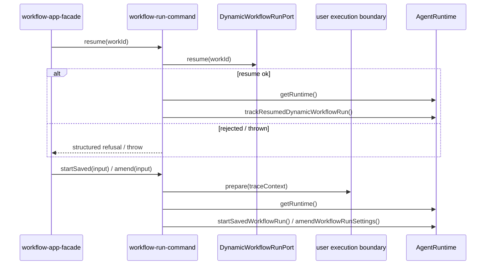

# workflow run command 应用上下文边界

状态：W1-R2 最小 bounded slice（2026-10-09）已冻结，实现在
`@acode/workflow-run-command`；真正的 Dynamic Workflow engine、journal、runtime owner
仍由 bootstrap/core 持有，本批不迁移它们。

## 所有者与公共接口

`@acode/workflow-run-command` 只拥有三条跨边界命令的应用编排顺序：

- `resume(workId, name?)`：调用宿主提供的 run port，成功后才从 `getRuntime()` 取得 runtime
  并注册恢复追踪；拒绝或异常不读取 runtime。
- `startSaved(input)`：先调用一次 `prepareUserExecutionBoundary`，成功后才取得 runtime
  并调用 `startSavedWorkflowRun`。
- `amend(input)`：沿用 `startSaved` 的边界顺序，调用 `amendWorkflowRunSettings`。

上下文不创建 run、写 journal、分配 owner 或执行模型。`getRuntime` 是惰性注入，避免
bootstrap 装配期访问尚未完成的 AgentRuntime；`traceContext` 由宿主冻结并在三条命令中
原样传递。失败沿用 runtime/port 的结构化结果，只有 wiring 故障或端口异常抛出。

## 事件顺序与幂等边界

每次调用只准备一次边界；准备失败时没有 runtime 读取和 workflow 写入。resume 的成功
追踪紧跟 port 成功返回，不能在其前注册，也不能为失败结果注册。能力是否公开仍由
bootstrap facade 根据端口及可选成员门控；command context 不把缺席能力伪装成空成功。

## 验收场景

1. resume 成功顺序为 `port → runtime → track`，并把 `runId/toolCallId/name/traceContext`
   原样传入；拒绝不读 runtime。
2. startSaved 与 amend 都是 `prepare → runtime → execute`；prepare 拒绝时 execute 不发生。
3. 上下文不保留第二份 run/journal/owner 状态，bootstrap facade 的公开能力和原有缺席门控
   保持不变。

