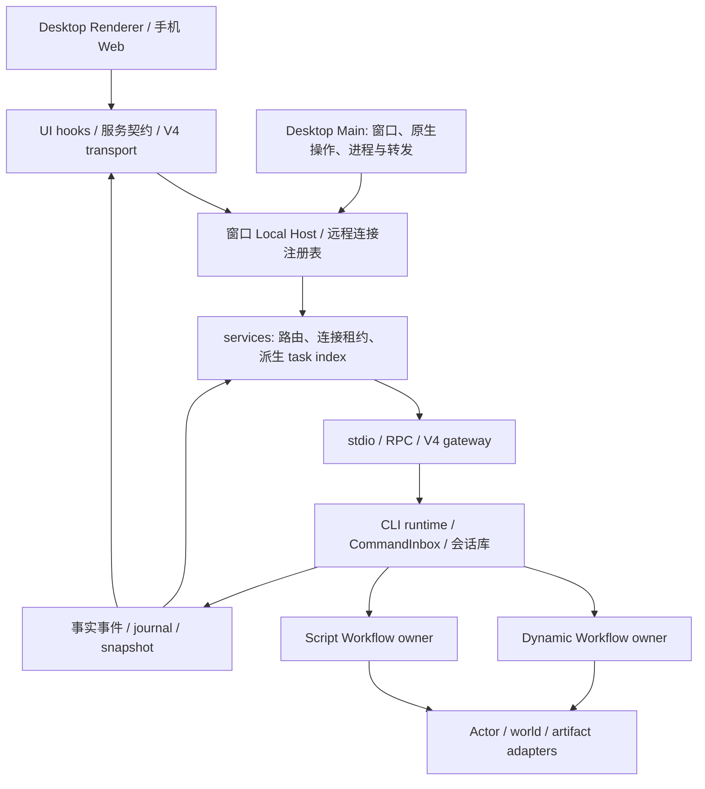
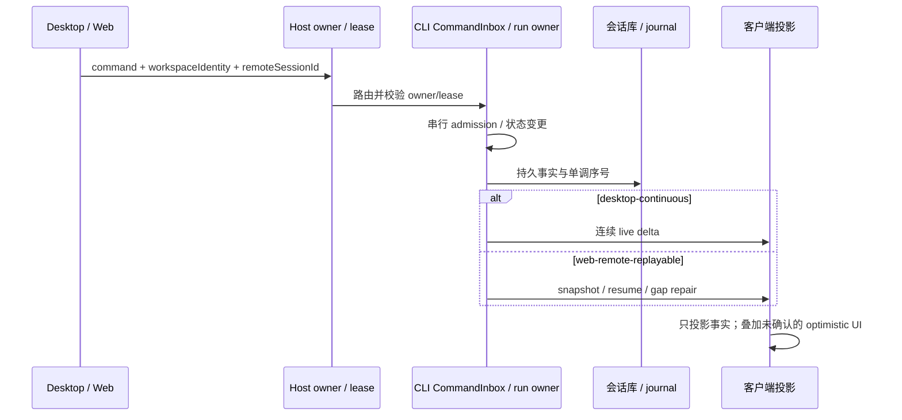
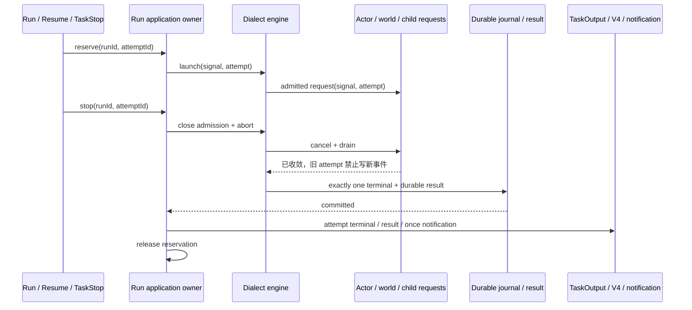

# ACode 完整项目审查：架构、CLI 与两套 Workflow

已修复原审查中可复现的执行、安全、配置、恢复与计量缺陷，并继续推进 CLI 状态写权限、Workflow 应用边界和真实架构纳管。两套 Workflow 保留各自执行语义，复用明确 owner、attempt、持久结果和生命周期边界。第二批（2026-10-09 晚）完成：ARCH-01 参数校验迁移清零（40/40 descriptor + 机械门禁）、bootstrap 物理拆包 W1-R3（59 引擎文件迁 `@acode/cli-workflow`）、架构纳管 5→18 模块（含 contracts 断 17 环、shared 断 2 环、harness-sdk 红门禁修复）、CLI-05 会话生命周期簇可写字段清零、Windows isolated-profile Electron smoke 落地全 PASS。仍余：ui/web/desktop/services/acode-cli 五模块纳管（已定价，前置为 checker resolver 缺口）、SSH 首次批准对话框的真实 GUI 驱动与跨平台矩阵、M2-M4 与 W2。逐项状态和最终验证以 [修复记录](reviews/2026-10-08/fix-status-2026-10-09.md) 为准。

审查日期：2026-10-08（Asia/Shanghai）。基线：`dev/0.0.7`，提交 `f4da4b0e1e3b1c35a805b95f6c1061a09317b38b`。本文保留原始源码审查和复现证据；下方修复复核记录当前工作树状态。

补充复核：2026-10-09。已完成对应生产修复，并新增 SSH 主机密钥、双 App 审计归属、Script 失败用量结算、结果读取、meta AST 解析、跨 session resume owner、workflow run owner lease、v4 capability query、CLI model-selection owner 与 Workflow read boundary 测试。

补充复核（第二批）：2026-10-09 晚。ARCH-01 校验器迁移完成并加覆盖门禁；W1-R3 物理拆包完成（bootstrap/src/app -14,940 行）；纳管模块 5→18（776 文件）、baseline 收紧 491→415；RuntimeSessionLifecycleState 可写扁平字段清零；Electron 启动闭环 smoke 落地。第二批当时门禁：根 test 1991 pass/2 skip/0 fail、根+CLI typecheck/lint 全绿、architecture 0 new/0 regrown、knip/pre-push exit 0。

当前复核（2026-10-09 17:34，`dev/0.0.8` @ `fa9d6d0c`，见[修复记录](reviews/2026-10-08/fix-status-2026-10-09.md)文首表）：第二批后又落地 U01（类型检查收敛为单一门禁入口 `scripts/typecheck-gate.mjs`，`8b9450ba`）与 worktree 短名路径修复（`ef474d76`），并修复 U01 自身引入的 renderer 守护测试回归（`fa9d6d0c`）。实跑门禁：根 test 2004 / 2001 pass / 3 skip / 0 fail，CLI 全套 1338 / 1337 pass / 1 skip / 0 fail，typecheck（三阶段）与 lint（145 warnings / 0 errors）退出 0，architecture 全量 OK（415/415、new 0）、managed 18 模块 776 文件 / legacy 5 模块 3463 文件，knip:gate 与 diff --check 通过。第二批表中「CLI 1327/1327」的 6 个既有失败已定位（本机 `%TEMP%` 为 8.3 短名）并修复。

## 修复复核（2026-10-09）

| 编号          | 当前状态                                              | 修复或剩余工作                                                                                                                                                                                                                                                                                                                                                                                                                                                                                                                                                    |
| ------------- | ----------------------------------------------------- | ----------------------------------------------------------------------------------------------------------------------------------------------------------------------------------------------------------------------------------------------------------------------------------------------------------------------------------------------------------------------------------------------------------------------------------------------------------------------------------------------------------------------------------------------------------------- |
| ARCH-01       | 已修复（第二批完成校验迁移）                          | 全部 40 个 descriptor 显式冻结公开方法/事件；装配读取真实 Proxy 覆盖，保留鉴权、owner 与远端转发。第二批把参数校验迁移清零：全部方法与 `onDynamicXxx` 动态事件登记保守校验器（普通事件按 `listen` 缓冲直返路径豁免并写入 spec），补齐 file/OAuth 拒绝测试，新增 5 个行为测试文件 32 个测试，`rpc-descriptor-surface` 升级为「漏登记即红」的机械覆盖门禁。                                                                                                                                                                                                         |
| ARCH-02       | 安全缺陷与 Desktop 接线已修复；Windows 启动闭环已验证 | 异步 known_hosts 支持 hex/base64、多 key/hashed host/revoked 与新握手刷新；managed trust 支持 candidate-aware precedence、显式 replace override、原子写入与并发合并。Desktop 首次批准、变化替换、拒绝、取消清理和跨宿主 IPC 已接通；未知/变更仍 fail-closed。第二批落地 isolated-profile Electron smoke（`pnpm --filter @acode/desktop e2e:smoke`）：CDP/首窗/Host fork/进程树与临时目录清理全 PASS，先前"无 CDP/首窗"卡点确认为探针发现方式而非应用缺陷；SSH 批准对话框真实 GUI 驱动与 macOS/Linux 矩阵仍待真实环境。                                            |
| ARCH-03       | 已修复                                                | CLI entry、真实源码 lint 与 Renderer 独立类型检查进入 CI/release；CLI 配置取消整目录 ignore，缓存含两级 lint 配置。                                                                                                                                                                                                                                                                                                                                                                                                                                               |
| ARCH-04       | 大幅推进（managed 5→18 模块）                         | 第二批纳管 harness-sdk（修复开工即红的 2 个超限文件与 client↔session 环）、acode-cua（aliasRules 消除扁平 JS 包 resolver 盲区）、acode-cli-contracts（断 17 环+真正根 contract）、rpc/client/provider-node/formal-proof/provider/acode-server-cli（零代码改动）、shared（断 2 环+20 导出入口）/server（通配导出显式登记）/session（空入口为登记迁移现状）；managed 文件 43→776，baseline 收紧 491→415。剩余 ui/web/desktop/services/acode-cli 已完成可行性定价，前置为 checker resolver 三缺口（exports map 解析/通配入口/asset 导入豁免）。                      |
| ARCH-05       | 已修复                                                | 从所有 policy roots 的共同仓库祖先发现 workspace package manifest；用 TypeScript JSONC parser 读取父级/嵌套 `tsconfig*.json` paths；支持 policy alias、字面量动态 import，无法解析的 workspace import 报错。真实 `packages/ui/tsconfig.json` 的 `@/*` alias 已进入发现结果。                                                                                                                                                                                                                                                                                      |
| ARCH-06       | 已修复                                                | HEAD 回长检测与当前树共用物理行口径，末尾 LF/CRLF 不制造假 regrown。                                                                                                                                                                                                                                                                                                                                                                                                                                                                                              |
| CLI-02        | 已修复                                                | 配置 read-modify-write 使用锁和原子写入；加载期 legacy plugin 迁移也在锁内重读最新快照后写回。                                                                                                                                                                                                                                                                                                                                                                                                                                                                    |
| CLI-03        | 已修复                                                | ACP cwd 使用异步 realpath/stat，拒绝越界链接、缺失目录和非目录。                                                                                                                                                                                                                                                                                                                                                                                                                                                                                                  |
| CLI-04        | 已修复                                                | 审计 sink 按 session 注册/释放，避免多 App 串线。                                                                                                                                                                                                                                                                                                                                                                                                                                                                                                                 |
| CLI-05/06     | 关键边界与 W1-R3 拆包已完成；W2 与其余簇待续          | reservation/drain/branch generation、restart reminder、session title、session-start hook、MCP registration、subagent notification seal 和 session model selection 有独立 owner/有限写端口；第二批把 RuntimeSessionLifecycleState 剩余 4 字段（shutdown/permission-grant/model-timeline）全部收敛，簇内可写扁平字段清零。W1-R1/R2/R3a-1 之后，W1-R3 已完成：59 个引擎文件物理迁入受管包 `@acode/cli-workflow`（唯一公开面 61 行 contract），bootstrap/src/app 净降 14,940 行只留 5 个装配接缝，守护测试扩展并含人为深导入红字自检；W2 仍依赖 legacy 协议 M3 删除。 |
| M2 capability | 已实现最小切片                                        | independent Plan preflight 改走严格 `v4/capabilities/query`，未知/缺字段/false/`-32601` 均 fail-closed，成功结果按 client 缓存且失败可重试；shared schema 已抽离，v4 → legacy 反向依赖由架构 fixture 固定禁止；其他 legacy services 调用仍按 M2 后续批次迁移。                                                                                                                                                                                                                                                                                                    |
| CLI-07        | 健康与生命周期已验证                                  | 心跳退化/恢复、当前 child/generation、restart/stop 和 status 原子写入有真实 IPC 测试。普通 CLI 原有 15 秒 ready deadline；自动重启也补齐同一 deadline，先等待 OS 终态再计 crash budget。                                                                                                                                                                                                                                                                                                                                                                          |
| DWF-01..04    | 已修复                                                | engine lifecycle 取消与 world drain、durable 预算拒绝重放、resume reservation、artifact admission lane 有真实子进程/恢复竞态测试。                                                                                                                                                                                                                                                                                                                                                                                                                                |
| SWF-01..08    | 已修复                                                | 请求/结果/attempt/取消/meta/worktree/owner 已覆盖；真实 child 用量按 activityId 在 SQLite 事务幂等结算，incomplete 可持久观察。Script `opts.schema` 现在在 child 启动前检查 schema 文档，并在结果提交前按受限 JSON Schema 子集校验，错误形状不再作为成功结果持久化。                                                                                                                                                                                                                                                                                              |

最终统一门禁已用声明版本 Node 24.14.0 / pnpm 10.33.2 完成；命令、退出码、计数与未执行范围统一写入 [修复记录](reviews/2026-10-08/fix-status-2026-10-09.md)。后文的旧测试日志保留为审查基线证据。

## 1. 阅读入口与审查范围

| 文档                                                            | 内容                                                                 |
| --------------------------------------------------------------- | -------------------------------------------------------------------- |
| 本文                                                            | 全局结论、问题索引、架构/服务/远程边界、验证结果、整改顺序           |
| [CLI 专项](reviews/2026-10-08/cli.md)                           | 配置并发、ACP 路径边界、审计上下文及 CLI 门禁                        |
| [Dynamic Workflow 专项](reviews/2026-10-08/dynamic-workflow.md) | world 副作用取消、ask 重放序号、artifact 版本、resume 并发           |
| [Script Workflow 专项](reviews/2026-10-08/script-workflow.md)   | 在飞请求、结果和通知、attempt 恢复、预取消、meta 解析、worktree 身份 |

本次把“两套 workflow”解释为源码中的 Dynamic Workflow 与 Script Workflow，同时检查 GitHub CI/release 对它们和 CLI 的验证范围。

覆盖了根 workspace/包清单、架构策略及检查器、Desktop Main/Host/Renderer 的职责与服务装配、UI 状态和订阅、shared 协议、RPC/client/server、CLI 的 contracts/core/adapters/bootstrap/入口，以及两套 workflow 的启动、执行、取消、持久化、恢复、观察和后台结果链路。provider/provider-node、model-option-map、harness-sdk、acode-server-cli、formal-proof 和 acode-cua 的公共面、依赖及验证入口也纳入检查。

方法是契约/spec → 源码调用链 → 现有测试 → 无模型最小行为复现。没有逐行审阅约 87 万物理行的全部实现，也没有运行真实模型、真实 SSH 服务、Electron GUI、手机远控或所有操作系统。后文区分已复现缺陷、源码确认的缺口和需要设计确认的风险。未读取未跟踪的 `.acode/` 用户数据；原始审查阶段只新增审查文档；2026-10-09 用户授权后实施修复。

## 2. 当前项目的实际形态

### 2.1 分层方向成立，机械约束与所有权收敛尚未完成

当前系统已经具备合理的技术方向：UI 经 hooks/service 契约发命令；窗口内 Local Host 组织服务和连接；CLI/runtime 承担会话与 accepted input；shared v4 声明严格协议和纯投影；adapters 执行外部副作用。问题在于真实边界仍依赖大型实现、legacy 桥接和部分源码扫描测试。

图中 Host/services 的 task index 是派生读模型；accepted 队列及 workflow 执行状态由 CLI 侧拥有。Main 不应成为会话事实或队列所有者。建议后续拆分继续保持这些方向。

### 2.2 两种客户端交付需要保持显式区别

`packages/shared/src/acode-protocol-v4/core.ts:34` 已有两种 delivery profile：continuous 每 30 ms flush，允许桌面行和流式 output；replayable 每 150 ms flush，不流式发送 input/output.text/summaryText，并启用 toolProgress。它们不是两套 workflow，而是同一事实流的两种交付规则。

本次未证明整个远控链路存在 identity 越权或 accepted 队列双写；不能因文件中存在 fallback 就删除 owner/lease 和 stale-run 防线。任何后续 stream/snapshot/queue 改动应同时验证两种交付模式。

### 2.3 规模说明了拆分优先级，不能替代缺陷证据

统计口径为 `git ls-files` 中包 `src/` 下的 TS/TSX/MTS/CTS/MJS/CJS，按换行统计物理行（不计末尾换行产生的空记录），包含空行、注释和部分生成内容；不是净代码行。共 3,914 文件、867,764 行。架构检查器自身范围更广，超限计数不能直接与此表相加。

| 范围               | 文件数 |  物理行 | 超过 400 行的文件数 |
| ------------------ | -----: | ------: | ------------------: |
| packages/ui        |  1,451 | 312,885 |                 176 |
| CLI core           |    588 | 118,650 |                  69 |
| packages/services  |    342 | 100,553 |                  54 |
| CLI bootstrap      |    243 |  68,692 |                  37 |
| CLI adapters       |    233 |  57,927 |                  34 |
| packages/desktop   |    210 |  52,170 |                  36 |
| packages/shared    |    238 |  44,114 |                  26 |
| CLI contracts      |    119 |  22,886 |                  11 |
| Dynamic Workflow   |     96 |  21,020 |                  13 |
| CLI TUI / CLI 入口 |    178 |  27,182 |                   9 |

值得优先隔离职责的真实文件包括 `botsService.ts`（6,751 行）、`acodeTaskServiceAdapter.ts`（5,860 行）、`acodeAgentService.ts`（5,662 行）、`product-projection.ts`（5,432 行）、`browserGuestManager.ts`（4,663 行）和 `SessionPane.tsx`（3,629 行）。语言词表也很长，但其风险和运行时状态机不同，不宜按总行数机械排序。

## 3. 审查问题索引

P1：应优先处理的执行、安全或恢复正确性问题；P2：明确缺陷、持续验证缺口或有实际维护成本的边界问题；设计跟踪项另列，不冒充运行故障。专项文档给出每条的精确源码位置、触发条件、复现、建议和验收。

下表为原始审查问题索引，当前状态见顶部修复表。共 21 项，8 项 P1、13 项 P2。ARCH-03 包含 CLI 专项的 CLI-01 门禁问题，不重复计数；CLI-05/06 的结构债务和 CLI-07 的待验证 Supervisor 风险在第 5.1 与第 6 节跟踪。

| 编号    | 优先级 | 问题                                                                      | 证据                                       |
| ------- | ------ | ------------------------------------------------------------------------- | ------------------------------------------ |
| ARCH-01 | P1     | RPC 自动代理暴露未声明的内部方法，可直接写 OAuth 会话                     | 真实 OAuthService + 假凭据端口复现         |
| ARCH-02 | P1     | SSH 未验证服务器主机密钥                                                  | 本机假 SSH server 更换 key 后仍被接受      |
| ARCH-03 | P2     | CI/release 漏掉 CLI 独立 lint/typecheck 与 Renderer 类型门禁（含 CLI-01） | 实际 CLI lint 失败、Renderer 112 错误      |
| ARCH-04 | P2     | 架构“通过”仅对 1/15 模块执行主要边界规则                                  | 策略、checker、context 输出确认            |
| ARCH-05 | P2     | 架构检查忽略包名和路径别名导入                                            | 双模块最小 fixture 复现                    |
| ARCH-06 | P2     | 超限 ratchet 在文件缩短后仍允许重新超限                                   | 410 → 5 → 420 行 fixture 复现              |
| CLI-02  | P2     | 用户配置并发 read-modify-write 丢失字段                                   | 公共 API 临时配置复现                      |
| CLI-03  | P2     | ACP cwd 词法边界误拒合法路径并允许 junction 逃逸                          | 真实 adapter + 临时目录复现                |
| CLI-04  | P2     | 多 App 共用进程级 audit sink，审计上下文可串到另一会话                    | 真实双 App + 双 JSONL 日志复现             |
| DWF-01  | P1     | 取消/结算后 world.run 外部命令继续执行                                    | 真实 NodeExecutionAdapter 临时 marker 复现 |
| DWF-02  | P1     | 被拒的 ask 留下序号空洞，resume 调度停滞                                  | scheduler/journal 行为复现                 |
| DWF-03  | P1     | 带 resumedFrom 的停止 run 两次并发 resume 都被接纳                        | service + journal 行为复现                 |
| DWF-04  | P2     | 并发 artifact 发布重复 version，live/replay 计数漂移                      | engine 行为复现                            |
| SWF-01  | P1     | 子脚本退出后父侧 agent 请求仍执行，run 提前终态                           | 真实子进程 + 受控在飞请求复现              |
| SWF-02  | P1     | 脚本结果、TaskOutput 和 resume 完成通知适配不完整                         | 真实 registry/projectTask/getTask 路径复现 |
| SWF-03  | P2     | 旧 attempt 终态掩盖新 attempt 中断，冷恢复显示 running                    | replay + 共享 reducer 复现                 |
| SWF-04  | P2     | 预先 aborted 的 run 仍 spawn 并执行脚本                                   | 真实 child 行为复现                        |
| SWF-05  | P2     | meta 字面量解析实际执行 Node 代码                                         | 真实解析器临时 marker 复现                 |
| SWF-06  | P2     | worktree 分支身份使用显示 label，重复 label 碰撞                          | 真实临时 Git 仓库复现                      |
| SWF-07  | P2     | 失败/取消/schema 解析失败遗漏已发生的子代理用量                           | 真实 runtime + 受控 child 复现             |
| SWF-08  | P1     | Script resume 未校验会话/工作区 owner，跨 workspace 执行旧脚本并复用缓存  | 真实 tool port + 假 store/runtime 复现     |

## 4. 架构与跨进程边界的具体问题

### ARCH-01 · P1 · RPC 公共契约没有限制实际可调用方法

**当前复核（2026-10-09）。** 方法/事件白名单已在全部 descriptor 与装配路径固定；新增的运行时参数校验器已接入凭据、文件、终端和 OAuth 入口，非法参数在服务方法体前返回 `rpc-invalid-arguments`，并通过 ChannelClient/ChannelServer 保留 `method` 与安全 `details`。其余低敏感历史方法仍按迁移规则逐步补齐参数校验，不能把当前白名单修复描述为全量 schema 完成。

**位置。** `packages/rpc/src/proxy-channel.ts:85` 直接读取 `handler[command]` 并执行；`packages/services/src/collection.ts:29` 将整个注册实例交给该代理。`packages/services/src/node.ts:2428` 注册真实 `OAuthService`；其 `persistOAuthSession`（`oauthService.ts:397`）和 `clearPendingState`（`:1147`）均不属于 `IOAuthService` 公共接口。

**原因。** TypeScript 的 `private` 和 interface 不提供运行时访问控制。代理既不检查方法白名单，也不区分原型内部方法、继承函数与公共事件。HTTP 鉴权和 credential/provisioning channel guard 不能自动约束其他 channel 的内部方法。

**触发与影响。** 能建立该服务 RPC 连接的客户端，发送 OAuth channel 的 `persistOAuthSession` 调用，可以跳过正常 callback/state/官方服务开关路径写入或清除 OAuth 数据。这里没有声称绕过 HTTP token 或 Origin 鉴权；缺陷发生在已建立连接的方法边界。

**复现。** 构造真实 `OAuthService`，注入只有内存记录的 credential adapter，`adapters: []`；经真实 `ProxyChannel.fromService` 调用 `persistOAuthSession('bigmodel', 测试tokenSet, 测试profile)`。观察到清理 inactive provider、保存 access_token/user_info/active_provider 的 9 次 save/delete，公共登录流程完全没有执行。另一个纯 fixture 也确认内部方法与继承的 `hasOwnProperty` 都可调用。复现没有读写真实凭据。

**建议。** ServiceDescriptor 声明有限的公开 method/event 表，并关联入参、出参运行时 schema 和连接角色；注册时只暴露该表。先为 OAuth、文件、终端、provider 等敏感 channel 建立显式契约，再迁移其他服务。仅检查 own-property 不够：正常 class 公共方法也在 prototype 上，仍需要公开表。

**验收。** 经真实 ChannelClient/ChannelServer 调用公共方法正常；内部方法、继承函数、非法参数、未知事件和不允许的角色得到稳定的结构化拒绝。敏感凭据 guard 应验证间接写入路径，不能只覆盖 credential channel 名称。

### ARCH-02 · P1 · SSH 加密没有建立服务器身份信任

**当前复核（2026-10-09）。** 已实现 known_hosts 与 managed trust 的 candidate-aware 组合：`@revoked` 永远优先，known_hosts changed 不被普通 managed approval 绕过；只有同一候选经过显式 `replace` 后持久化 override 才允许重试。server SSH focused 18/18、Desktop focused 72/72 通过；真实 Electron、手机远控和跨平台矩阵仍待验收。

**位置。** `packages/server/src/remote/sshAuth.ts:25` 创建 `ConnectConfig`，没有 `hostVerifier`/`hostHash` 或受信主机记录；`ssh-backend.ts:131` 使用它，`:199` 直接 `client.connect(this.config)`。当前仓库没有 SSH known_hosts/fingerprint 校验实现。

**确认依据。** 已安装 ssh2 的 `README.md` 对 `hostVerifier` 明确写明未设置时 auto-accept；其 `lib/client.js:273` 仅在提供 verifier 时建立验证函数。这是客户端库的实际默认行为，不是把系统 `ssh` 的默认规则套给 ssh2。补充本机假 SSH server 行为复现：同一 `127.0.0.1:port` 先以 host key A 运行，再换成 host key B，当前 `SSHBackend` 两次都完成认证和 exec；对照连接提供固定 A 的 `hostVerifier` 时，B 在认证前被拒绝。

**触发与影响。** 新主机、主机密钥被替换或连接被中间人导向其他服务器时，ACode 仍接受服务器。密码/keyboard-interactive 模式可能把凭据交给假服务器；私钥模式虽然不会直接传出私钥，仍会在未受信端执行命令、部署运行资产并读取伪造的工作区内容。

**建议。** 先定义跨 Desktop/CLI 的 SSH host-trust 契约：按规范化 host+port 记录 key/fingerprint；首次连接交互确认，已记录密钥变化默认拒绝；headless 仅接受显式受信配置。验证应在认证、上传、exec 前完成。不要把“TLS/SSH 链路加密”当作服务器身份验证。

**验收。** 本地假 SSH server 覆盖首次确认、同 key 重连、同 host key 变化拒绝、用户拒绝、非交互未知 key 拒绝；拒绝时不得进入 password responder、上传或 exec。本次已完成同地址换 key 和固定 verifier 的最小行为复现；真实网络、中间人拓扑和跨平台交互仍未测。

### ARCH-03 · P2 · 发布级“全绿”没有覆盖所有交付入口

**位置。** 根 `package.json:29` 的 typecheck 列表不含 CLI workspace、Desktop Renderer；`.oxlintrc.json:64` 忽略 `apps/acode-cli` 和 formal-proof。`.github/workflows/ci.yml:43`、`release.yml:58` 只跑根门禁；其 CLI build 过滤 `!@acode/cli`。

**真实结果。** 根 typecheck/lint 通过，但独立 Renderer 检查有 112 个 TS 错误；CLI 独立 lint 因 `script-workflow-tool-port.ts:480` 的 max-lines 失败。CLI 独立 typecheck 本次通过。CLI build 会为若干依赖包进行类型构建，因此不是“CLI 完全没有类型检查”；遗漏的是完整 CLI 独立检查，尤其 CLI 入口及独立 lint。esbuild 打包也不能代替 `tsc --noEmit`。

**Renderer 原因。** 大量错误是 `Window.acode` 声明未进入 renderer 类型编译，以及 CSS side-effect import 的声明缺失。声明当前位于 `packages/client/src/globals.d.ts:54`，client 工程有该源文件但其公共声明入口没有把 ambient 声明带入下游。错误应先按 bridge/types 编译边界修复，不宜给 112 个调用点逐个加 any。

**建议。** CI 和 release 复用同一个有明确定义的验证入口，加入 CLI typecheck/lint、renderer 和生成物 parity 检查；修好既有失败再设门禁。平台相关行为测试建立 Windows/macOS/Linux 矩阵，昂贵桌面 smoke 可独立发布前执行。不能把 Linux verify 通过当作所有桌面平台行为通过。

**验收。** 人为引入 CLI 入口 TS 错误、CLI lint 错误、Renderer bridge 类型错误，CI 和 release 都应失败；恢复后四项真实绿。清洁 checkout 按 CI 的 build→test 顺序通过，不依赖开发者曾生成的 dist。

### ARCH-04 · P2 · 大部分模块仍只受文件行数 ratchet 管理

**位置。** `architecture-policy.yaml` 当前 15 个模块仅 `storage` 为 managed；`global.managedOnly: true`。`scripts/architecture/index.mjs:183` 至 `:207` 对其他模块执行行数检查后 `continue`，不构建其导入边，也不执行主要分层/跨模块规则。

**影响。** `architecture: OK / new: 0` 实际表示当前受管范围及基线未新增违规，不表示 UI→实现、core→adapter、循环依赖和 CLI 子包边界已全仓通过。CLI 所有 packages 作为一个 `acode-cli` legacy 模块，其内部边界无法由该策略表示。harness-sdk/model-option-map 等包也未有独立模块定义。

**现场证据。** 架构检查输出 491 baseline / 0 new；`architecture:context acode-cli` 显示 `owner: unassigned`、`managed: false`、没有 module.ts，却选到了 `contracts/src/tools/contract.ts`。这个文件是 tool 契约，不能当成整套 CLI 的架构契约。唯一 managed storage 当前也缺少技能模板要求的 `CONTRACT.md` 和 `contract.example.ts`，checker 只强制 module.ts/contract.ts，文档完备性尚不机械检查。

**建议。** 逐域登记和纳管，优先 workflow 应用层、CLI core/contracts/adapters、协议 publisher/gateway、Host routing 和 UI conversation data layer。每次只纳管一个边界：补模块 manifest/公开 contract/owner/验收，然后把实存例外显式登记。不要一次把全仓 managedOnly 关闭并刷 baseline 吞掉结果。

**验收。** 每个新纳管域的 forbidden edge fixture 真正使门禁失败；context 返回域自己的 contract、直接依赖与正确 owner；报告列出纳管比例和未受管范围。

### ARCH-05 · P2 · 包名和别名导入不进入架构依赖图

**位置。** `scripts/architecture/policy.mjs:152` 的 `resolveImport` 对非 `.` 开头的 specifier 返回 null；`index.mjs:264` 遇到 null 跳过后续依赖检查。`importsOf` 也只收集静态 import/export/import-equals，不收集字面量动态 import。

**复现。** 临时 policy 定义两个 managed 模块 a/b，a 没声明 requires b，b 只公开 contract。a 引用 b 内部文件：写成 `@review/b/private` 时 `aliasRules: []`；改成相对路径则出现 `module-dependency` 和 `deep-import`。违规依赖仅改变导入写法即可消失。该 fixture 复现的是 checker 遗漏，未声称上述虚构别名已经出现在产品运行代码中。

**影响。** 仓库主要依赖路径正是 `@acode/*` 和 `@/`；后续把模块标成 managed 仍不能得到完整边界检查。纳管计划必须同时解决 import resolution。

**建议。** 根据当前 package exports、workspace 包、tsconfig paths/project references 解析导入，将字面量动态 import 纳入边；对无法解析的 workspace 导入显式报告。仍按公开入口判断，不把合法 exported subpath 误认 deep import。可复用已有 dependency-graph/TypeScript 解析基础。

**验收。** 同一违禁边的相对路径、包名、paths alias、export-from、动态 import 写法都被检测；合法 package subpath、type-only contract 和外部 npm 依赖不会误报。

### ARCH-06 · P2 · ratchet 没有自动兑现“一旦干净必须保持干净”

**位置。** `scripts/architecture/index.mjs:199` 为 legacy 超限文件生成不含行数的固定指纹；`:345`、`:368` 永远按已提交 baseline 指纹区分 new；删除过期 baseline 仅依赖人工 `baseline:update`。

**复现。** 在临时仓库记录 410 行文件为 baseline，缩成 5 行后检查为零违规，但不刷新 baseline；再增长到 420 行，输出 `regrown: 1, regrownNew: 0`。检查器因此仍通过。它与代码注释及治理说明声称的“一旦干净必须保持干净”不一致。

**影响。** 拆分后没有立即人工刷新 baseline 的文件，可以再次超限；现有超限文件继续增长也不会报新违规，这一后者本来就是当前选择的“超限文件数量”ratchet。不能把该门禁描述为总行数或职责复杂度只减不增。

**建议。** 检查时报告 baseline 中已消失/已达标的条目，并要求一次经过评审的收紧提交；或者比较 Git 基线中实际源文件，阻止已达标文件复长。CI 不应自动写 baseline，也不应仅靠全量 baseline:update 掩盖新违规。

**验收。** 410→5→420 场景最后一步失败；无违规的收紧可以自动提示具体待删条目；跨机器指纹稳定；已有未迁移 legacy 文件继续按事先声明的数量 ratchet 工作。

## 5. CLI 与两套 Workflow 的整体意见

### 5.1 CLI 的接口设计比其状态封装成熟

contracts 已声明 tool schema、副作用范围、超时、并发能力和权限相关信息；core 通过 ports 执行，这些都值得保留。CommandInbox、branchGeneration、owner/lease 等机制承担真实时序约束，不能在“清理复杂度”时删去。

主要债务是 `AgentRuntimeInternal` 的扁平可变状态、原型注入 methods、bootstrap 内完整 application service，以及 module-global audit/policy 状态。类型分簇帮助阅读，但没有限制方法实际读写哪些字段，也没有让全局 sink 变为实例上下文。CLI-02/CLI-04 分别证明文件更新与审计上下文仍缺明确的单一 owner。

应先为 turn admission、branch lifecycle、permission audit 和 workflow run 建立有行为测试的接口，再逐个迁出。`runtime-state-ownership.md` 和 `bootstrap-app-boundary.md` 是可复用的计划；本次是核验和补充，不建议另建与它们平行的重构体系。

### 5.2 两套 Workflow 应共享生命周期契约，分别保留执行语义

| 维度       | Dynamic Workflow                                    | Script Workflow                                        | 审查意见                                          |
| ---------- | --------------------------------------------------- | ------------------------------------------------------ | ------------------------------------------------- |
| 表达形式   | TypeScript 编译/分析/lowering、typed actor sites    | JavaScript + meta + ALS callPath                       | 工具、技能和 UI 均应明确 dialect                  |
| 恢复依据   | journal、调用 site/ordinal、prefix 校验与缓存       | 重跑脚本，按 runId/callPath/inputHash 复用已成功 agent | “resume”含义不同，不能给同一续执行承诺            |
| 输出类型   | typed schema、validator/repair                      | opts.schema 提示 + 受限 JSON Schema runtime validator  | Script 没有 typed schema 合成或 mismatch 自动重试 |
| 预算       | engine caps/tokenBudget/admission                   | budget 目前为观测桩，另有每 run agent 数上限           | UI 和文档应只承诺实际强制的限额                   |
| 终态与观察 | engine/journal → run service → shared progress      | run/activity/event → script adapter → shared progress  | 统一 attempt、result、stop 与 notification 契约   |
| 工作区     | actor/world driver；当前 facade 没有 isolation 选项 | agent/worktree +脚本 cwd                               | 身份用稳定 id，label/path 仅用于显示/执行         |
| 隔离       | 子进程 VM，不是 OS 安全沙箱                         | 子进程 VM，不是 OS 安全沙箱                            | 已接受的 prototype escape 边界须继续如实披露      |

两套引擎各自维护自己的权威状态是合理的；重复的是 run launch/resume/cancel/background/result/projection 的应用协议。Script 技能明确 resume 只能在同一 session，但当前实现允许新 session 仅凭全局 runId 取旧脚本，并在当前 cwd 启动；这既是 owner 边界缺口，也是两套引擎共用 run application contract 时必须先固定的身份规则。建议将共同协议抽成有明确输入/终态错误/attemptId/owner 的 contract，再由 dialect adapter 接入。不要先把两套 journal 或 replay 算法揉成一个实现。

生命周期至少应满足：先 reserve 单一 attempt → 接纳请求 → 执行/持久事实 → 关闭 admission → 取消或等待在飞副作用收敛 → 落唯一终态 → 发布结果/通知 → 释放 owner。DWF-01/DWF-03/SWF-01/SWF-02 正是这一公共边界的裂缝。

这是建议的验收顺序图，不是当前实现已经满足的状态。

### 5.3 Script Workflow 的已接受边界与实现缺陷需要分开

Script 的 resume 重跑、budget 桩、入口批准后的子代理权限模式，以及 VM 不能作为安全沙箱，已有 spec/技能边界。schema 现在按 Dynamic Workflow 共用的受限子集运行期校验；它仍没有完整 JSON Schema vocabulary、typed schema 合成或 mismatch 自动重试。需要 `oneOf`、`allOf`、自定义 format 等能力时，应扩展契约与 validator 后再对外承诺。

SWF-05 则是另一个问题：meta 明确承诺纯字面量却使用普通 Node eval。正常 RunWorkflow 已先经过权限允许，本次没有证明审批前执行；缺陷是解析会执行超出字面量契约的代码和副作用。

## 6. 继续推进的架构跟踪项

以下是设计/覆盖意见，不计入上面的已确认问题数量。

| 跟踪项                       | 当前依据与风险                                                                                                  | 建议及完成判据                                                                                                                                                |
| ---------------------------- | --------------------------------------------------------------------------------------------------------------- | ------------------------------------------------------------------------------------------------------------------------------------------------------------- |
| legacy 协议收敛              | services 同时调用 legacy 与 v4；UI 仍消费 acodeSessionProjection；旧 server 仍承担创建/恢复等装配               | 继续既有 M1–M4，按符号和真实调用角色核对；不能把 model picker 纯格式 helper 和旧状态读者简单等同；每步跑两种 delivery 的真实恢复 smoke                        |
| task index / unread 单一事实 | syncer 已有 subagent_child 守卫；writer 白名单与 unread S1–S3 已登记，但白名单只能证明引用文件没有增加          | 为持久字段、runtime 字段和 optimistic 字段分别限定写接口；加逆序回包、重启、remote identity 与后台终态行为测试，再删 legacy map                               |
| UI conversation 边界         | SessionPane 等大组件承载 command、pane、provider、workflow 与投影；隐藏侧栏已通过 subscriptionActive 释放 lease | 优先抽 command controller / data-layer contract / workflow join；保持草稿 owner 与 accepted queue 分离；实际 Electron+手机 Web 验证分屏、隐藏恢复、长会话内存 |
| 观测与 formal-proof          | session 审计路由与 Script 真用量结算已修；formal-proof 模型与生产运行裁决仍缺机械一致性                         | 保留审计与计量行为回归；formal-proof 做统一 fixture 对照或明确仅解释模型，不能称已证明生产正确                                                                |
| 跨包公共面与配置治理         | server 暴露 remote/\*.js 广泛子路径；根与嵌套 workspace、工具版本/锁文件仍有历史债；provider codec/凭据锁较成熟 | 以调用点收紧 exports；核对嵌套锁文件真正消费者后决定删或修；复用 credential/provider 的锁与版本化模式管理 CLI config；不凭 unused 工具输出直接删公共 API      |

Script resume owner 已校验 session/workspaceIdentity/remoteSessionId，用量已通过真实 SQLite/child fixture 验证；Supervisor freshness 已做真实 Core child/control socket 故障回归。跨 Host 完整查询/恢复语义与真实模型计费仍需各自验收；当前测试不声称覆盖实际云账单或手机端到端。

## 7. 已有的良好设计

1. shared v4 明确 schema、实体/row 锚、delivery profiles、帧与重放限额；为 desktop 与手机提供了共同事实基础。
2. CLI contracts/ports 和 tool 副作用元数据已经成形；workflow journal、call site、typed artifact 和 child runtime 可作为重构的稳定接缝。
3. credential/provider 存储具有原子写、跨进程文件锁、版本 codec、损坏证据和不静默覆盖策略；CLI config 可以复用这些纪律。
4. Host attachment/remote registry 明确窗口与远程连接身份；task index 派生定位、subagent 修复和 hidden-pane lease 释放已有实现与验证。
5. 根 test、CI/release、knip gate 与 architecture baseline 已经可以真实执行；本次发现的缺口有条件转为可复现的持续门禁。

## 8. 实际验证记录

仓库要求 Node 24.14.0 / pnpm 10.33.2。终端最初是 Node 25.8.2 / pnpm 9.10.0，且没有 mise；审查使用临时 npx 缓存中的指定版本，并把指定 Node/pnpm 路径放到子进程 PATH 前端。下表结果来自指定工具链，不把初始环境版本当作仓库要求。

| 命令                                                                | 结果                                  | 解释                                                                          |
| ------------------------------------------------------------------- | ------------------------------------- | ----------------------------------------------------------------------------- |
| `node scripts/check-workspace-freshness.mjs`                        | 通过                                  | 与 origin/dev/0.0.7 同步；相对 origin/main ahead 2 / behind 0                 |
| `pnpm typecheck`                                                    | 通过，exit 0                          | 根列表范围；不含 CLI 独立工程与 Renderer                                      |
| `pnpm lint`                                                         | 通过，0 errors / 73 warnings          | 2,641 files；忽略 CLI 等配置范围                                              |
| `pnpm architecture:check`                                           | 通过，491 baseline / 0 new            | 491 legacy 超限；不能解释为零架构债                                           |
| `pnpm architecture:context storage` / `acode-cli`                   | 已执行                                | storage owner明确；CLI context不具备可用模块边界                              |
| `pnpm knip:gate`                                                    | 通过                                  | 1 条 turbo ignoreDependencies 配置提示；exports/types backlog 不在 gate 内    |
| `pnpm test`                                                         | 通过，1,757 pass / 2 skipped / 0 fail | 10 个有 test 脚本的 workspace 套件，总计 1,759 场景                           |
| `pnpm --dir apps/acode-cli typecheck`                               | 通过                                  | CLI 独立验证，详情及 force 重跑记录见专项                                     |
| `pnpm --dir apps/acode-cli lint`                                    | **失败**                              | bootstrap max-lines 414 > 400；详情见 CLI 专项                                |
| `pnpm exec tsc -p packages/desktop/tsconfig.renderer.json --noEmit` | **失败，112 TS errors**               | Window.acode ambient 声明与 CSS 类型边界等                                    |
| Script 5 文件专项测试                                               | 通过，53 / 53                         | 现有 sandbox/cold replay/tool/cancel/usage/cancel chain；不能覆盖本次新增复现 |
| Script 失败用量专项复现                                             | 确认 SWF-07                           | failed/abort/schema-invalid 都漏记 child 已产生的 100 tokens/2 tools          |
| 架构/RPC、CLI、DWF、SWF 最小复现                                    | 确认上文缺陷                          | 假端口、内存 fixture、系统临时目录或临时 Git 仓库；无需真实模型和凭据         |

全仓测试细分：

| 套件          | Tests |  Pass | Skip | Fail |
| ------------- | ----: | ----: | ---: | ---: |
| acode-cli     | 1,182 | 1,182 |    0 |    0 |
| rpc           |    19 |    19 |    0 |    0 |
| shared        |   102 |   102 |    0 |    0 |
| harness-sdk   |    15 |    15 |    0 |    0 |
| provider      |    16 |    16 |    0 |    0 |
| provider-node |    13 |    13 |    0 |    0 |
| services      |   178 |   176 |    2 |    0 |
| ui            |   109 |   109 |    0 |    0 |
| server        |    56 |    56 |    0 |    0 |
| desktop       |    69 |    69 |    0 |    0 |

两项 skip 都发生在 services 的文件软链测试，本机权限不支持创建文件软链：受控根内软链逃逸拒绝，以及 updateAgent 的软链异拼写同文件场景。它们不算通过。ACP 专项另用本机可以创建的目录 junction 做了实际边界复现。

文档验证：4 份报告已格式化；37 个本地 Markdown 链接和 44 个完整源码行号引用校验无失效；Script 专项附录 A/B/C 的完整复现代码从报告中提取再执行，均重现记录的缺陷。耗时数字会随机器负载变化，行为结果一致。

本次全仓测试使用现有本地 dist；没有另建完全清洁的依赖安装环境。CI 已配置 CLI 依赖包 build 前置步骤，但清洁安装/发布产物 smoke 仍需在真实 CI/平台矩阵复核。未执行全仓 fmt、完整 unused exports 清理或发布构建，它们不属于本次源码审查产物的验证结果。

## 9. 建议执行顺序与验收包

工作量是便于排期的工程估计，不是修复承诺；每包先补对应 spec 与真实失败测试，再实现，并实际运行根 typecheck/lint 和影响范围测试。

| 顺序 | 工作包                          | 包含问题                         | 预计工程投入     | 完成判据                                                                                      |
| ---- | ------------------------------- | -------------------------------- | ---------------- | --------------------------------------------------------------------------------------------- |
| 1    | Workflow 生命周期与执行收敛     | DWF-01/02/03、SWF-01/02/03/04/08 | 24–40 小时       | owner 校验；无重复 attempt；终态后无新副作用；cancel/resume/crash 后状态和结果一致            |
| 2    | 可信 RPC / SSH 边界             | ARCH-01/02                       | 16–32 小时       | 内部方法不可远程调用；服务器 key 变更在认证/exec 前拒绝                                       |
| 3    | 发布门禁与治理可信度            | ARCH-03/04/05/06                 | 16–28 小时       | CLI+Renderer 真正进门禁；别名/动态边可检测；ratchet 复长失败                                  |
| 4    | 配置、路径、artifact 和脚本解析 | CLI-02/03、DWF-04、SWF-05/06/07  | 16–28 小时       | 并发写不丢字段；真实物理cwd受限；版本唯一；meta无副作用；失败用量只入账一次；worktree身份唯一 |
| 5    | 状态封装与长期迁移              | CLI-04 及第6节跟踪项             | 40–80 小时，分批 | 实例审计不串线；模块contract受管；legacy和UI迁移有双链路验收                                  |

优先新增组合行为测试：真实 store + run service + registry + child/adapters，主动控制异步屏障和崩溃点。源码正则守护适合冻结边界，不能替代取消、结果交付、恢复和并发 admission 的运行证明。

下一步：先按问题索引审阅 DWF-01、DWF-03 与 SWF-01；三条都涉及“用户以为执行已停止或唯一，但仍有副作用继续发生”，适合作为第一个修复批次的规格输入。
