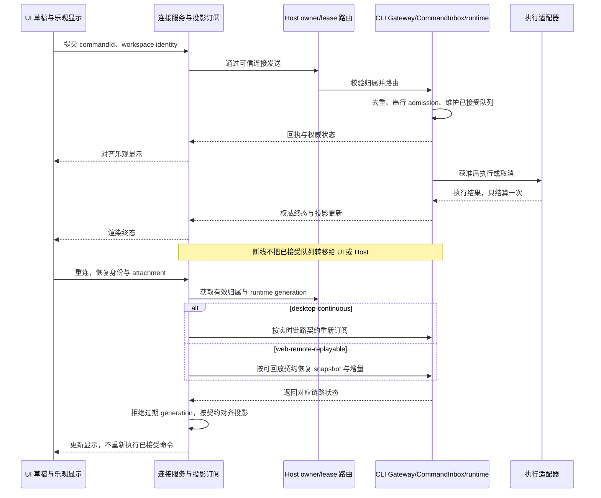

# ACode 项目升级建议（2026-10）

类型门禁的 renderer 与 CLI 自身入口已在 CI 与 release verify 落地且诊断为 0，U01 只剩统一入口、release 两个 job 与注入验证；接着补真实执行故障测试，再建设交互 E2E、发布产物启动验证，随后推进现有协议与状态收敛计划。产品侧优先完成长对话导航和首次配置诊断。

本文是升级建议与立项依据，不代表以下改动已经实现，也不替代各模块 spec。实施前先更新对应 spec，明确状态所有者、接口、事件顺序和验收场景。

## 1. 调查范围与实测结果

调查日期：2026-10-09。首次调查基线：`dev/0.0.8`，commit `f4da4b0e`；同日在 commit `f9ed8961`（`dev/0.0.7`，含 2026-10-08 审查修复批一+批二 `c453fca5` 与其后三条 CI 修复）复测，下表以复测结果为准，首次调查的差异写在结论边界里。根 `package.json` 版本为 `0.0.6`；分支名不等于软件发布版本。

范围包括 Desktop、手机 Web、共享 UI、services、CLI/runtime、协议、CI/release 和已有升级计划。采用当前检出源码与脚本作为事实依据；历史报告中的数量和性能数字不直接视为当前结果。

| 检查                                                                | 复测结果（`f9ed8961`）                                                                                                                                                        | 结论边界                                                                                                                                                                                 |
| ------------------------------------------------------------------- | ----------------------------------------------------------------------------------------------------------------------------------------------------------------------------- | ---------------------------------------------------------------------------------------------------------------------------------------------------------------------------------------- |
| `node scripts/check-workspace-freshness.mjs`                        | 通过；`dev/0.0.7` 与 `origin/dev/0.0.7` 同步，相对 `origin/main` ahead 6 / behind 0                                                                                           | 仅表示复测时本地已知引用的基线状态；首次调查在 `f4da4b0e` 记为 ahead 2                                                                                                                   |
| `pnpm typecheck`                                                    | 通过，退出码 0                                                                                                                                                                | 清单仍只有 `packages/*` 与 Desktop host/main/preload/scheduler，不含 renderer 和 CLI 自身入口                                                                                            |
| `pnpm lint`                                                         | 通过，145 warnings、0 errors，扫描 4330 个文件                                                                                                                                | 存量 warning 仍存在。首次调查记为 73 warnings / 2633 文件；扫描面变大的方向与批一+批二取消整目录 ignore、把 CLI 两级 lint 配置纳入 Turbo 一致，warning 增量未逐项归因                    |
| `pnpm architecture:check`                                           | 通过；violations 415、baseline 415、new 0、regrown 0；managed 18 模块 776 文件，legacy 5 模块 3461 文件                                                                       | 首次调查记为 491/491、managed 5 模块 43 文件；批二纳管 5→18 并收紧 baseline 491→415。相对基线没有新增违规，不等于技术债归零                                                              |
| `pnpm exec tsc -p packages/desktop/tsconfig.renderer.json --noEmit` | 通过，退出码 0；覆盖 414 个非 `node_modules` 文件                                                                                                                             | 首次调查在 `f4da4b0e` 记为 112 个诊断、退出码 2，已在批一+批二修复。`packages/desktop/src/renderer` 只有 12 个文件，renderer UI 主体在 `packages/ui`，其余来自 shared/ui/client 工程引用 |
| `pnpm --dir apps/acode-cli/packages/cli typecheck`                  | 通过，退出码 0                                                                                                                                                                | CLI 自身入口可单独检查，已进 CI 与 release verify，但仍未纳入根 `pnpm typecheck` 单命令                                                                                                  |
| CI 与 release 的类型步骤                                            | [ci.yml](../.github/workflows/ci.yml) 第 43/66/69 行、[release.yml](../.github/workflows/release.yml) verify job 第 58/76/79 行都跑「根 typecheck + CLI 入口 + renderer」三条 | release.yml 的 `build`（第 295 行）与 `desktop`（第 372 行）job 只跑根 `pnpm typecheck`，缺另外两条                                                                                      |
| 运行环境                                                            | Node `25.9.0`，pnpm `10.33.2`                                                                                                                                                 | `mise.toml` 固定 Node `24.14.0`；复测未在该固定 Node 下执行                                                                                                                              |

复测只跑了上表中的静态检查与单入口类型检查，没有运行全量测试、浏览器/Electron E2E、构建、模型调用或设备测试；全量测试与 Electron smoke 的证据见 [fix-status-2026-10-09.md](./reviews/2026-10-08/fix-status-2026-10-09.md) 与 [external-e2e-2026-10-09.md](./reviews/2026-10-08/external-e2e-2026-10-09.md)。以下交互、性能和恢复收益均为待验收目标，不是复测测量结论。

## 2. 优先级与投入原则

1. **P0（主体已落地）：收敛类型门禁入口。** renderer 与 CLI 自身入口已在 CI 与 release verify 独立成步骤、诊断为 0；剩余是根单命令覆盖、release `build`/`desktop` 两个 job，以及证明门禁真会红的注入测试。
2. **P0：验证真实执行与 Gateway 的失败路径。** 优先覆盖取消、超时、重复命令和进程清理。
3. **P1：建立桌面与手机交互 E2E。** 为未读、面板订阅、恢复链路和后续组件拆分提供回归依据。
4. **P1：验证发行产物能启动。** 将现有跨平台构建矩阵延伸到安装后运行验证。

其余建议分为可靠性、产品体验、长期维护三组。工作量按一名熟悉仓库的工程师有效人日估算，包含 spec、实现和针对性验证；不包含等待签名环境、真实 provider 或外部发布审核的时间。各项有共享前置工作，不能直接相加当作交付承诺。

## 3. P0：先补齐验证缺口

### U01. 完整类型门禁（原估 4–8 人日，剩余 1–2 人日）

**已实现（`c453fca5`，对应 ARCH-03 / CLI-01）：** [ci.yml](../.github/workflows/ci.yml) 第 66/69 行与 [release.yml](../.github/workflows/release.yml) verify job 第 76/79 行新增「Typecheck CLI entry」与「Typecheck Desktop renderer」两条独立步骤；renderer 的 112 个历史诊断已修到 0，CLI 自身入口 0 诊断。CLI 就近 lint 配置消除了整目录 ignore，Turbo 纳入两级 lint 配置。

**剩余缺口：** 根 [package.json](../package.json) 第 29 行的 `typecheck` 清单仍是 `packages/*` 加 Desktop host/main/preload/scheduler，本地单跑 `pnpm typecheck` 时 renderer 与 CLI 入口的类型错误不会红；release.yml 的 `build`（第 295 行）与 `desktop`（第 372 行）job 只调用根 `pnpm typecheck`；三个入口没有注入测试证明失败可阻断（对应 [实施意见](./upgrades/quality-and-release-2026-10.md) 的 T02/T03）；复测在 Node `25.9.0` 而非 `mise.toml` 固定的 `24.14.0` 下执行。

**建议与所有者：** 构建/CI 入口统一维护完整类型检查集合，把三条检查收敛成一个可复用入口（脚本或 turbo pipeline），本地、CI 与 release 的 verify/build/desktop 全部调用它；不用整体关闭严格检查制造通过。

**验收：** 单一入口一次跑完三个检查集合，任一失败返回非零；在 renderer 与 CLI 自身分别注入一个类型错误，该入口与 CI、release 三条流程都必须失败；`build` 与 `desktop` job 不再只跑根 `pnpm typecheck`。承接 [技术债登记册](./tech-debt-backlog.md)，其中旧诊断数量保留日期，复测结果单独记录。

### U02. 真实执行与 V4 Gateway 故障注入（4–7 人日）

**证据：** [执行适配器](../apps/acode-cli/packages/adapters/src/exec/node-execution-adapter-run.ts) 包含异步准备、spawn、进程树停止和停止原因归一化；[V4 Gateway](../apps/acode-cli/packages/bootstrap/src/acode-protocol-v4/v4-gateway.ts) 装配 `CommandInbox`。现有测试检索未见直接实例化这些执行入口的行为测试。[CommandInbox 测试](../apps/acode-cli/tests/command-inbox-invariants.test.mjs) 已覆盖锁序、去重、CAS 和 LRU，建议补足的是实际执行与完整 Gateway 路径。

**建议与所有者：** adapters 继续拥有进程生命周期和执行结果；Gateway/runtime 拥有命令 admission、队列和终态事件。以受控 Node 子进程及 Gateway 夹具覆盖 spawn 前取消、运行中取消、超时、输出超限、非零退出、子进程占住 pipe 和 adapter close；Host/UI 不接管执行状态。

**验收：** 同一 `commandId` 重发至多执行一次；每条停止路径只结算一次；用户取消与超时可区分；close 后无残留执行或进程；Windows/macOS/Linux 分别留下真实进程冒烟记录。该项是已有“高风险执行链路行为测试”债务的具体落实。

## 4. P1：提高运行与发布可靠性

### U03. 可重复的桌面与手机 Web E2E（8–12 人日）

**证据：** 当前根目录、Desktop 与 UI 的测试入口主要是 `node --import tsx --test`，尚无统一可运行的 UI E2E 门禁。已有 [E2E bridge](../packages/shared/src/e2e-test-bridge.ts) 和 [Desktop 覆盖率钩子](../packages/desktop/src/main/e2eCoverage.ts) 可复用。[未读单一事实源](../packages/ui/specs/unread-single-source.md) 的 S3 与 [隐藏面板订阅释放](../packages/ui/specs/hidden-pane-subscription-release.md) 都需要交互验证。

**建议与所有者：** 测试设施维护隔离环境与固定 provider fixture；实际业务状态仍由现有服务/runtime 持有。隔离测试 workspace、`ACODE_DATA_BASE_DIR`、desktop home 和 Electron userData；仅切换 test 环境不足以保证凭据目录隔离。默认不使用真实密钥或产生模型费用。

**验收：** 仓库提供明确脚本与 CI job，覆盖发送/取消、隐藏面板恢复、未读水合及手机断线重连；分别验证 `desktop-continuous` 与 `web-remote-replayable`；失败保留截图、trace 和脱敏协议证据。该项作为现有交互收敛计划的共享前置设施。

### U04. 跨平台发行产物启动门禁（4–7 人日）

**证据：** [PR CI](../.github/workflows/ci.yml) 主要在 Ubuntu 验证；[release](../.github/workflows/release.yml) 已构建 macOS arm64/x64、Windows x64、Linux x64/arm64 五类产物，不能把跨平台打包当作缺失功能。缺口是矩阵以检查、打包、上传为主，未验证每类产物实际启动。[现有 distribution smoke](../scripts/acode-distribution-smoke.mjs) 已在仓库外验证 tarball、CLI help/version、TUI 初始化/退出和 Web 启动，但未接入根脚本或 CI。

**建议与所有者：** 发布流水线复用现有 smoke，并补足 Desktop Host/Agent 与各平台适配。在公开发布前验证下载/解包后的实际产物，保留当前全部上传成功后才公开 draft 的机制。工具链从 [mise.toml](../mise.toml) 和根 packageManager 获取精确版本，取代 workflow 中浮动 Node `24`，输出实际版本以便复现。

**验收：** CLI 发行包通过 help/version、TUI 初始化/退出和 Web 就绪 smoke；各 Desktop 目标产物通过应用及 Host/Agent 启动/退出检查。各类产物均在隔离目录运行，不依赖仓库内 `node_modules` 或源码路径；受路径、PTY、native module 影响的改动增加对应平台测试。Linux arm64 若使用模拟环境，明确标注验证方式及尚未覆盖的原生运行风险。

### U05. 按现有里程碑退役 legacy，并明确恢复策略（15–25 人日，分批）

**证据：** [acodeAgentService](../packages/services/src/acode-agent/acodeAgentService.ts) 同时调用 legacy `sessionCreate` 与 `V4_METHODS.command`；legacy bootstrap 目录当前仍有 48 个文件，services 中 legacy method/client 消费文件为 6 个。旧计划中的 7 个是历史计数。[连接 scope](../packages/services/src/acode-agent/acodeAgentConnectionScope.ts)、[task adapter](../packages/services/src/acode-agent/acodeTaskServiceAdapter.ts) 和 [Host](../packages/desktop/src/host/index.ts) 分散处理两种 delivery mode；[恢复测试](../packages/services/test/importedClaudeRecovery.test.ts) 与 [非 CLI ACP 测试](../packages/services/test/nonCliAcpRetirement.test.ts) 已有部分双模式覆盖。

**建议与所有者：** 执行 [legacy M1–M4 计划](./legacy-protocol-convergence-plan.md)，不创建竞争方案。先用恢复测试固定契约，再从可信握手生成有限的 delivery/recovery policy，明确共享规则与有意差异；策略收口可与迁移分批交付，不作为整包重构前置条件。shared 管理 wire schema，bootstrap 承担 gateway，services 适配连接；CLI/runtime 仍是已接受命令、会话与队列事实源。

**验收：** 各里程碑生成剩余消费者清单，按阶段归零；新增命令/事件仅进入 v4；本地会话、手机恢复与 ACP 入口均通过验证。增加断线、重连、runtime restart、snapshot/delta 重排、pending input/permission 恢复场景；不重复执行命令，不让旧 generation 帧污染新投影，连接释放后无残留订阅。

**必须保留的约束：** owner/lease、跨 Host 路由、stale run 防护和远程 `remoteSessionId`。身份 key 继续使用 `workspaceIdentity?.trim() || workspacePath`；路径只承担文件、cwd 与展示职责。Main/relay 只转发，手机附着桌面已有 Host，不另起 Agent。实时模式与可回放模式不能被强行统一为相同恢复行为。

下图是升级后仍须遵守的所有权与事件顺序约束，不是新增一套传输实现；Main/relay 等转发层在图中省略。

### U06. 可复现的性能回归基线（3–5 人日）

**证据：** [J5 性能报告](./j5-performance-baseline.md) 的探针位于仓库外历史 Temp 目录，报告也明确真实 LLM 轮次、Host RSS、多窗口和多 workspace 尚未测量。L1 字节码与 L4 token 估算已落地，L2/L3/L5 暂缓，不能把它们当作尚未实现或已经验证有效的统一优化包。

**建议与所有者：** 性能设施维护入库探针、固定 fixture 和机器可读结果。测量 main、renderer、host、agent 的完整启动与稳态资源，长会话流式显示延迟，以及多窗口/workspace 的增量成本；记录 commit、OS/arch、Node/Electron 和构建形态。

**验收：** 干净检出可运行同一实验；先积累稳定样本，再为可比较场景设置相对退化阈值。固定 mock provider 回归与真实 provider 人工实验分开报告。后续订阅调整、大组件拆分、依赖升级均用相同基线评价，暂缓项仅在测量支持时立项。

## 5. P1：完成已有能力的产品入口

### U07. 长对话目录索引与窗口外跳转（3–5 人日）

**证据：** 当前已经有虚拟列表、有界正文窗口与轻量 turn 索引。[projection store](../packages/ui/src/v4/conversationProjectionStore.ts) 的 `getTurnIndexEntries()` 仅被测试调用；[ConversationTimeline](../packages/ui/src/v4/ConversationTimeline.tsx) 的目录仍基于 `renderUnits`，历史加载涉及逐页扫描。[当前内存 spec](../packages/ui/specs/renderer-memory-budget.md) 的预算是正文 1200 行/32MB、turn 索引 8000 项，历史报告中的 4000 行/128MB 不适用于当前验收。

**建议与所有者：** 先完成现有 spec R3，把轻量索引接入目录。projection store 唯一管理索引、正文窗口、分页和请求有效性；目录只读索引，通过 store API 定位指定 row 附近正文。先在 spec 中明确“历史聚焦窗口”与当前连续尾部窗口不变量的关系，避免新增第二份权威窗口状态。若确需服务端分页目录，另估 4–6 人日并通过 v4 提供。

**验收：** 超过 1200 行仍可从目录定位窗口外输入；打开目录不全量拉取正文；点击后正确定位且保持内存预算；rewind/edit 后索引失效正确；切换会话拒绝迟到响应；桌面实时与手机恢复分别验证。

### U08. 首次配置与模型故障诊断（4–6 人日）

**证据：** [首次密钥表单](../packages/ui/src/login/LoginApiKeyForm.tsx) 保存 provider、选择默认模型后即标记成功，未进行可用性验证。[设置 hook](../packages/ui/src/hooks/useModelProviders.ts) 与 [connectivity service](../packages/services/src/model-provider/providerSettingsConnectivity.ts) 已有连通检查；[CLI Provider Doctor](../apps/acode-cli/packages/cli/src/provider-doctor-command.ts) 已按 [spec](../apps/acode-cli/specs/provider-doctor.md) 提供 offline/catalog/live 分档。

**建议与所有者：** GUI 整合已有诊断能力，清楚区分“已保存”与“已验证”。Registry 继续拥有 provider 配置与目录，vault 拥有凭据；诊断只读取并返回结构化 checkpoint 和修复动作。UI 通过 hook/service 公共接口访问，不直导 CLI adapters。首次配置可能还没有 workspace，不能硬复用要求 workspace 的设置页 probe。

**验收：** 默认 offline 零网络，用户可稍后验证；catalog/live 由用户选择，live 提示可能产生费用。错误密钥、无可用模型、失效凭据引用、断网/代理和策略阻断有不同结果；失败保留草稿，重试不重复创建 provider。桌面、手机和中英文状态一致。

### U09. 文档事实校准与升级/备份说明（1–2 人日）

**证据：** [中文 README](../README.zh-CN.md) 仍把 OS keychain 写作未来方向；[英文 README](../README.md)、[master key 实现](../packages/shared/src/node/credentialMasterKey.ts)、[keychain 实现](../packages/shared/src/node/credentialKeychain.ts) 和 [凭据 spec](../packages/services/specs/credential-storage.md) 已描述/实现 OS keychain、Windows DPAPI 与 Linux fallback。[安全交接文档](./security-hardening-handoff.md) 记录的是较早阶段，需要标注历史适用范围。

**建议与所有者：** 各能力的模块 spec 保持权威，README 与升级说明链接该事实源；建立简短能力/状态索引，双语内容同步更新。按实际存储模式说明同机备份、跨机迁移和回滚限制。现有 mixed-generation key 恢复与备份行为应解释清楚，不重复设计。

**验收：** 中英文对凭据保护和 fallback 的描述一致；历史报告保留日期并指向当前 spec；删除模块时同步清理指令和技能引用。不得把 OS 绑定的保护材料说成可直接跨机复制，不建议通过删除密钥或导出明文解决迁移。技术债数量来自新的检查结果，历史数保留时间标签。

## 6. P2：降低维护成本与媒体开销

### U10. Runtime 写入边界与大组件分批收敛（Runtime 首批 5–8 人日，UI 另估）

**证据：** [runtime ownership spec](../apps/acode-cli/specs/runtime-state-ownership.md) 已做类型分簇，但 [internal.ts](../apps/acode-cli/packages/core/src/runtime/internal.ts) 仍组合为扁平字段，[methods 安装入口](../apps/acode-cli/packages/core/src/runtime/methods/index.ts) 仍使用 prototype 注入。reservation、drain 防重入与 generation 防护已存在，不能据此断言当前有双 turn bug。[UI 大组件计划](../packages/ui/specs/god-component-split-plan.md) 已完成附件预览的第一批抽取，其余交互仍需回归保障。

**建议与所有者：** 先为真实 runtime 的 I1–I4 不变量补测试与 dev-only 断言，再以一簇为单位限制 admission、drain、branch generation 的写入口。core/runtime 是唯一写入方，bootstrap 只发命令、读回执。UI 在 U03 场景稳定后再拆发送、历史回滚和命令闭包，保持当前 store/service 所有权。

**验收：** 并发 prompt 只有一个 active reservation，drain 不重入，rewind 后迟到通知被 generation fencing 拒绝，一次性 flag 不反向复位；生产环境不因调试断言引入新的崩溃。拆分前后交互证据一致，架构存量项减少；baseline 只在实际债务消除后收紧，不能刷新基线掩盖新增违规。

### U11. 工具图片使用受授权附件引用（6–9 人日）

**证据：** [v4 tool display](../packages/shared/src/acode-protocol-v4/toolDisplay.ts) 的 `node_repl_images` 仍将 base64 放入 row，每张字符串上限为 `200 * 1024`、最多两张；[图片 renderer](../packages/ui/src/ToolCallBlocks/renderers/nodeReplImageGrid.tsx) 组合 data URL。lazy img 能延迟解码，不能消除 row 字符串的传输、解析和窗口占用。这也是 [内存预算 spec](../packages/ui/specs/renderer-memory-budget.md) 的后续方向。

**建议与所有者：** CLI/Host 中现有持久化 owner 管理媒体，shared v4 定义稳定引用与有界读取；UI 只保留引用、缩略图及有字节上限的 Blob 缓存。复用附件授权模式，但先明确工具 row 与 user attachment 的授权差异；renderer 提交的 ID 不能直接解释为文件路径。旧 base64 row 保持可读，新写入逐步使用引用。

**验收：** 新图片 row 的 snapshot/replay 不携带原图 base64；可见或预览时按需读取，重连后可恢复；跨 workspace/session 的引用被拒绝；缓存有上限；旧历史可预览。对图片密集历史记录桌面/手机网络字节和堆占用前后数据。当前 CUA 包保持 fail-closed，此项不包含恢复 CUA 功能。

### U12. 桌面与手机 Web 本地诊断报告（3–5 人日）

**证据：** [Web platform](../packages/web/src/main.tsx) 的 `exportLogs` 返回 unsupported；[帮助菜单动作](../packages/ui/src/lib/helpMenuActions.ts) 已定义导出能力，但 [帮助菜单按钮](../packages/ui/src/WorkspaceHelpMenuButton.tsx) 未提供该入口。[Desktop 导出](../packages/desktop/src/main/exportLogs.ts) 已具备日志整理和脱敏，项目也已有内存及 session debug 诊断，缺口在统一可用的产品入口。

**建议与所有者：** 服务提供脱敏诊断 DTO，UI 选择范围并预览，经 [IPlatformService](../packages/shared/src/platform.ts) 下载。Web 导出自己可获得的客户端 JSON；Desktop 按能力补充本机日志。复用 Provider Doctor、连接 profile、错误码和局部缓存计数，不引入自动上传或遥测，不默认采集会话正文、完整 header、凭据与机器路径。

**验收：** 手机可下载报告，离线也可生成客户端部分；报告明确未采集/不可用字段，不把无法检查显示为健康；含 token/header/路径的测试夹具通过脱敏；Desktop 现有 zip 导出保持可用。Web 不声称能够读取桌面的全部日志。

## 7. 建议交付顺序

| 批次                  | 范围                                                                               | 进入下一批的条件                                                        |
| --------------------- | ---------------------------------------------------------------------------------- | ----------------------------------------------------------------------- |
| A：先使问题可见       | U01 残余（统一入口 + release `build`/`desktop` job + 注入测试）、U02；并行完成 U09 | 单一类型入口可阻断错误且被注入测试证明，执行故障有稳定复现与终态断言    |
| B：建立交互与发行保障 | U03、U04、U06                                                                      | 桌面/手机关键交互可重复，产物在仓库外可启动，性能实验可复现             |
| C：完成既有收敛与体验 | U05 分里程碑，U07、U08                                                             | 双链路契约稳定，legacy 消费者按阶段减少，历史定位与首次配置通过交互验收 |
| D：按证据逐项优化     | U10、U11、U12                                                                      | 不变量、媒体成本和用户诊断需求有明确基线，每项独立验收                  |

下一项具体工作：把根 `pnpm typecheck` 与 release.yml 的 `build`/`desktop` 两个 job 接到同一个类型检查入口，并给 renderer 与 CLI 各补一条注入测试。其余建议先保留为待排期项，不同时启动多个跨域重构。
