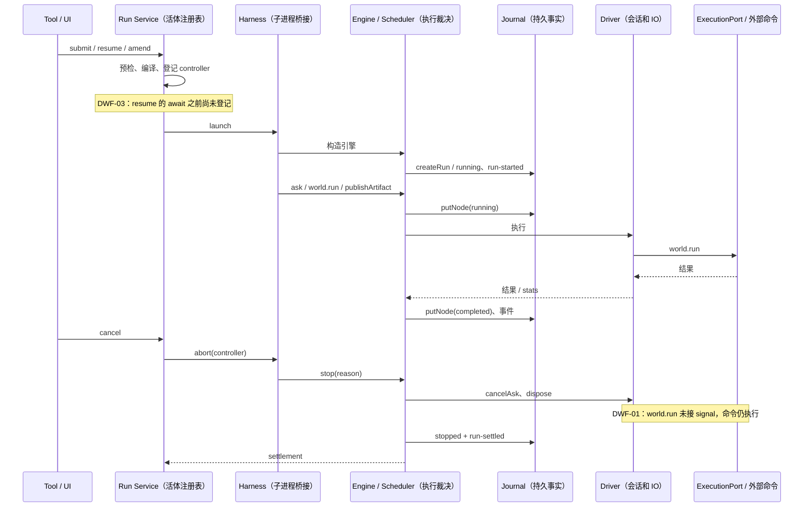

# Dynamic Workflow 深入审查

审查日期：2026-10-08（Asia/Shanghai）。基线提交：`f4da4b0e1e3b1c35a805b95f6c1061a09317b38b`。

审查范围：`apps/acode-cli/packages/dynamic-workflow` 的编译、分析、lowering 与纯执行引擎，`dynamic-workflow-runtime` 的子进程桥接，以及 bootstrap 的 run service、driver、journal/recovery、world 执行、产物发布和 core 的恢复入口。阅读了 CLI 的 `AGENTS.md`、两个 dynamic 包的 README、workflow ports、预算 spec、worktree spec、Script Workflow revival spec；以当前源码作为最终证据。本报告保留原始复现证据；2026-10-09 已完成 DWF-01..04 修复复核。未读取工作区 `.acode/` 用户数据。复现只使用新建的系统临时目录和内存 journal，不请求模型、不使用凭据。

**DWF-01..04 已修复并二次复核。** engine 拥有 lifecycle signal，complete/stop/fail 均 abort 并 drain world，再发布终态；预算拒绝作为 durable failed ask 重放 catch，缺席 actorSeq 且不计 admission 预算。resume 采用同步 reservation，artifact 采用 id FIFO 与全局 admission lane。矩阵 106/106、新增 lifecycle/replay 10/10 通过，含真实子进程和 harness Promise.race。最终门禁与兼容性见 [修复记录](fix-status-2026-10-09.md)，后文为原始缺陷证据。

### 修复状态

| 编号   | 状态   | 关键证据                                                                            |
| ------ | ------ | ----------------------------------------------------------------------------------- |
| DWF-01 | 已修复 | engine lifecycle → world/ExecutionPort，所有终态先 abort/drain；兄弟 run 不被取消。 |
| DWF-02 | 已修复 | 拒绝落 failed ask、无 actorSeq；恢复忠实重放拒绝，不重新 admission 或阻塞 FIFO。    |
| DWF-03 | 已修复 | 同 runId resume 使用同步 reservation，重复并发被拒绝。                              |
| DWF-04 | 已修复 | artifact id FIFO、全局新 id admission、失败不消费版本；新增竞态测试。               |

| 编号   | 级别 | 确认程度                           | 结果                                                 |
| ------ | ---- | ---------------------------------- | ---------------------------------------------------- |
| DWF-01 | P1   | 当前源码 + 真实子进程复现          | `world.run` 在 run 停止后继续执行，仍能写文件        |
| DWF-02 | P1   | 当前源码 + 引擎复现                | 积压预算拒绝制造 actorSeq 空洞，resume 永久等待      |
| DWF-03 | P1   | 当前源码 + 两次真实 launch 复现    | 并发 resume 启动两个同 runId 引擎，注册表只保留一个  |
| DWF-04 | P2   | 当前源码 + 合法脚本分析 + 引擎复现 | 同 id 并发发布得到重复版本，live/recovery 计数不一致 |

## 状态所有者与事件顺序

当前职责划分基本合理：纯引擎拥有 run/node 的执行裁决；scheduler 拥有 actor FIFO 与 ask admission；driver 拥有 actor runtime、submit/escalate 和真实 IO；service 拥有本进程的活体句柄与恢复入口；journal 是持久事实，UI 投影是读模型。以下图中的 Note 标明本轮需要收敛的边界。



修复的方向应保留上述单一裁决者：service 在异步工作前取得 run admission；engine/driver 将 run 生命周期取消传播到每个外部副作用；journal 明确记录所有会影响脚本分支的准入结果；产物 owner 在异步 IO 前串行分配身份。不要让 UI、超时轮询或额外状态表猜测这些事实。

## DWF-01：run 已停止，`world.run` 仍继续执行

**P1；已确认。** 真实 `NodeExecutionAdapter` 执行一个 250 ms 后写临时文件的命令，调用 `engine.stop("user")` 并等待 stopped settlement 后，文件仍被写入。

源码证据：

- [`workflow-world-read.ts:39`](../../../apps/acode-cli/packages/bootstrap/src/app/workflow-world-read.ts#L39) 的 `WorldReadDeps` 没有 run signal；[`workflow-world-read.ts:323`](../../../apps/acode-cli/packages/bootstrap/src/app/workflow-world-read.ts#L323) 调 `executionPort.run(request)` 时不传第二参数，尽管 [`execution.port.ts:244`](../../../apps/acode-cli/packages/contracts/src/interfaces/execution.port.ts#L244) 已支持 `ExecutionRunOptions.signal`。
- [`workflow-driver.ts:430`](../../../apps/acode-cli/packages/bootstrap/src/app/workflow-driver.ts#L430) 的 dispose 释放 actor sessions、订阅和映射；[`workflow-driver.ts:461`](../../../apps/acode-cli/packages/bootstrap/src/app/workflow-driver.ts#L461) 的 world 执行只委托，没有持有可取消的执行句柄。
- [`engine-settlement.ts:49`](../../../apps/acode-cli/packages/dynamic-workflow/src/engine/engine-settlement.ts#L49) 只中止 scheduler 的 ask；[`engine-world.ts:148`](../../../apps/acode-cli/packages/dynamic-workflow/src/engine/engine-world.ts#L148) 在迟到结果到达时因 run 已结算而直接抛错，因此 world 节点继续保持 `running`。

**触发条件。** 脚本正在等待 `world.run` 时用户 Cancel/TaskStop、service close 或 amend supersede；脚本用 `Promise.race` 返回而还有未完成 world 命令时，同一取消缺口也存在。后一类影响由相同 finishRun/dispose 路径证实，未另跑 UI 测试。

**实际影响。** 用户看到停止成功，命令仍能修改工作区、发送网络请求或继续占用资源。amend 已等待前驱 settlement 后仍可与旧命令同时改写 cwd；resume 看到旧节点为 running 会重新执行，有重叠或重复副作用的风险。真实复现确认的是 stopped 后继续写临时文件，网络/部署影响是此执行模型下的后果，未访问真实服务。

**原因。** run abort 只进入 harness/engine，actor turn 有 abortController，world IO 没有同等生命周期。结算 promise 表示业务状态结束，并不表示外部命令已结束。

**修复建议。** driver 为本 run 的所有 world 操作持有统一取消 signal/执行登记；通过 `ExecutionPort.run(request, { signal, context })` 传到 adapter，dispose 时取消，禁止取消后新派发。amend 在允许后继写入之前等待取消副作用实际静默，避免以 run settlement 代替 IO quiescence。不得直接关闭共享 execution adapter，因为兄弟 run/会话仍依赖它。

**验收。** 覆盖 user/model/interrupted/superseded、正常 complete 抛弃 `Promise.race` 输家，真实子进程写 marker 的用例应证明终态后不会再写；同时验证兄弟 run 不被误杀，cancel 后的 world 节点与恢复规则明确一致。

复现步骤（本轮实际执行）：

1. 创建临时 cwd、`InMemoryJournalStore` 和 `WorkflowEngine`；driver 的 world 执行委托真实 `executeWorldRead`，后者使用真实 `createNodeExecutionAdapter()`。
2. 调 `engine.worldRead("world#1", "run", [process.execPath, ["-e", "setTimeout(()=>require('node:fs').writeFileSync(process.argv[1],'post-stop'),250)", marker], { timeoutMs: 2000 }])`，并监听 adapter 收到 run 请求。
3. 请求已派发后立即 `engine.stop("user")`，等待 `engine.settled`，随后等待 world promise 的最终拒绝。
4. 读取临时 marker 与 journal 节点，真实输出如下。`cwd` 字段含测试机临时绝对路径，已从记录中移除。

```json
{ "terminal": "stopped", "reason": "user", "marker": "post-stop", "nodeStatus": "running" }
```

## DWF-02：预算拒绝制造 actorSeq 空洞，恢复挂死

**P1；已确认。** 积压预算本身能正确拒绝当前 promise，但拒绝未 journal 化且消费了 actorSeq；随后成功的 ask 让序列永久缺一格。resume 的 hold/admission 规则无法越过该空洞。

源码证据：

- [`scheduler.ts:173`](../../../apps/acode-cli/packages/dynamic-workflow/src/engine/scheduler.ts#L173) 在预算判定之前执行 `const seq = actor.nextAdmitSeq++`。
- [`scheduler-types.ts:240`](../../../apps/acode-cli/packages/dynamic-workflow/src/engine/scheduler-types.ts#L240) 积压超限只 `deferred.reject(...)`，不写 node；总量拒绝 [`scheduler-types.ts:232`](../../../apps/acode-cli/packages/dynamic-workflow/src/engine/scheduler-types.ts#L232) 也不写行。
- [`scheduler.ts:93`](../../../apps/acode-cli/packages/dynamic-workflow/src/engine/scheduler.ts#L93) 的 `recordedCount` 取该 actor 的 ask **行数**；[`scheduler-types.ts:282`](../../../apps/acode-cli/packages/dynamic-workflow/src/engine/scheduler-types.ts#L282) 的 drain 按 `nextAdmitSeq` 查 `pendingRecorded`；[`scheduler-types.ts:294`](../../../apps/acode-cli/packages/dynamic-workflow/src/engine/scheduler-types.ts#L294) 只有到达 `recordedCount` 才接纳 fresh asks。

**触发条件。** 同一个 actor 连续提交 ask；其中一个因 run pending 上限而被脚本 catch，待前一个结算后继续成功提交；run 随后停止或崩溃并 resume。生产默认 pending cap 是 2048；复现用合法的更严覆盖 1 缩小规模。

**实际影响。** resume 回放第一条成功 ask 后，下一条被拒调用没有记录，被放进 pendingLive；但下一条成功记录的 actorSeq 是 2，scheduler 永远等 seq 1。fresh ask 与已记录的后续 ask 都没有结算；默认 run 没有墙钟超时，会一直 running。再次 stop 只遍历 liveNodes，尚未 admitted 的 pending promises 也不在其中，无法靠普通 ask cleanup 自愈。

**原因。** “拒绝不写行也可确定性重现”依赖 admission 时序与计数在重放时相同；实际恢复先重建全 run 计数，已完成节点以缓存释放，pending 压力也已改变，拒绝的位置不是仅凭成功行就可恢复的事实。序号递增进一步造成永久空洞。

**修复建议。** 先定义“被预算拒绝的调用”在执行轨迹中的身份与重放语义，再实现：将拒绝决策以可重放记录或稳定的 admission 事件记下；actor FIFO 不能用成功行数推断连续序列，也不能先消费 sequence 再丢弃事实。仅把 `nextAdmitSeq++` 移到 budget check 之后不足以保证分支保真，因为 resume 的 pending 压力已不同。run 终态需要拒绝所有 pendingRecorded/pendingLive deferred，确保当前调用者也能收口。

**验收。** 同 actor pending 拒绝→catch→成功重试→stop→resume 必须复现同一拒绝、同一后续结果，且完整 run 能结束；跨 actor 高 fan-out 下的拒绝顺序、总量拒绝后的 catch/report、取消 admission hold 中的节点都应覆盖。

复现步骤（本轮实际执行）：

1. 构造 caps `{ maxConcurrency: 1, maxPendingAsks: 1 }`，actor `agent#1@1`，driver 暂不结算 ask。
2. `ask#1` 入队；`ask#2` 被 `AgentBudgetExceeded` 拒绝；手动用 `askTurnEnded` 结算第一条，再提交并结算 `ask#3`。
3. `stop("user")`，用同一 journal/runId 构造新引擎；按原顺序再调用这三次 ask。
4. 第一条已缓存兑现，30 ms 后第二和第三条仍 pending；journal 只包含 actorSeq 0 与 2。本轮未通过超时修复它，30 ms 只是观察，静态状态机证明已无能使 seq 1 到达的事件。

```json
{
  "case": "pending-refusal-replay",
  "refusal": "AgentBudgetExceeded",
  "rows": [
    { "site": "ask#1", "seq": 0, "status": "completed" },
    { "site": "ask#3", "seq": 2, "status": "completed" }
  ],
  "q2Settled": false,
  "q3Settled": false
}
```

## DWF-03：异步 resume 缺少独占 admission，可启动两个同 runId 引擎

**P1；已确认。** 在同一 service context 对一个带 `resumedFrom` 的 stopped run 同时 resume，两次都成功，两个引擎共写一份 journal，而 Map 只保留后一个句柄。

源码证据：

- [`dynamic-workflow-run-submit.ts:406`](../../../apps/acode-cli/packages/bootstrap/src/app/dynamic-workflow-run-submit.ts#L406) 检查 `runs.get(runId)` 的 live 条目。
- [`dynamic-workflow-run-submit.ts:461`](../../../apps/acode-cli/packages/bootstrap/src/app/dynamic-workflow-run-submit.ts#L461) 到 467 行等待 `rebuildImportedCacheForResume`；[`dynamic-workflow-import.ts:540`](../../../apps/acode-cli/packages/bootstrap/src/app/dynamic-workflow-import.ts#L540) 的重建是异步构建函数。即使前驱没有 actor、无需真实存储 IO，`await` 仍让出执行。
- 直到 [`dynamic-workflow-run-submit.ts:501`](../../../apps/acode-cli/packages/bootstrap/src/app/dynamic-workflow-run-submit.ts#L501) 才 `runs.set(runId, entry)`，随后 [`dynamic-workflow-run-submit.ts:506`](../../../apps/acode-cli/packages/bootstrap/src/app/dynamic-workflow-run-submit.ts#L506) launch。
- [`resume-workflow-run.ts:184`](../../../apps/acode-cli/packages/core/src/tool/handlers/resume-workflow-run.ts#L184) 还声明 `concurrentSafe: true`，会允许 executor 并发派发该工具；UI 与模型并发也是可能入口。

**触发条件。** 同 runId 的两次 resume 在 cache rebuild 的 await 窗口内相遇；至少目标为 amend 后继（`resumedFrom` 在场）。不需要多进程、网络模型或损坏存储。

**实际影响。** 两个子进程和两个 actor/driver 生命周期对同一 runId、同一 actor sessionId、同一 journal 行写入；用户 cancel 只能取消 Map 中最后一个 controller。两条 run-settled 可以互相覆写，前一个可能继续执行副作用；恢复约束、通知计数、token 账及 live lease 均不能可靠保持。真实复现确认两次 launch 和被覆盖的注册表，不使用模型观察重复 token 支出。

**原因。** 已有“注册必须先于 launch”的纪律只覆盖启动末尾，没有覆盖 resume 的整个异步预备阶段；检查与 claim 分离，没有 runId 级独占。

**修复建议。** 在任何 await 前原子 claim `runId` 的 starting/resuming admission；所有启动控制入口通过同一个 owner 管理。预检/重建失败释放 claim，再 launch；关闭期间应等待或取消该 preparing 工作，不能让先通过 assertOpen 的 resume 在 close 后继续 launch。把 `concurrentSafe` 改为 false 可缓解工具同批并发，但不能代替 service 的完整门，因为 UI、两个 App 或其他内部调用仍能到达。

**验收。** 用延迟 transcript/cache reader 故意扩大窗口，同时进行两次 resume，必须一个成功、一个 already_running，且只有一条 run-started、一份可取消控制器；增加 resume 与 close、resume 与 amend、两个服务/进程竞争同 run 的测试。跨进程 owner/lease 是否已阻止同会话启动需另做集成证据，不把单一 Map 当作跨进程证明。

复现步骤（本轮实际执行）：

1. 新临时 cwd；内存 journal 写入 completed 前驱 `pre`，以及 stopped(user) 目标 `target`，目标带 `resumedFrom: "pre"`、脚本文本 `return await files.read("x.txt");` 和匹配 SHA-256。
2. 构造一份 run entry context、一个 Map 和一张 escalation registry；fileSystemPort 的 readFile 挂起，actor factory 不会被调用。
3. `Promise.all([resumeDynamicWorkflowRun(ctx, "target"), resumeDynamicWorkflowRun(ctx, "target")])`；trackSettlement 保存每次 entry 的引用，观察 journal 的 run-started 数量。
4. 输出后中止两份实际创建的 controller 并等待它们 settlement，未留下测试子进程。实际输出：

```json
{
  "results": [
    { "ok": true, "runId": "target" },
    { "ok": true, "runId": "target" }
  ],
  "runStartedEvents": 2,
  "registryEntries": 1,
  "launchedEntries": 2
}
```

## DWF-04：同 id 的并发内容产物得到重复版本

**P2；已确认。** 同一个 id 的两次并发 `artifact.markdown` 都按旧 completed 状态取得 version 1，成功后各写一个 version 1；版本历史不再唯一。

源码证据：

- [`engine-artifacts.ts:132`](../../../apps/acode-cli/packages/dynamic-workflow/src/engine/engine-artifacts.ts#L132) 准入只查看 completed 内存状态；[`engine-artifacts.ts:137`](../../../apps/acode-cli/packages/dynamic-workflow/src/engine/engine-artifacts.ts#L137) 算 `(idState?.versions ?? 0) + 1`，随后开始异步 publish，未预留版本或 id。
- [`engine-artifacts.ts:378`](../../../apps/acode-cli/packages/dynamic-workflow/src/engine/engine-artifacts.ts#L378) 在结算时重新检查 primary 冲突，却没有同等版本/数量复核；[`engine-artifacts.ts:408`](../../../apps/acode-cli/packages/dynamic-workflow/src/engine/engine-artifacts.ts#L408) 用各自旧 issued.version 覆写状态。
- [`engine-artifacts.ts:478`](../../../apps/acode-cli/packages/dynamic-workflow/src/engine/engine-artifacts.ts#L478) resume 恢复按 completed 行数累加 versions；因此 live 的 1 与恢复的 2 不是同一事实。
- [`artifact-read.ts:106`](../../../apps/acode-cli/packages/workflow-run-read/src/app/artifact-read.ts#L106) 按 `(id, version)` 返回首个匹配 row，同版第二份内容无法通过该读取键准确定位。

**触发条件。** 合法脚本同时发布同一个内容 artifact id，例如：

```ts
return await Promise.all([artifact.markdown("report", "one"), artifact.markdown("report", "two")]);
```

本轮对该脚本调用真实 `analyzeWorkflowScript`，返回 `{"ok":true,"diagnostics":[]}`，因此不是仅靠绕过 compiler 的非法接口调用。

**实际影响。** 两份不同内容同属 version 1，脚本拿到相同 ref；UI/字节读接口无法稳定区分版本。live 低估版本数，resume 后下一版编号跳变，16 版上限跨世行为不同。不同新 id 同时通过准入也存在 32 id 上限窗口，属于相同原因的结构推断，本轮只真实复现同 id 重复版本。

**原因。** 版本分配发生在异步 IO 前，却只在完成后记账；两个调用之间没有 identity reservation 或 per-id 顺序控制。成功行计数既用作版本又用作配额，而并发时它不覆盖正在发布的记录。

**修复建议。** 由 artifact owner 串行处理同 id 的 publish，完成/失败后再裁决下一个版本；或设计 durable reservation，并明确失败是否消费版本、崩溃后的 reservation 如何回收。为新 id 的 run 级上限也预留席位，确保 live 与恢复使用同一计量规则。不要只在返回时给结果改号，因为 store/journal/读接口的身份必须一致。

**验收。** 两个同 id 并发发布应得到严格递增且唯一的版本，两份字节可分别读回；测试乱序完成、先失败后成功、第 16/17 版并发、32/33 个 id 并发、发布中崩溃后恢复，live/recovery 应给出相同后续编号和拒绝结果。

复现步骤（本轮实际执行）：

1. driver 的 executeArtifactPublish 保存 request，返回两个由测试控制释放的 promise。
2. 同一引擎先后调用 `publishArtifact("artifact#1", "markdown", ["report", "one"])` 与 `publishArtifact("artifact#2", "markdown", ["report", "two"])`，期间不释放结果。
3. 同时释放两份回执，读取 refs 与 journal 的 completed 记录版本；真实输出如下。

```json
{
  "case": "concurrent-artifacts",
  "issuedVersions": [1, 1],
  "refs": [
    { "id": "report", "version": 1 },
    { "id": "report", "version": 1 }
  ],
  "storedVersions": [1, 1]
}
```

## 两种 Workflow 的语义边界

两种 dialect 共用观测词汇与 UI 时，应保留执行差异。以下按本次检出的实际源码陈述，不能把 Script Workflow revival 文档的全部历史描述当作现状。

| 维度           | Dynamic Workflow                                                                                                                                         | Script Workflow                                                                                                                                                          |
| -------------- | -------------------------------------------------------------------------------------------------------------------------------------------------------- | ------------------------------------------------------------------------------------------------------------------------------------------------------------------------ |
| 作者 API       | `agent(name, persona).ask<T>()`，普通 TS 控制流/Promise join；`files/git/world`、`artifact`、`report`                                                    | `agent(prompt, opts)`，`parallel/pipeline/phase`、`export const meta`、`budget`；`workflow()` 嵌套仍是明确拒绝                                                           |
| 确定性与身份   | 虚拟 TS compiler、站点表/lowering；site×ordinal、actorSeq、inputHash 和结算次序 replay；纯引擎不读时钟/IO                                                | ALS 构造 callPath；缓存键为同 runId+callPath+`hash({opts, phase, prompt})`，不是完整 temporal replay                                                                     |
| resume / amend | resume 要逐字节同脚本+同 args，同 runId；amend 铸新 runId、停止前驱、导入具名 actor 前缀和 world 条目                                                    | `resumeFromRunId` 复用原记录，按调用路径命中 activity，脚本文档可重新读取；不是 Dynamic 的 supersede 语义                                                                |
| 副作用恢复     | world.run 完成结果可以 journal replay；running 节点再次执行，外部效应没有 exactly-once 保证，DWF-01 加剧风险                                             | agent activity 有 completed 缓存，但外部工具中途被中止/进程崩溃仍可能再次执行；也不能宣传 exactly-once                                                                   |
| 预算           | 默认 4096 ask、2048 pending、2,000,000,000 token；更严 engine caps 可覆盖，usage journal 化、跨 resume/amend 继承。token 是事后判定                      | 每次 run 执行的 agent 调用上限 1000（包含缓存查询前的计数），runtime Map 在终态清理；budgetTotal 可存储/注入，但外部指定入口未接出，默认 total=null、remaining=Infinity  |
| 类型结果与产物 | TS interface 合成 JSON Schema、typed submit_result 校验/repair/nudge；用户面 artifact 另有 id/version、primary、预置 spec、字节 store 和 journal reports | 手写 opts.schema 进入提示词，源码 `runLiveAgent` 只对响应做 JSON 提取/JSON.parse；不能视为 Dynamic typed ask 的 schema 验证。worktree material 通过 activity result 留痕 |
| 隔离边界       | 子进程+vm，编译期没有 process/fetch/require；runtime 禁 Date.now/随机数。不是安全沙箱                                                                    | 同样子进程+vm、确定性禁令；外层 DSL 函数注入存在原型上溯出口。worktree 隔离在本 dialect 的 agent opts 接线，Dynamic facade 当前没有 isolation 选项                       |

对比证据：Dynamic 的 [`facade/dts.ts:17`](../../../apps/acode-cli/packages/dynamic-workflow/src/facade/dts.ts#L17)、[`budget-caps.ts:24`](../../../apps/acode-cli/packages/dynamic-workflow/src/facade/budget-caps.ts#L24)、[`harness.ts:200`](../../../apps/acode-cli/packages/dynamic-workflow-runtime/src/harness.ts#L200)；Script 的 [`script-workflow-runtime.ts:51`](../../../apps/acode-cli/packages/bootstrap/src/app/script-workflow-runtime.ts#L51)、[`script-workflow-runtime.ts:375`](../../../apps/acode-cli/packages/bootstrap/src/app/script-workflow-runtime.ts#L375)、[`script-workflow-runtime.ts:490`](../../../apps/acode-cli/packages/bootstrap/src/app/script-workflow-runtime.ts#L490)、[`script-workflow-prepare.ts:35`](../../../apps/acode-cli/packages/bootstrap/src/app/script-workflow-prepare.ts#L35)、[`script-workflow-child-source.ts:242`](../../../apps/acode-cli/packages/bootstrap/src/app/script-workflow-child-source.ts#L242)、[`script-workflow-runtime.ts:444`](../../../apps/acode-cli/packages/bootstrap/src/app/script-workflow-runtime.ts#L444)。

产品文案、tool schema 和 UI capability 要按 dialect 显式分流：例如 Script 的 `resumeFromRunId` 不能使用 Dynamic `ResumeWorkflowRun` 的 same-script 承诺；共用 run 面板也不意味着能力相同。`workflow-typed-artifacts.md` 主要描述旧 expert workflow 的 handoff/critic 数据，不能代替 Dynamic 用户面 artifact/id/version 的运行规则。

## 已有设计优点

1. **纯核心与 IO driver 分离。** dynamic compiler 通过嵌入 stdlib 工作，不读磁盘；runtime 包只依赖纯 dynamic 包与 Node；bootstrap 承担 App 会话和存储适配。上述缺陷都能用无模型替身重现，说明核心可测试边界成立。
2. **journal-first 的保真意识。** 脚本 hash、输入 hash 不一致时 fail-loud；typed 站点缺规格不静默降级；失败结果可重放；replay 记录首生结算次序，处理 Promise fan-out 的续体时序；run result 与终态同一写入，避免 completed 无产物的常见窗口。
3. **amend 前缀和写入失效策略明确。** 具名 actor 唯一、persona 比对、完整 messageBoundary、种子转录截断、关导入缓存事件均是显式事实；对旧无边界记录拒绝，避免伪造可恢复性。待决问题的 deferred 与进程同命，避免把 journal 的历史提问当作 live 等待。
4. **生命周期资源归属较清楚。** runId=background taskId=workId；新建 controller 先入注册表再 launch；父 App 常驻阻塞工作通过结算统一登记；close 的 interrupted 与 user/provider/superseded 语义分辨；driver 不销毁共享执行/MCP/store。
5. **结果与容量边界透明。** report 可保存失败前的成果，world/artifact 超限显式拒绝而非悄悄截断；artifact 文件路径额外 realpath 检查；run artifact 字节读取先验证父会话归属并只读 journal 指定 URI。

## 已知边界与测试缺口

**不能把这些边界写成已完成安全保证。** vm 注入面不是可信恶意脚本安全边界；workflow 确认批准的是脚本能力，`declaredRunCommands` 验证命令字面量也不能约束全部 argv/外部效应；running world.run 崩溃恢复只有至少再执行的语义，没有外部幂等键/事务。worktree 是文件协作隔离，不是 IO/网络/凭据沙箱。以上是当前设计范围，和 4 个可修复缺陷分开处理。

**优先补测试矩阵，而非增加普通 happy-path snapshots。** 现有 `workflow-budget-fuses.test.mjs` 覆盖 total/pending/token、resume 继承、harness 错误码保真；`workflow-script-determinism.test.mjs` 覆盖确定性沙箱；本轮暴露的是这些机制交叉时的空白：

| 交叉场景                               | 本轮证据                      | 建议测试层                                                         |
| -------------------------------------- | ----------------------------- | ------------------------------------------------------------------ |
| pending 拒绝后继续成功，再 resume      | DWF-02                        | 纯引擎 + 真 harness 的完整脚本                                     |
| stopped/amend/complete × world 副作用  | DWF-01                        | 真实 execution adapter、临时 cwd marker；至少 Windows/Linux 各一次 |
| cache rebuild await × 并发恢复/close   | DWF-03                        | run service 契约测试、慢 reader 和真实 harness                     |
| 同 id 发布 × 乱序完成/失败/recovery    | DWF-04                        | 纯引擎 + 字节 store 读回契约                                       |
| 两 dialect 共用投影 × 不同 resume/能力 | 源码职责不同，未做本轮 UI E2E | service/protocol/renderer 联合验证，记录 dialect-specific 能力     |

本轮 4 个定向复现均用 Node `v24.14.0` 和当前工作区 `tsx` 加载源码，命令从仓库根启动，所有探针退出码为 0，输出已在各条目记录；退出码 0 表示**缺陷复现成功**，不表示相应功能通过测试。合法并发 artifact 脚本分析额外确认 `ok:true`。没有调用真实模型/provider、没有声称完成桌面/手机 E2E、SEA/字节码发行包或跨操作系统运行验证。全仓 typecheck/lint/test 的真实结果由本次项目总审查索引统一记录，本分报告不重复或假定其结果。

修复顺序建议：先 DWF-01 的外部效应取消与 DWF-03 的 admission 独占，再完成 DWF-02 的拒绝重放契约，最后修 DWF-04 版本/席位分配。每项应先更新对应 spec 和验收用例，再实施，保持唯一 owner、存储事实和实时事件一致。
