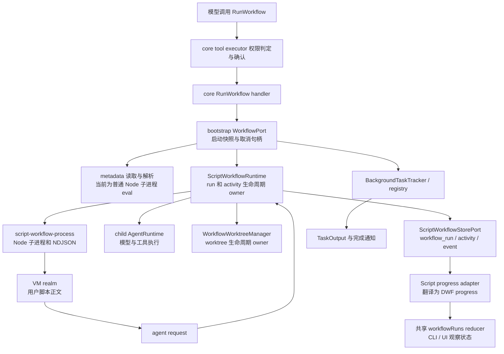
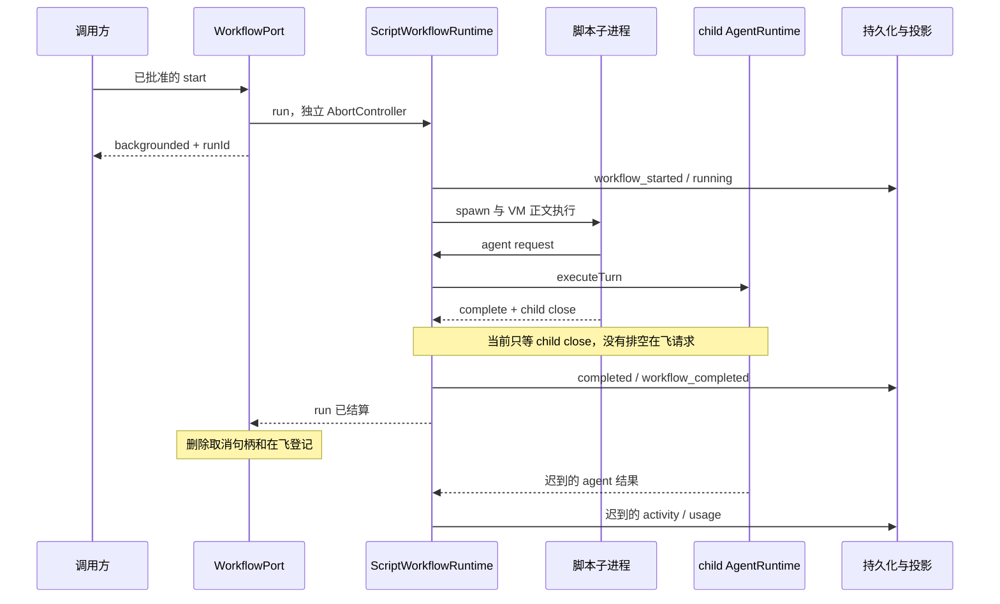

# Script Workflow 深度审查

审查日期：2026-10-08。源码基线：`f4da4b0e1e3b1c35a805b95f6c1061a09317b38b`。本报告是完整项目审查的 Script Workflow 分报告，关注 CLI、状态所有者、两套 Workflow 的接口适配、取消、恢复、计量与执行边界；下方保留原始问题证据并追加修复复核状态。

2026-10-09 补充完成 SWF-07 的失败用量结算复现和 SWF-08 的跨 session resume owner 复现，并已完成 SWF-01..08 修复与回归测试。

**SWF-01..08 已修复并二次复核。** 请求排空、取消、durable 结果/TaskOutput/getTask、最新 attempt 冷回放、纯 AST meta、activityId worktree 与 resume owner gate 已覆盖。用量由 SQLite activityId 幂等事务结算，重试和观察失败不双计，元数据更新不覆盖并发统计；结算缺失保存 incomplete。相关回归 84/84，用量/取消 focused 19/19。最终门禁见 [修复记录](fix-status-2026-10-09.md)，后文保留原始证据。

### 修复状态

| 编号   | 状态   | 关键证据                                                                                                                               |
| ------ | ------ | -------------------------------------------------------------------------------------------------------------------------------------- |
| SWF-01 | 已修复 | child close 后排空已接纳 request；run 终态等待 handler 收口。                                                                          |
| SWF-02 | 已修复 | durable result 投影到 `resultText`、TaskOutput、完整 getTask 和 resume 通知。                                                          |
| SWF-03 | 已修复 | 冷回放按最后一个 `workflow_started` 切 attempt。                                                                                       |
| SWF-04 | 已修复 | 入口、写库和 spawn 前检查 aborted，race 时 kill child。                                                                                |
| SWF-05 | 已修复 | meriyah AST 纯字面量解析，无 eval/Node 子进程副作用。                                                                                  |
| SWF-06 | 已修复 | worktree branch 名加入 activityId。                                                                                                    |
| SWF-07 | 已修复 | 真实 child stats 按 activityId 同事务写 aggregate/ledger；commit 响应丢失重试幂等、incomplete durable，尾部失败不改 completed 或双计。 |
| SWF-08 | 已修复 | parentSessionId、workspaceIdentity、remoteSessionId owner gate；foreign run fail-closed。                                              |

## 审查范围与证据等级

阅读范围包括 `apps/acode-cli/AGENTS.md`、Script Workflow 的 contracts、`bootstrap/src/app/script-workflow-*`、worktree manager、`RunWorkflow` 工具、headless 权限入口、后台任务 registry/TaskOutput、存储仓库、冷回放/共享投影、复活 spec 和相关测试。

原始审查只进行源码审查、假端口调用和系统临时目录中的行为复现；未读取现有 `.acode/` 用户数据，未使用模型服务或真实凭据。修复复核新增了对应 focused 测试，仍未提交。以下“行为确认”表示调用当前源码的真实函数并观察到结果；其中涉及 agent 的测试通过假 `handleRequest` 控制时序，不宣称已经调用真实模型或真实业务工具。

| 编号   | 优先级 | 确认程度                               | 核心问题                                                                 |
| ------ | ------ | -------------------------------------- | ------------------------------------------------------------------------ |
| SWF-01 | P1     | 真实子进程行为确认                     | 尚未完成的 agent 请求不参与 run 结算，终态后仍可继续副作用               |
| SWF-02 | P1     | 真实 registry/投影/端口函数行为确认    | TaskOutput 无结果、完成快照丢返回值、resume 后通知被旧 claim 吞掉        |
| SWF-03 | P2     | 真实 replay + 共享 reducer 行为确认    | 最新 attempt 已中断，旧终态事件仍阻止补结算，冷恢复显示 running          |
| SWF-04 | P2     | 真实子进程行为确认                     | 已经 aborted 的 signal 不阻止 spawn 或执行正文                           |
| SWF-05 | P2     | 真实 metadata 解析及临时文件行为确认   | 纯字面量契约未落实，metadata 在普通 Node realm 内被 eval                 |
| SWF-06 | P2     | 真实临时 Git 仓库行为确认              | 重复或归一化后相同的显示 label 造成 worktree 分支身份碰撞                |
| SWF-07 | P2     | 真实 runtime + 受控 child/store 复现   | 失败/取消/schema-invalid 漏记用量；投影写失败还会重复 agent 计数         |
| SWF-08 | P1     | 真实 tool port + 假 store/runtime 复现 | resume 仅按全局 runId 取旧脚本，跨 workspace 在当前 cwd 执行并复用旧缓存 |

## 所有者与事件顺序



正常模型调用路径确实先通过权限，再进入 metadata 解析与正文执行。SWF-05 不应被描述为“批准前执行”或“绕过 alwaysAsk”。正常顺序的源码依据是 `apps/acode-cli/packages/core/src/tool/executor/call-runner.ts:309` 的 `resolveToolPermission`，随后 `call-runner.ts:463` 调用 handler；`apps/acode-cli/packages/core/src/tool/handlers/run-workflow.ts:83` 才调用 `port.start`。



应有的收口顺序是：停止接纳请求 → 取消或完成已接纳请求并排空 → 确认 activity 与计量写完 → 落 run 终态 → 发最终通知 → 删除取消与 attempt 句柄。不能把 child 退出当作父侧所有外部工作都已停止的证据。

## SWF-01：run 在未完成的 agent 请求仍执行时提前结算

**优先级：P1。确认程度：真实子进程行为确认，真实模型副作用未执行。**

**源码证据。** `apps/acode-cli/packages/bootstrap/src/app/script-workflow-process.ts:95` 收到每一行后使用 `void handleChildLine(...)`，不登记或等待处理中的 Promise；`:113` 只等待子进程 `close`；`:184` 的 `handleRequest` 可以在 child 退出之后继续执行。`apps/acode-cli/packages/bootstrap/src/app/script-workflow-runtime.ts:268` 在 child 返回后写 completed，`:307` 起清理 agent 计数、用量串行链和投影上下文。

**触发条件。** 脚本提交没有 await 的 agent 调用后返回，或者启动 agent 请求后正文抛错。例如：

```js
void agent("unawaited");
return "done";
```

该脚本不需要 Node 逸出、异常 schema 或非法 agent 入参。只要它的 agent 请求在 child 退出前已经送到 parent，parent 就可以继续处理。

**最小复现与结果。** 用附录 A 的真实 `runScriptWorkflowChild`，将 `handleRequest` 阻塞在测试可控制的 Promise 上。child 在父侧请求未完成时返回：

```json
{
  "probe": "undrained-request",
  "value": "done",
  "requestSeen": true,
  "requestDone": false,
  "elapsedMs": 73
}
```

**影响。** 真实请求链是 `runAgent → runLiveAgent → childRuntime.executeTurn`。run 已完成、取消句柄被删、完成通知可以已经送出时，旧请求仍可花 token、运行工具、写 activity、写计量和投影。端口此时允许 resume 同一个 runId，旧请求与新 attempt 会继续交错。用户看到的“已完成/已停止”不能代表副作用已停止。

**根因。** 脚本子进程生命周期与父侧 agent 请求生命周期没有统一结算边界。脚本返回只意味着 JS 正文完成，不意味着已发送的父侧执行请求完成。

**修复建议。** 在 run owner 下登记所有接纳的请求。收到 complete、child close、脚本失败或取消时，明确停止 admission，取消或排空已接纳请求，等待其持久化和计量结束后再落 run 终态。取消 signal 应传播到执行面和等待队列。仅在技能里要求“所有 agent 都必须 await”不能代替 owner 的收口。

**验收场景。**

1. unawaited agent 阻塞时，run 不得对外宣告已完整结算。
2. 启动 agent 后脚本抛错时，所有已接纳 agent 必须取消并排空。
3. TaskStop 返回最终停止后，不得新增模型请求或工具副作用。
4. 终态通知恰好一次，终态后不得再追加该 attempt 的 activity/usage。
5. 旧 attempt 排空前 resume 必须拒绝，排空后新 attempt 不受旧结果污染。

## SWF-02：返回值与 resume 生命周期没有完整接入后台任务面

**优先级：P1。确认程度：当前 registry、TaskOutput 投影与 WorkflowPort 函数行为确认。**

本项包含三处不同接线缺口，建议分成独立修复提交；共同验收对象是“脚本 run 结果从 runtime 到后台接口的完整交付”。

### A. TaskOutput 不能读取脚本返回值

**源码证据。** `apps/acode-cli/packages/core/src/tool/executor/background-task-registry.ts:162` 的 `runtimeTaskResultText` 只接纳 Dynamic Workflow，RunWorkflow 不写 registry 的结果；`apps/acode-cli/packages/core/src/tool/handlers/task-output-projection.ts:39` 只有 `local_dynamic_workflow` 走结果投影；`:43` 的 `local_workflow` 落入 outputFile 读取，而 Script Workflow 不提供 outputFile。

**触发与影响。** 任意 Script Workflow 完成后，按启动响应建议调用 TaskOutput。完成快照携带 `output.response: "result: 42"` 时，真实 register/update/project 函数链仍返回：

```json
{ "taskOutput": "" }
```

TaskOutput 的读取会 claim 完成通知，空结果因此还可能让模型失去后续通知带回结果的机会。工具接口推荐了一个实际不能交付结果的通道。

**修复建议。** 将 Script Workflow 完成文本或 durable 顶层返回值存入 registry 的明确字段，并增加 `local_workflow` 的 TaskOutput 投影。结果读取成功才认领通知，不得把空输出当作完整产物已交付。

### B. 完成后的 getTask 把完整结果降成状态摘要

**源码证据。** `apps/acode-cli/packages/bootstrap/src/app/script-workflow-tool-port.ts:61`、`:64` 优先读取数据库重建快照，覆盖 `launchSnapshots`；`:131` 保存的是完整 runtime response；`:280` 的数据库快照只返回 `Workflow completed: <runId>`。`apps/acode-cli/packages/bootstrap/src/app/script-workflow-runtime.ts:273` 已把真正的返回值保存在 `workflow_completed` 事件的 `result` 中，但端口没有读取接线。

**最小结果。** 用假 store 提供一条 completed run，调用真实 `port.getTask`：

```json
{ "output": { "response": "Workflow completed: wf_result-review", "status": "completed" } }
```

**影响与范围。** running 期已挂上的 waiter 可以从 completion Promise 拿到完整 response，所以不能声称“第一次通知必然无结果”。但之后的 getTask、已完成时的 waitForTask、快速完成后 tracker 的首次读取，以及冷恢复都只得到状态摘要。

**修复建议。** 确定 durable 结果的唯一读取接口。运行时快照与冷恢复快照必须同形，不能通过“先读库还是先读 Map”决定是否能拿到产物。顶层返回值已经存在事件中，应明确按最新 attempt 读取或存入结果表/字段。

### C. 同进程 resume 后第二次通知被旧 notified 吞掉

**源码证据。** `apps/acode-cli/packages/core/src/tool/executor/background-task-registry.ts:78` 的 rearm 只认 Dynamic Workflow；`:100` 对 RunWorkflow 保留 `notified:true`；`:176` 的 claim 因旧 notified 拒收。`apps/acode-cli/packages/bootstrap/src/app/script-workflow-tool-port.ts:78` 明确在 Script resume 时复用 wf\_ runId。

**最小复现。** 使用真实 registry 原语执行：

```text
register RunWorkflow → completed → claim 第一次通知
→ 同 runId register RunWorkflow → completed → claim 第二次通知
```

观察结果：

```json
{ "notified": true, "secondClaim": false }
```

**影响。** resume 的第二次终态已产生，但完成通知被上一轮的 claim 吞掉。旧 error/completedAt 也不重置。branchGeneration 同样没有按新生命重盖；rewind 后 resume 可能因此触发旧分支 fencing，这一扩展影响没有独立行为复现，不能写成已证实。

**修复建议。** 为 Script resume 定义新 attempt 的重臂语义：保留 run 身份和原始工具锚，复位结算面，重新盖当前分支 generation，通知认领必须属于 attempt。不要把所有重复 register 都当成新 attempt，否则晚挂载会重复发通知。

**本项共同验收。**

1. 完成后 TaskOutput 返回真实结果，失败时返回真实错误，取消时说明停止原因。
2. running 期阻塞读取、快速完成后读取与冷恢复读取得到同一结果。
3. completed→resume、cancelled→resume 的每个 attempt 恰好通知一次。
4. 已读取某 attempt 的结果不影响下一 attempt 的通知。
5. rewind→resume 不被旧 generation 丢弃，旧错误和完成时间不混入 running 新 attempt。

## SWF-03：resume 后宿主退出，冷回放仍显示 running

**优先级：P2。确认程度：真实 replay 和共享 reducer 行为确认。**

**源码证据。** `apps/acode-cli/packages/bootstrap/src/app/script-workflow-prepare.ts:35` 复用已有 run 行，`apps/acode-cli/packages/bootstrap/src/app/script-workflow-runtime.ts:232` 每次 resume 再追加 workflow_started；`apps/acode-cli/packages/bootstrap/src/app/script-workflow-replay.ts:143` 只在没有任何 settle 时补行结算；`:203` 的 `hasSettledEvent` 用 `events.some(...)`，历史任意 attempt 的终态都满足条件。

**触发条件。** 旧 attempt 已 failed/cancelled/completed，resume 后新 attempt 尚未结算时宿主退出。孤儿收敛已经把当前 run 行写成 cancelled + `ScriptWorkflowInterrupted`，历史事件仍有旧终态。

**最小复现。** 事件按序为 `workflow_started → workflow_failed → workflow_started`，当前行为：

```json
{ "status": "cancelled", "failure": { "code": "ScriptWorkflowInterrupted" } }
```

喂给真实 replay，再用共享 reducer 投影，得到：

```json
{ "probe": "resume-cold-replay", "status": "running", "settles": 1 }
```

**影响。** 旧 workflow_failed 阻止给最新 attempt 补 interrupted；最后的 workflow_started 又把投影改为 running。数据库和目录可说“已中断”，状态卡却仍亮 running，Cancel 指向已不存在的句柄。

**根因与修复。** “run 是否出现过终态”和“最近 attempt 是否已结算”是不同事实。按最后一次 workflow_started 划分 attempt，或者落明确 attemptId，只判断最新 attempt 的终态。历史结算不能替代本轮结算。

**验收。** 失败→resume→崩溃、用户停止→resume→崩溃、成功→resume→崩溃都应冷回放成 stopped/interrupted；最新 attempt 已结算时不得重复合成终态；正常 cold/live 对同一多 attempt 历史产生一致的当前状态。

## SWF-04：预先 aborted 的 run 仍会 spawn 和执行正文

**优先级：P2。确认程度：真实子进程行为确认。**

**源码证据。** `apps/acode-cli/packages/bootstrap/src/app/script-workflow-process.ts:56` 先 spawn，`:88` 只订阅未来的 abort，`:118` 在 child close 后才检查 aborted。`apps/acode-cli/packages/bootstrap/src/app/script-workflow-runtime.ts:202` 起的启动准备包含多次 await，取消可能在正文子进程启动前已经发生。

**最小复现。** 先执行 `controller.abort()`，再传入其 signal，正文为 `log("ran after abort"); return 1;`。附录 A 观察到：

```json
{
  "probe": "pre-aborted-child",
  "events": [{ "payload": { "message": "ran after abort" }, "type": "log" }],
  "error": "AbortError"
}
```

**影响。** 代码确实执行了，退出之后才报告取消。若脚本无限循环或等待不会返回的父请求，已经发生的 abort 不会再次触发 kill，用户可能无法停止这次 run。

**根因与修复。** 事件订阅不重放已发生的 abort。spawn 前检查 signal，挂监听器后再次检查并立即 abort，封住检查与订阅之间的窗口。取消后的 agent queue/worktree admission 也应在启动前检查。

**验收。** 预先 abort 不得 spawn、log 或派 agent；在 metadata 解析、run 写库、spawn 三个准备节点之间取消都应快速结算 cancelled；不得依赖脚本自行完成才能取消。

## SWF-05：纯字面量 meta 实际在完整 Node realm 中执行

**优先级：P2。确认程度：真实 metadata 解析及临时文件副作用确认。**

**源码证据。** `apps/acode-cli/packages/bootstrap/src/app/script-workflow-meta.ts:74` 用非锚定正则寻找 meta，没有检查首条语句；`:89` 直接丢掉其前面的源码；`:95` 用普通 Node 子进程解析；`:182` 使用 `(0, eval)(expression)`。产品规则 `apps/acode-cli/specs/script-workflow-revival.md:270`、`:847` 要求非纯字面量或非第一条语句拒绝；技能 `apps/acode-cli/packages/bundled-skills/skills/script-workflows/SKILL.md:68` 明确禁止调用、spread、computed keys、methods 和 accessors。

**最小复现。** 附录 B 在系统临时目录分配 marker，解析以下内容：

```js
export const meta = {
  name: (process.getBuiltinModule("node:fs").writeFileSync(markerPath, "side effect"), "review"),
  description: "review",
  phases: [],
};
return 1;
```

真实 `readWorkflowScriptDocument` 接纳它，同时产生文件：

```json
{ "probe": "metadata-validation-executes-node", "name": "review", "marker": "side effect" }
```

**影响。** metadata 无需主脚本原型链逸出就能获得 Node 能力。普通 scriptPath 路径在 `apps/acode-cli/packages/bootstrap/src/app/script-workflow-tool-port.ts:306` 验证源文件、`:308` 验证副本，然后 runtime 再读副本；同一个动态 meta 的副作用可以重复。validate facade 也会实际执行 metadata 表达式，不能当成无副作用静态验证。

**权限澄清。** 正常模型调用的 metadata 求值发生在权限允许之后。未发现这一调用链在批准前求值，也没有证明 alwaysAsk 被绕过。缺陷是“纯字面量规则与 VM 边界没有覆盖 metadata 执行面”，而不是未经许可启动正文。

**根因与修复。** object literal 的外形不代表内部全是 literal。改为 JS parser 的 AST 白名单提取：允许纯标量/数组/object/负数 literal，拒绝调用、spread、getter/method、计算属性及 meta 之前实际语句；不要求值。应将验证接口的输入、拒绝错误与无副作用性质写成契约。

**验收。** 纯 meta 可解析；函数调用、访问器、spread、computed keys、模板插值、非首语句均拒绝；使用临时 marker 证明拒绝过程中没有文件/网络/进程副作用。不能只检查最终 Zod shape。

## SWF-06：显示 label 被错误用作 worktree 唯一身份

**优先级：P2。确认程度：真实临时 Git 仓库行为确认。**

**源码证据。** `apps/acode-cli/packages/bootstrap/src/app/workflow-worktree-manager.ts:136` 的 branch 由 runId 与 `input.label ?? input.activityId` 生成，`:139` 的 path 才含唯一 activityId；`:294` 在分支已存在时 checkout 该分支。`apps/acode-cli/packages/contracts/src/workflow/script.ts:49` 的 label 只要求非空，没有唯一性约束。

**最小复现。** 附录 C 初始化一个临时 Git 仓库和提交，用相同 label、不同 activityId 调用两次 ensure：

```js
await manager.ensureWorktree({
  repoDir,
  runId: "wf_review",
  activityId: "activity_1",
  label: "review",
});
await manager.ensureWorktree({
  repoDir,
  runId: "wf_review",
  activityId: "activity_2",
  label: "review",
});
```

第一个成功，第二个失败。为避免记录个人路径，以下输出仅替换临时目录前缀：

```text
fatal: 'acode/workflow/wf_review/review' is already used by worktree at '<临时目录>/wf_review-activity_1'
```

**影响。** 相同显示名在批量 review 或同阶段多个 agent 中合理。parallel/pipeline 将失败转换为 null，编排会少执行一份任务。两个不同 label 在 slug 归一化或长度截断后也可能相同。

**根因与修复。** 显示 label 不是业务唯一身份。branch 必须包含唯一 activityId，label 仅作可读片段。不能通过要求所有调用方自己生成唯一显示名来修补内部身份规则。

**验收。** 在真实 Git 仓库测试相同 label、归一化后相同 label、截断后相同 label；两个 worktree 均能建立并独立写入，clean 回收和 dirty 保留分别正确。

## 两套 Workflow 的边界与差异

| 维度         | Dynamic Workflow                                                              | Script Workflow                                                 | 审查判断                                                           |
| ------------ | ----------------------------------------------------------------------------- | --------------------------------------------------------------- | ------------------------------------------------------------------ |
| 状态 owner   | WorkflowEngine 与 typed actor/node/journal                                    | ScriptWorkflowRuntime 与 workflow_run/activity/event            | 独立写 owner 是良好边界，共享观察适配仍需覆盖完整生命周期          |
| 脚本         | TypeScript 编译、分析、lowering；静态 site id × ordinal                       | JavaScript + meta；运行期 ALS callPath                          | 不能互换；工具描述和技能已明确区分                                 |
| resume       | journal/前缀核验与引擎恢复                                                    | 从头执行 JS；成功 agent 按 runId/callPath/inputHash 命中缓存    | Script resume 不是恢复 JS 指令位置，非缓存副作用仍可能重复         |
| typed 输出   | ask schema/validator/repair 路径                                              | schema 进入 prompt，结果提取后 JSON.parse                       | 当前 Script 实现与技能一致，但复活 spec 的“运行期校验”文字过度承诺 |
| budget       | caps/tokenBudget 与模型请求准入                                               | budget 是观测桩；产品未传 budgetTotal；每 run 1000 agent cap    | 不能宣称 Script 已有总 token/金额硬预算                            |
| 子代理       | 每 actor 独立持久会话；复用 child runtime 创建基础设施并注入 policy/admission | 强制 mode yolo；共享 PermissionService；tools 可选              | 父会话 plan/build 不会自动成为 child 的模式边界                    |
| sandbox      | 子进程 VM，宿主句柄原型链逸出是已知边界                                       | 子进程 VM，同类残余逸出被 spec R4 接受                          | 不能将 VM 称为安全隔离；SWF-05 是另一个未兑现的 metadata 约束      |
| 持久化与事件 | `dwf_*` 表、`dwfrun_*` 标识、原生 DWF progress                                | `workflow_*` 表、`wf_*` 标识、script events 翻译进共享 progress | 身份/事件隔离合理；attempt、返回值和通知适配是当前薄弱处           |
| UI/协议      | 原生 run 状态、目录、详情                                                     | dialect=script，同一个 reducer，冷/实时共用适配器               | 复用观察 owner 可降低漂移；SWF-03 表明最新 attempt 的判断仍缺失    |

### schema：当前技能与 spec 文字冲突

`apps/acode-cli/packages/bootstrap/src/app/script-workflow-runtime.ts:490` 只调用 `parseStructuredResponse`；`apps/acode-cli/packages/bootstrap/src/app/script-workflow-utils.ts:57` 的函数提取文本后在 `:60` 执行 `JSON.parse`，没有针对 JSON Schema 校验值形状。技能 `apps/acode-cli/packages/bundled-skills/skills/script-workflows/SKILL.md:184` 至 `:189` 明确说只有 prompt 指令和 JSON 提取，不验证 schema，也不因形状不符重试。

但 `apps/acode-cli/specs/script-workflow-revival.md:795` 至 `:796` 写的是“schema 是模型手写的 JSON Schema，运行期校验”。因此这里不能说“实现、技能、spec 已共同接受不校验”，也不能直接断定用户需要补 validator。应先确定产品承诺：若维持现状，修正文档的“运行期校验”为“JSON 语法解析，不校验 schema”；若需要严格 typed 输出，先更新规则、接口和失败/修复场景，再实现 validator。此项是文档契约冲突，未另计为已确定的新增行为缺陷。

### budget 与 sandbox：明确接受的边界

技能 `apps/acode-cli/packages/bundled-skills/skills/script-workflows/SKILL.md:200` 说明产品没有调用方供应 budgetTotal，remaining 为 Infinity；1000 agent cap 不是成本预算，超限会使请求失败，也不是优雅停止。不要把这一明确描述的现状当成本轮新发现的预算实现 bug。

spec R4 已接受宿主函数原型链逸出，现有 sandbox 测试还主动证明该残余面可达。当前 VM 主要隔离普通全局和降低无意使用 Node 的可能性，不承诺抵御恶意脚本。Script process 直接 spawn，继承宿主环境；取消实现只 kill 直接 child，未在本次证明其能清理逸出脚本派生的进程树。报告不宣称已经复现凭据泄露、网络攻击或孤儿孙进程。

## SWF-08：跨 session resume 没有 owner 校验

**P1；已确认。** Script 技能明确规定 resume 只能在同一 session（`apps/acode-cli/packages/bundled-skills/skills/script-workflows/SKILL.md:257`），但实现只按全局 `runId` 找到旧行和脚本路径。新 session/new cwd 可以成功启动旧 run：读取旧 workspace 脚本，子进程却使用当前 App 的 working directory，并继续使用旧 runId 的 activity/cache 身份。

**源码证据。** `apps/acode-cli/packages/bootstrap/src/app/script-workflow-tool-port.ts:395–404` 的 `findResumeSource` 只调用 `getScriptWorkflowRun(runId)` 并检查 `scriptPath`，没有比较 `parentSessionId`、`workspaceIdentity` 或 `remoteSessionId`；`script-workflow-runtime.ts:212–224` 的准备路径也没有 owner 校验。`:247–266` 启动子进程时使用当前 App 的 `deps.workingDirectory`。同时 `:382–386` 查询 `findCachedScriptWorkflowActivity` 的键只含 `runId/callPath/inputHash`，不含 session 或 workspace identity。

**实际复现。** 用真实 `createScriptWorkflowToolPort`，仅替换 store/runtime 为受控 fixture：旧 run 的 `parentSessionId` 为 `session-old`、脚本路径为 `C:/old/.acode/workflow-runs/wf_old123.mjs`；新 port 使用 `session-new` 和新 cwd 调 `start({ resumeFromRunId: "wf_old123" })`，结果为 `backgrounded`，runtime 收到旧 `runId/scriptPath`，没有拒绝、没有停在参数校验阶段。这个探针不执行真实脚本和模型，但已经证明 owner gate 缺失及错误的 cwd/identity 组合可进入执行路径。

**影响。** 只要调用方能拿到另一个 runId，就可能在不符合 same-session 契约的 session 中启动旧脚本。脚本读取旧 workspace 内容，却把写入、命令和通知放到新 workspace；同一 run 的旧 activity 结果还可能在新 App 中被当作 cache replay。对不同 `workspaceIdentity` 的远程目录，路径相同也不能替代身份隔离。该问题同时是安全边界和数据正确性问题，优先级定为 P1；本次没有声称已经绕过外层工具鉴权。

**建议。** 在 `findResumeSource` 前以 `parentSessionId + workspaceIdentity + remoteSessionId` 做强 owner 校验；不匹配时结构化拒绝，且不得读取脚本、创建 activity、写 event 或 spawn。若产品要支持显式接管，必须先定义接管命令，重新绑定 cwd/identity/通知 owner，并让 cache key 带稳定 owner。Dynamic Workflow 的跨会话 resume 有源码注释明确属于开放语义，不能把同一结论直接套到 Dynamic。

**验收。** foreign run 在入口即拒绝且无脚本读取、activity/event 写入或子进程；same-session resume 保持既有缓存命中和通知；同路径不同 remote identity 仍拒绝；显式接管若保留，则通知、TaskOutput、cwd 和缓存都归属新 owner，并有独立审计记录。

## SWF-07：失败路径遗漏已发生的子代理用量

**P2；已确认。** `runLiveAgent` 只在 `executeTurn` 成功后读取 child session stats；执行失败、取消和成功响应的 schema 解析失败都会落入统一 catch，以空 stats 加一条 failed call。真实受控 child runtime 证明三条失败路径都会丢失已经持久化的用量。

**源码证据。** `apps/acode-cli/packages/bootstrap/src/app/script-workflow-runtime.ts:483–490` 的 `collectSessionStats` 位于成功 `executeTurn` 之后，schema 解析也在 stats 读取之后；`:535` 起的 catch 在 `:547–551` 使用 `emptyScriptWorkflowStats()`，只增加 `agentCalls: 1` 和 `failedAgentCalls: 1`。成功路径在 `:503–508` 写 completed、`:526` 先追加真实 stats；观察事件写入失败会回到 `:535` 的 catch，再次经过 `:540–546` 和 `:547–551`。`script-workflow-utils.ts:146–166` 的统计读取实际从 `sessionStore.messages` 汇总，`runtime.ts:608–618` 才把 delta 累加到 run。

**实际复现。** 用真实 `ScriptWorkflowRuntime.runLiveAgent`，只替换 child runtime 工厂；每个 child 的消息存有 100 tokens 和 2 次工具调用。执行失败、run-level `AbortError`、`schema` 响应为非 JSON 三种路径的最终 run 都是 `agentCalls: 1, failedAgentCalls: 1, toolCalls: 0, tokens.total: 0, budgetSpent: 0`，但成功路径正确记录 `toolCalls: 2, tokens.total: 100, budgetSpent: 100`。三种失败路径都产生了 0 值的 `workflow_usage` 事件。另一个受控 case 让成功路径在写入 `workflow_usage` 事件时失败：stats 已先写入 100 tokens，随后 catch 再追加空 stats，最终 `agentCalls: 2, failedAgentCalls: 1, tokens.total: 100, budgetSpent: 100`，并出现 `activity_completed` 后又 `activity_failed` 的矛盾事件。未调用真实 provider，故结论是应用侧结算幂等/可观测性缺陷，不延伸为供应商账单错误。

**影响。** 失败或取消的模型调用仍可能消耗 token、工具调用和费用，但 run 摘要、预算投影和后续排查显示为零；这会让失败重试和成本汇总低估实际消耗。观察事件写入失败还会触发 activity 二次失败和 `agentCalls` 重复累计，导致统计与事件状态不一致。

**建议。** 把 child activity 的统计读取放进统一、幂等的结算路径，在 completed、failed、cancelled 和“执行成功但结果解析失败”四种终态只读取并入账一次；统计读取失败要有结构化的未知状态，不能静默伪造成零。run stats 写入与观察事件投影要分离，投影失败不能重新改变 activity 终态或再次计作 agent。`failedAgentCalls` 与已发生的 token 用量应分别表达，不要用空 stats 覆盖真实账本。

**验收。** 上述四种路径均保留 child 已持久化的 100 tokens/2 tools；并发 agent 的 run stats 仍只累计一次；`workflow_usage` 投影写失败不改变已提交 activity 终态、不生成第二次 agent 计数；重启/恢复读取同一 durable 数值；stats 读取失败时 UI 明确显示未知或不完整，而不是 0。

## 失败路径计量与可观测性

SWF-07 已用受控 child runtime 复现；真实 provider 账单差异仍未验证。子会话如果已有持久化模型用量，再超时、取消或后续失败，run 聚合会少计真实花费。

这与“是否有总量硬预算”不同：即使预算只是观测桩，已经发生的用量也应如实计入。建议在统一 activity 结算时从持久化用量取值，保证成功/失败/取消只入账一次，并覆盖执行失败和“成功结果解析失败”两种路径。真实 provider 账单差异没有在本次复现，不能宣称已经证明账单错误。

另一个观测边界是 trace：工具请求带本次 trace，但 Script child 派生使用 runtime deps 的 trace；这可能保留顶层 traceId 而丢失本次工具 span/turn 关联。本次没有抓取真实协议 trace，按待验证风险处理，避免把“traceId 仍一致”误报为“完全无 trace”。

## 已有良好设计

1. wf*/dwfrun*、存储与写入 owner 分离；模型工具名、技能和脚本语法明确区分，避免两个系统写对方状态。
2. 真实子进程测试覆盖 VM 全局隔离、ALS callPath、pipeline/parallel 与大脚本入口文件，验证了跨 realm 和 Windows 命令行上限相关行为。
3. worktree clean 才回收，dirty 产物优先保留，失败不静默退回共享 cwd。
4. 事件先持久化再投影，观察适配器异常不终止 run；cold/live 使用同一映射减少状态漂移。
5. 用户取消、脚本失败、宿主退出分开编码；权限拒绝和未实现 cancel 能力不会假报成功。

## 测试与发布验证缺口

现有 `script-workflow-cancel-and-usage.test.mjs`、agent cap、resume 守卫及 cancel-chain 的多项断言读取源码正则。它们证明某段代码存在，不能证明取消、计量、重臂和结果从头到尾正确。此次 53 项全绿与 8 组行为缺陷并存，就是该限制的直接证据。

建议验收按五条链组织，避免只为每个新 if 再写一条源码匹配：

1. 真实 child + 受控 agent Promise：admission、终态排空和取消竞态。
2. 真实 SQLite store + registry + TaskOutput：产物 durable、完成 claim、多 attempt 重臂。
3. 真实多 attempt 事件流 +共享 reducer：冷恢复、孤儿收敛、最新 attempt 状态。
4. 无副作用 metadata AST 解析：合法 literal、所有非法表达式、marker 不出现。
5. 真实 Git fixture：相同 label、slug 碰撞、独立写入、dirty 保留与 clean 回收。

本次未验证打包后的 CLI bundle、真实模型取消、Desktop continuous 与手机 Web replayable 完整链路、macOS/Linux、跨 Host lease/identity。不能将源码 tests 通过等同于这些表面已通过。

## 执行过的验证

执行时使用仓库指定 Node 24.14.0；`mise` 不在当前环境中，因此没有假称执行过 `mise exec`。以下是从仓库根可重现的命令形式：

```powershell
node --import tsx --test `
  apps/acode-cli/tests/script-workflow-sandbox.test.mjs `
  apps/acode-cli/tests/script-workflow-cold-replay.test.mjs `
  apps/acode-cli/tests/run-workflow-tool.test.mjs `
  apps/acode-cli/tests/script-workflow-cancel-and-usage.test.mjs `
  apps/acode-cli/tests/script-workflow-cancel-chain.test.mjs
```

实际结果：53 tests、53 pass、0 fail、0 cancelled、0 skipped，耗时 2.103 秒。根仓 typecheck/lint/test 的执行结果由总报告记录，本分报告不另声称通过。

以下附录均使用 `node --import tsx --input-type=module -e $reviewScript` 从仓库根执行，将对应 JS 文本放在 PowerShell 单引号 here-string 的 `$reviewScript` 中。没有写入仓库测试或读取现有用户数据库。测试临时目录和 Git fixture 在结束时回收。

## 附录 A：未排空请求、预取消与冷回放复现

```js
import { mkdtemp, rm } from "node:fs/promises";
import { tmpdir } from "node:os";
import { join } from "node:path";
import { runScriptWorkflowChild } from "./apps/acode-cli/packages/bootstrap/src/app/script-workflow-process.ts";
import { replayScriptWorkflowRuns } from "./apps/acode-cli/packages/bootstrap/src/app/script-workflow-replay.ts";
import { reduceWorkflowRunsState } from "./packages/shared/src/acode-protocol-v4/workflow-runs-reducer.ts";

const events = [
  { type: "workflow_started", payload: {} },
  { type: "workflow_failed", payload: { message: "old failure" } },
  { type: "workflow_started", payload: {} },
];
const store = {
  listScriptWorkflowRuns: async () => [
    {
      id: "wf_resume-review",
      status: "cancelled",
      failure: { code: "ScriptWorkflowInterrupted" },
    },
  ],
  listScriptWorkflowEvents: async () => events,
};
const payloads = await replayScriptWorkflowRuns(
  { parentSessionId: "sess_review", store },
  { excludeRunIds: new Set() },
);
let state;
for (const payload of payloads) state = reduceWorkflowRunsState(state, payload) ?? state;
console.log(
  JSON.stringify({
    probe: "resume-cold-replay",
    status: state.runs[0].status,
    stopReason: state.runs[0].stopReason,
    settles: payloads.filter((p) => p.eventType === "run-settled").length,
  }),
);

const dir = await mkdtemp(join(tmpdir(), "acode-script-review-"));
const doc = (body) => ({
  body,
  content: body,
  hash: "review",
  meta: { name: "review", description: "review", phases: [] },
  path: join(dir, "review.workflow.js"),
});
try {
  let requestDone = false,
    requestSeen = false,
    finishRequest;
  const requestBlock = new Promise((resolve) => {
    finishRequest = resolve;
  });
  const started = Date.now();
  const child = await runScriptWorkflowChild({
    document: doc('void agent("unawaited"); return "done";'),
    runId: "wf_unawaited-review",
    workingDirectory: dir,
    handleEvent: () => {},
    handleRequest: async () => {
      requestSeen = true;
      await requestBlock;
      requestDone = true;
      return { value: "late", stats: { tokens: { total: 1 } } };
    },
  });
  console.log(
    JSON.stringify({
      probe: "undrained-request",
      value: child.value,
      requestSeen,
      requestDone,
      elapsedMs: Date.now() - started,
    }),
  );
  finishRequest();
  await new Promise((resolve) => setTimeout(resolve, 20));

  const controller = new AbortController();
  controller.abort();
  const seen = [];
  try {
    await runScriptWorkflowChild({
      document: doc('log("ran after abort"); return 1;'),
      runId: "wf_preabort-review",
      workingDirectory: dir,
      signal: controller.signal,
      handleEvent: (event) => seen.push(event),
      handleRequest: async () => null,
    });
  } catch (error) {
    console.log(JSON.stringify({ probe: "pre-aborted-child", events: seen, error: error.name }));
  }
} finally {
  await rm(dir, { recursive: true, force: true });
}
```

## 附录 B：结果、通知重臂和 metadata 复现

```js
import { mkdtemp, readFile, rm } from "node:fs/promises";
import { tmpdir } from "node:os";
import { join } from "node:path";
import { readWorkflowScriptDocument } from "./apps/acode-cli/packages/bootstrap/src/app/script-workflow-meta.ts";
import { createScriptWorkflowToolPort } from "./apps/acode-cli/packages/bootstrap/src/app/script-workflow-tool-port.ts";
import { InMemoryRuntimeTaskRegistry } from "./apps/acode-cli/packages/core/src/runtime-task/registry.ts";
import {
  registerRuntimeBackgroundTask,
  updateRuntimeBackgroundTask,
  claimRuntimeBackgroundTaskNotification,
} from "./apps/acode-cli/packages/core/src/tool/executor/background-task-registry.ts";
import { projectTask } from "./apps/acode-cli/packages/core/src/tool/handlers/task-output-projection.ts";

const registry = new InMemoryRuntimeTaskRegistry();
const deps = { runtimeTaskRegistry: registry };
const call = {
  name: "RunWorkflow",
  id: "tool_review",
  input: { resumeFromRunId: "wf_resume-review" },
};
registerRuntimeBackgroundTask(deps, call, "wf_resume-review", {});
updateRuntimeBackgroundTask(deps, call, "wf_resume-review", "completed", {
  status: "completed",
  output: { response: "result: 42" },
  completedAt: new Date(),
});
claimRuntimeBackgroundTaskNotification(deps, call, "wf_resume-review");
const first = await projectTask(registry.get("wf_resume-review"), {
  abortSignal: new AbortController().signal,
});
registerRuntimeBackgroundTask(deps, call, "wf_resume-review", {});
updateRuntimeBackgroundTask(deps, call, "wf_resume-review", "completed", {
  status: "completed",
  output: { response: "result: 43" },
  completedAt: new Date(),
});
console.log(
  JSON.stringify({
    probe: "registry-resume",
    notified: registry.get("wf_resume-review").notified,
    secondClaim: claimRuntimeBackgroundTaskNotification(deps, call, "wf_resume-review"),
    taskOutput: first.output,
  }),
);

const port = createScriptWorkflowToolPort({
  sessionStore: {
    createScriptWorkflowRun() {},
    createScriptWorkflowActivity() {},
    async getScriptWorkflowRun() {
      return {
        id: "wf_result-review",
        name: "review",
        status: "completed",
        createdAt: 1,
        scriptPath: "review.workflow.js",
      };
    },
  },
  sessionId: "sess_review",
  traceContext: { traceId: "trace_review" },
  workingDirectory: process.cwd(),
  storageRoot: process.cwd(),
  fileSystemPort: {},
  getRuntime: () => {
    throw Error("unexpected");
  },
});
console.log(
  JSON.stringify({
    probe: "completed-port-output",
    snapshot: await port.getTask("wf_result-review"),
  }),
);

const dir = await mkdtemp(join(tmpdir(), "acode-meta-review-"));
try {
  const marker = join(dir, "meta-marker.txt");
  const content = `export const meta = {
    name: (process.getBuiltinModule("node:fs").writeFileSync(${JSON.stringify(marker)}, "side effect"), "review"),
    description: "review", phases: []
  }; return 1;`;
  const document = await readWorkflowScriptDocument({
    scriptPath: join(dir, "review.workflow.js"),
    fileSystemPort: {
      async readTextFile() {
        return { content, truncated: false };
      },
    },
    traceContext: { traceId: "trace_review" },
  });
  console.log(
    JSON.stringify({
      probe: "metadata-validation-executes-node",
      name: document.meta.name,
      marker: await readFile(marker, "utf8"),
    }),
  );
} finally {
  await rm(dir, { recursive: true, force: true });
}
```

## 附录 C：重复 worktree label 复现

```js
import { execFileSync } from "node:child_process";
import { mkdtemp, writeFile, rm } from "node:fs/promises";
import { tmpdir } from "node:os";
import { join } from "node:path";
import { WorkflowWorktreeManager } from "./apps/acode-cli/packages/bootstrap/src/app/workflow-worktree-manager.ts";

const root = await mkdtemp(join(tmpdir(), "acode-worktree-review-"));
const repo = join(root, "repo");
execFileSync("git", ["init", repo], { stdio: "ignore" });
execFileSync("git", ["config", "user.name", "Review Fixture"], { cwd: repo });
execFileSync("git", ["config", "user.email", "review@example.invalid"], { cwd: repo });
await writeFile(join(repo, "file.txt"), "review fixture");
execFileSync("git", ["add", "file.txt"], { cwd: repo });
execFileSync("git", ["commit", "-m", "fixture"], { cwd: repo, stdio: "ignore" });
const manager = new WorkflowWorktreeManager({ tmpRoot: join(root, "worktrees") });
let one;
try {
  one = await manager.ensureWorktree({
    repoDir: repo,
    runId: "wf_review",
    activityId: "activity_1",
    label: "review",
  });
  try {
    await manager.ensureWorktree({
      repoDir: repo,
      runId: "wf_review",
      activityId: "activity_2",
      label: "review",
    });
    console.log(JSON.stringify({ probe: "same-label-worktree", second: "success" }));
  } catch (error) {
    console.log(
      JSON.stringify({ probe: "same-label-worktree", second: "failed", error: error.message }),
    );
  }
} finally {
  if (one) await manager.releaseWorktree(one);
  await rm(root, { recursive: true, force: true });
}
```

## 修复顺序

1. 先完成 SWF-01 的 admission/排空/终态 owner 规则和行为测试，避免终态后继续执行。
2. 修复 SWF-02 的 durable 结果与 attempt 重臂，使 TaskOutput/通知/恢复交付一致。
3. 在明确 attempt 后修复 SWF-03 冷回放；同时修复 SWF-04 的预取消启动窗口。
4. 修复 SWF-05 的无副作用 AST metadata 解析和 SWF-06 的唯一 worktree 身份。
5. 统一 spec/技能对 schema、预算、sandbox 的承诺，再补失败用量与跨 Host/identity 验收。
