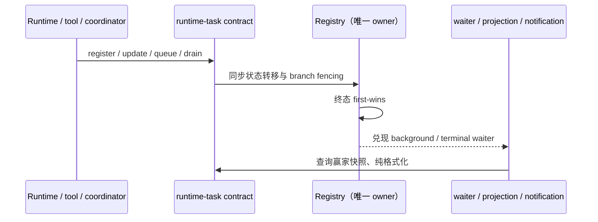

# 架构检查覆盖与 runtime-task 纳管

## 规则与所有者

- `architecture: OK` 只表示已检查范围没有新增违规，不能表示全仓分层、依赖与状态所有权均已通过。
  报告必须列出全仓 discovered source 的 managed / legacy 模块与文件数、实际规则及 legacy 未检查规则；
  `--changed` 的违规子集不改变全仓覆盖统计。
- legacy 文件也解析真实 imports 并加入 reverse dependency graph。来自 legacy 生产源码、指向 managed
  模块的导入必须走该模块公开入口；不能因为 importer 未纳管而绕过新模块边界。白盒测试/评测的
  源码深导入仍不属于生产边界，采用现有 test/eval 分类，不给生产代码新增例外。
- legacy 模块的 `requires`、层定义和公开契约仍不完整，本轮不将 legacy graph 全面标成纳管。
  未声明依赖、无法解析的 workspace 导入、legacy 内部循环、domain IO、层方向与契约规模不在
  legacy 强制范围。全面开启需要
  可复核的存量图基线与分批修复；不得用 HEAD 临时豁免已提交的新债，也不得刷新 baseline 掩盖问题。
- `core/runtime-task` 纳为 managed 纯状态模块：`InMemoryRuntimeTaskRegistry` 是任务快照、pending
  message 与 waiter 的唯一 owner；调用者通过 `contract.ts` 命令与查询，formatter 只读输入并产出文本。
  原有终态 first-wins、branch generation、background/terminal waiter、取消信号与 register 重臂语义不变。
- managed `runtime-task` 的外部依赖只有 CLI contracts 公开入口。CLI contracts 单独登记为 legacy 模块，
  这只提供可解析的边界，不声称其已纳管。通知与 registry 类型归模块内唯一 `types.ts`；XML/截断原语
  单独归 `notification-primitives.ts`，解除 notification 与 workflow 文案格式器的循环。公开 Registry API
  保留 11 个方法，由契约示例验证实现；消费者迁到 contract，core 的包级公开 API 保持兼容。
  `module.ts` 与 `contract.example.ts` 是架构 context / TypeScript 的验证入口，须进入 Knip 分析；
  无消费者的内部 `runtime-task/index.ts` 删除，不删除 `contract.ts` 或 core 包级重导出。
- storage 的浏览器安全服务契约仍归 `contract.ts`；Node 装配工厂、port 类型及 adapters
  从单独的 `node.ts` 公开入口导出。services 的 Node 聚合入口只能经它再导出，不再深入
  storage/app 或 storage/adapters。该入口不新增状态所有者，原扫描/清理生命周期不变。
  同步补齐 storage 的 CONTRACT.md 与可编译契约示例，记录 job owner、取消、旧 job
  事件与最新快照区别以及清理副作用边界，供受控 context 阅读。

## 验收

1. 独立 fixture 同时有 managed 与 legacy 文件：文本、Markdown、JSON 都说明覆盖及未检查规则；
   只改 legacy 文件的 `--changed` 仍报告全仓覆盖。
2. legacy 生产代码导入 managed 私有实现被拒；改成 contract 后通过；白盒测试导入实现允许。
3. runtime-task 无循环、无 IO 依赖、11 方法契约、物理行数满足 managed 门禁；原有终态竞态、通知
   golden、branch generation 与 waiting 行为测试通过。
4. checker 检查既有 baseline 未改写，已有债务与新增违规分开报告；不产生新 ratchet 豁免。

## 明确剩余范围

本次最小闭环不是 `acode-cli` 所有内部包的完整治理：CLI contracts 之外的内部包仍属于 legacy
`acode-cli` 大根。可以解析包名不等于已约束每个包的依赖、exports 或循环；必须继续按模块建立
契约与来源清楚的存量债务清单。桌面 continuous 与手机 replayable 交付仍由各自现有 Host/协议 owner
负责，本模块只提供同一运行时事实的内存快照，不新增远程队列或持久化 owner。
