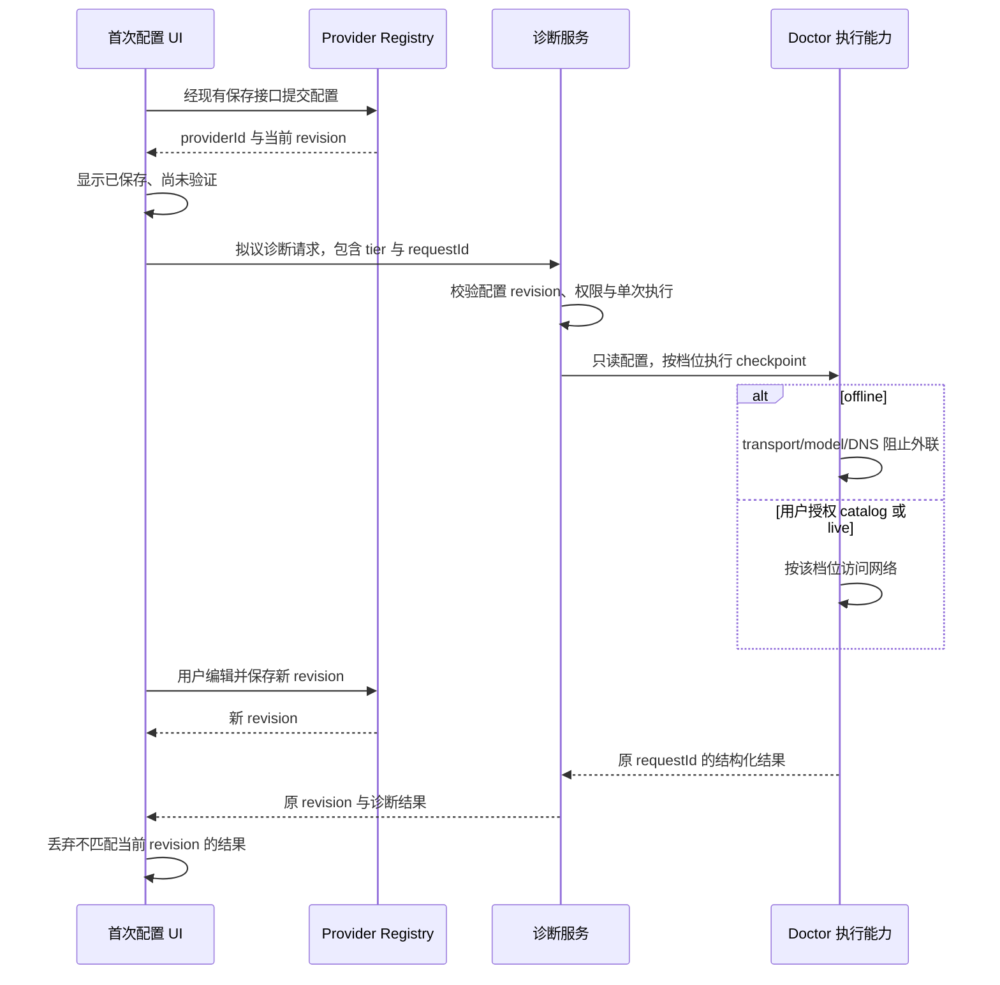

# 产品体验与支持能力升级标准（2026-10）

先为 U07、U08 更新模块 spec 和验收夹具，再实现产品入口；U09 可独立完成文档校准，U11、U12 按依赖顺序推进。

本文细化[项目升级建议](../project-upgrade-recommendations-2026-10.md)中的 U07/U08/U09/U11/U12，仅定义拟议实施标准，不代表行为已经实现。调查日期为 2026-10-09，事实以本文链接的当前源码和 spec 为准。

## 1. 共用实施约束

1. 行为修改先更新对应 spec，列清用户规则、唯一状态所有者、接口、失效条件和验收场景。文档自身不能替代模块 spec。
2. UI 通过 `packages/ui/src/hooks/` 访问服务；跨包只用公开入口。平台下载通过 `IPlatformService`，不直接调用 `window.acode`。
3. 所有标为“拟议”的接口、阈值和脚本必须在实施 PR 中确认或调整；正文中的现有常量不能由建议值静默替换。
4. 默认使用合成会话、图片和凭据夹具。模型 live 测试必须显式授权，记录成本边界；本地报告生成不能触发模型请求。
5. 桌面与手机 Web 分别验证；存在恢复时序时分别验证 `desktop-continuous` 与 `web-remote-replayable`。当前没有统一 E2E 命令，实施方需提供实际运行入口和失败证据。

各项工作量按一名熟悉仓库的工程师估算，包含 spec、实现及针对性验证；共享 E2E 设施、外部 provider 等待和额外协议能力不计入重复投入。

## 2. U07：长对话目录索引与窗口外跳转

### 2.1 用户目标与当前边界

用户打开目录即可找到已经索引的历史输入，点击后定位窗口外正文，查看历史期间仍能收到运行状态，并能明确返回最新位置。

当前已有虚拟列表、有界正文窗口与轻量 turn 索引。`getTurnIndexEntries()` 已存在，但生产目录仍使用 `renderUnits`；`loadAllOlder()` 会逐页读取正文再收集索引。证据见 [projection store](../../packages/ui/src/v4/conversationProjectionStore.ts)、[timeline](../../packages/ui/src/v4/ConversationTimeline.tsx)和[turn index](../../packages/ui/src/v4/conversationTurnIndex.ts)。

[内存 spec](../../packages/ui/specs/renderer-memory-budget.md)当前约束是正文最多 1200 行、32 MiB，索引最多 8000 项；[v4 limits](../../packages/shared/src/acode-protocol-v4/core.ts)中单次 `rowsRange` 最多 200 行。历史报告的 4000 行/128 MB 不能用于当前验收。

本项不建设全文搜索，不保证尚未索引的任意远古输入都能立即定位，不扩大 renderer 预算，不在打开目录时扫描全部正文。超过 8000 项的索引淘汰必须可识别；若产品要求完整历史目录，另立 v4 分页目录能力，追加估算 4–6 人日。

### 2.2 状态所有者与接口标准

| 对象                             | 所有者与约束                                                                                                        |
| -------------------------------- | ------------------------------------------------------------------------------------------------------------------- |
| 目录、正文窗口、分页及请求有效性 | `conversationProjectionStore` 唯一拥有；目录组件只读索引和选择状态，不自行合并正文                                  |
| 权威会话与 row identity          | CLI/runtime 投影事实源；UI 不为历史浏览创建第二份权威会话状态                                                       |
| 历史聚焦                         | **拟议**：同一 store 中的有界派生聚焦视图；与尾部正文合计仍受 1200 行/32 MiB 限制                                   |
| 定位入口                         | **拟议**：store 公共 `focusIndexedRow(target)`；参数包含当前会话、generation、rowId，响应包含定位结果和可恢复错误码 |
| 返回最新                         | **拟议**：store 公共 `returnToLive()`；清理聚焦请求和派生正文，恢复尾部滚动意图                                     |

实施前必须在 spec 中裁决窗口语义：建议保留连续权威尾部，历史焦点只作为派生读取；共享总预算由 store 调整，不能各保留 1200 行后再相加。拟议保留尾部 60 行作为起点，须验证连续更新及 rewind 不变量后才采纳。

现有索引项没有 `turnId`；若定位、编辑或 rewind 需要新增稳定实体标识，标为**拟议字段**并同步严格 schema，不能将 UI 推断出的 turn 当作权威值。远端请求继续带 `workspaceIdentity`、`remoteSessionId`，身份 key 使用既有工具生成。

### 2.3 实施步骤（3–5 人日）

1. 更新内存与导航 spec，裁决聚焦窗口语义、索引覆盖范围、预算归属及“返回最新”；先补 >1200 行、索引淘汰和迟到响应测试（0.5–1 日）。
2. 将现有轻量索引接入目录，显示当前可导航范围；沿用 `DESIGN.md` 的组件、主题和国际化（0.5–1 日）。
3. 在 store 实现拟议定位入口、按需页读取、单次有效请求和总预算管理；焦点失效时返回结构化结果（1–1.5 日）。
4. 连接目录点击、历史焦点和返回最新；手机窄屏关闭目录后正文可独立操作，运行状态保持可见（0.5 日）。
5. 执行 store 行为测试及桌面/手机 E2E，记录请求次数、预算计数、截图和 trace（0.5–1 日）。

### 2.4 编号验收场景

| 编号   | 前提                                     | 操作                     | 必须断言                                                 | 证据                                          |
| ------ | ---------------------------------------- | ------------------------ | -------------------------------------------------------- | --------------------------------------------- |
| U07-A1 | 合成会话 6000 行，目标在索引内、正文窗外 | 打开目录，点击该输入     | 打开目录不请求正文；点击定位到正确 row；不全量加载历史   | 目录 E2E、协议请求记录、目标 row 截图         |
| U07-A2 | 会话仍在持续流式输出                     | 浏览历史，再返回最新     | 历史焦点不吞掉权威更新；返回最新显示当前尾部，没有重复行 | 双 delivery mode 夹具、generation 与 row 断言 |
| U07-A3 | 定位请求尚未返回                         | 切换会话或 workspace     | 旧响应被拒绝，新会话正文与目录未被写入                   | 可控延迟测试、请求标识断言                    |
| U07-A4 | 聚焦目标即将被 rewind/edit 移除          | 执行 rewind/edit         | 索引与聚焦一起失效，显示确定的不可定位状态，无无限重试   | 变更前后索引和预算快照                        |
| U07-A5 | 索引输入超过 8000 项，手机窄屏           | 查找已淘汰入口、关闭目录 | 只承诺现有覆盖范围；淘汰可见；目录不遮挡正文操作         | 8001+ 项测试、手机截图                        |

### 2.5 量化门槛与退出条件

- **现有硬约束**：正文合计 ≤1200 行、≤32 MiB；索引 ≤8000 项；每次 `rowsRange` ≤200 行；索引摘要沿用现有 120 字符上限。
- **拟议请求门槛**：打开目录新增正文请求为 0；一次索引内跳转最多 3 个正文请求，超过范围必须明确取消或继续动作，不能后台遍历全部历史。
- **拟议性能门槛**：固定本地 fixture 中目录打开 p95 ≤100 ms，定位 p95 ≤800 ms；远端用受控 150 ms RTT 单列结果，不混入本地数字。
- **拟议生命周期门槛**：同一 store 最多一个有效定位操作；会话切换、关闭或 generation 变化后，旧结果应用次数为 0。预算断言涵盖焦点、尾部和临时 page buffer。
- **验收记录**：至少 30 次操作样本，记录机器、构建形态和 fixture；计时是拟议回归目标，当前尚未实测。

依赖 U03 的交互设施及 U06 的预算计数。索引接入可先交付，服务端完整目录不是阻塞条件。[隐藏面板订阅释放](../../packages/ui/specs/hidden-pane-subscription-release.md)已有 lease 规则继续生效，历史导航不能额外长期持有隐藏订阅。

定位失败保留目录与当前尾部，给出重试或返回最新动作。回退到原目录入口时关闭拟议聚焦能力，保留索引与原有持久数据；不能用恢复“全量正文加载”作为回滚方案。任何预算溢出、错会话写入或旧 generation 污染均阻止上线。

## 3. U08：首次配置与模型故障诊断

### 3.1 用户目标与非目标

用户保存 provider 后知道配置已保存还是已验证，能看到明确故障阶段，并在不重复创建 provider 的前提下重试或稍后验证。

当前[首次配置表单](../../packages/ui/src/login/LoginApiKeyForm.tsx)保存 provider、选择默认模型后标记成功；设置页已有[连通性 hook](../../packages/ui/src/hooks/useModelProviders.ts)和[service](../../packages/services/src/model-provider/providerSettingsConnectivity.ts)。[Provider Doctor spec](../../apps/acode-cli/specs/provider-doctor.md)已定义 offline/catalog/live 分档，GUI 应承接其语义。

本项不自动更换模型、不自动修复或覆盖凭据、不承诺 offline 能证明模型可用，不为首次配置或手机另起 Agent/Host，不将诊断失败等同保存失败。

### 3.2 所有者、权限与拟议契约

Registry 保持 provider 配置与目录的唯一写入方，vault 保持凭据唯一所有者；诊断只读已保存配置并返回 checkpoint。UI 草稿属于表单，`saved/unverified` 与 `validated` 是不同状态，只有匹配当前 revision 的结果才有效。

| 档位    | 已有 Doctor 语义                         | GUI 必须呈现的结果                                                 |
| ------- | ---------------------------------------- | ------------------------------------------------------------------ |
| offline | 本地配置、路由与依赖检查；零网络、零费用 | `tier-passed` 或具体失败；不能标为 `ready`                         |
| catalog | 真实目录或 endpoint 检查；不调用模型推理 | 说明会联网；通过仍为 `tier-passed`                                 |
| live    | 非流式、流式与工具解析的实际 probe       | 显式用户选择；提示可能产生费用；仅满足 Doctor 完整条件时为 `ready` |

**拟议公共服务契约**：`runProviderDiagnostics({ providerId, revision, modelSelection, tier, requestId })` 返回固定 checkpoint ID、状态、稳定错误码和允许展示的修复动作；`cancelProviderDiagnostics(requestId)` 只取消该次诊断。最终命名由模块 spec 决定。

调用路径为 UI hook → service 公共入口 → 既有 Doctor 执行能力的合规适配。GUI 不深导 CLI adapters；若抽共享能力，先以架构上下文确认公开模块边界。首次配置可能没有 workspace，不能硬复用当前要求 workspace 的设置页 probe。

用户选择 catalog/live 只授权本次、该档位的请求；授权不成为持久网络绕过。offline 必须在 HTTP transport、model port 与 DNS 等实际入口阻断网络，不能只根据测试名称保证。保留 Doctor 已登记的 live DNS 残余边界，不宣称本项消除该风险。

### 3.3 事件顺序

### 3.4 实施步骤（4–6 人日）

1. 更新首次配置与诊断 spec，复用 Doctor checkpoint、档位与状态；先补无 workspace、零网络、过期结果和重试幂等测试（0.5–1 日）。
2. 定义拟议 service DTO 与适配路径，保证凭据只在受控执行方解析，返回值不含密钥或密钥派生值（1–1.5 日）。
3. 把保存与诊断状态分开，增加档位选择、运行、取消、失败原因及修复动作；同步中英文（1–1.5 日）。
4. 实现单次执行、revision fencing 与重试，沿用现有 provider 保存接口，不增加写入分支（0.5 日）。
5. 用合成 provider 执行三档测试及桌面/手机 E2E；真实 live 另行授权并登记费用和未覆盖条件（1–1.5 日）。

### 3.5 编号验收场景

| 编号   | 前提                                       | 操作                         | 必须断言                                                                                    | 证据                               |
| ------ | ------------------------------------------ | ---------------------------- | ------------------------------------------------------------------------------------------- | ---------------------------------- |
| U08-A1 | 无 workspace，fixture 中配置合法           | 保存后运行默认诊断           | provider 仅创建一次；显示 saved；offline 网络/DNS/model 调用为 0                            | 首次配置 E2E、调用计数             |
| U08-A2 | 错误密钥、空模型目录、失效凭据引用分别存在 | 选择合适档位诊断             | 各自稳定错误码不同；offline 不伪造远端鉴权结论；草稿与已保存配置可继续编辑                  | Doctor fixture 与 UI 状态表        |
| U08-A3 | live 正在执行                              | 修改模型或 provider revision | 原结果不能标记新配置已验证；live 取消不声称退还已发请求费用                                 | 可控延迟测试、revision 断言        |
| U08-A4 | 上一次请求失败或用户双击                   | 重试、连续点击运行           | 仅一次有效执行；不重复创建 provider；按请求返回终态                                         | 单次执行计数、请求日志             |
| U08-A5 | 断网、策略阻断或模型不支持 tool 分别存在   | 运行 catalog/live            | 不可检查与失败可区分；不支持 tool 遵守 Doctor 的 skipped 规则；仅完整 live 满足规则才 ready | 档位/checkpoint 黄金结果、手机截图 |

### 3.6 量化门槛、依赖与回退

- **既有强约束**：offline 外联次数为 0，模型推理次数为 0；live probe 沿用 Doctor `maxOutputTokens: 64` 并服从模型合法范围；不重复定义 checkpoint 顺序。
- **拟议幂等门槛**：相同 provider/revision/model/tier 的并行有效诊断最多 1 个；一次保存操作创建 provider 最多 1 次；迟到结果对新 revision 的状态写入为 0。
- **拟议响应门槛**：本地 fixture 的 offline p95 ≤300 ms；网络档位按阶段可取消并有明确终态。可配置超时建议为 catalog 15 s、live 30 s，需在 spec 中区分阶段，不用超时修补同步错误。
- **隐私门槛**：DTO、UI、日志和测试快照出现完整密钥、Authorization、密钥派生 hash 的数量均为 0。
- **发布门槛**：桌面/手机和中英文状态一一对应；live 无授权时调用数为 0；12 checkpoint 的 ready 判定严格遵守现有 Doctor spec。

依赖 U03 的交互验证及现有 Doctor 公共适配；U12 只消费脱敏结果，不拥有诊断状态。失败不清空已保存 provider；可保持“已保存、未验证”并稍后诊断。

回退时关闭新增诊断入口，保留原保存流程和配置；不能将失败配置标记为已验证。若发现重复写 provider、绕过 offline 网络门禁或 UI 获得凭据，立即阻止发布。费用请求已发出后只能停止后续阶段，不能承诺撤销既有费用。

## 4. U09：文档事实校准与升级、备份说明

### 4.1 目标与范围

用户能从中英文 README 找到当前能力、凭据保护方式及备份限制，知道同机恢复、跨机迁移和混版运行分别有什么风险。

[中文 README](../../README.zh-CN.md)仍包含 OS keychain 是未来方向的描述；[英文 README](../../README.md)已描述部分新行为，但优先级列表仍需逐条核对。[credential-storage spec](../../packages/services/specs/credential-storage.md)及[master key](../../packages/shared/src/node/credentialMasterKey.ts)、[keychain](../../packages/shared/src/node/credentialKeychain.ts)实现是事实依据。

本项仅改文档与事实索引，不运行真实用户凭据迁移，不读取真实密钥，不导出明文，不改变 cipher、钥匙串、文件锁或自动恢复行为。历史[安全交接](../security-hardening-handoff.md)和设计文档保留时间与历史适用范围。

### 4.2 当前事实必须准确说明

| 主题       | 文档必须保留的当前标准                                                                                                     |
| ---------- | -------------------------------------------------------------------------------------------------------------------------- |
| 材料优先级 | 显式注入 secret > OS keychain > 已存在密钥文件 > `ACODE_CREDENTIAL_SECRET` > 新生成随机材料；不能把 env 一律列为最高优先级 |
| 平台实现   | macOS generic-password；Windows DPAPI(CurrentUser) blob；Linux `secret-tool`/D-Bus，不可用时文件 fallback 与告警           |
| 可用与损坏 | 材料可见但读不出时保留现场并报错；不能静默生成新材料或降级覆盖                                                             |
| 文件迁移   | absent keychain + 既有文件才迁移；写入后逐字节回读通过才删除旧文件；同材料迁移不重加密 v2                                  |
| 版本与混版 | 新写仅 v2，v1 只读；R2 新构建可回退读取分歧材料，host CAS 收敛，CLI 不负责重写，旧构建自身仍会失效                         |

必须解释 Linux 文件模式无法防止整个数据目录外带；keychain 模式主要改善材料与密文分离，不能保护同一已授权 OS 用户下执行的恶意进程。Windows blob 物理同目录、受 OS 身份绑定，不能描述为独立可移植密钥文件。

备份说明按存储模式分开：整目录备份不等于备份 OS 钥匙串；跨机通常需要重新登录/输入 Key，不推荐导出明文材料。钥匙串账户包含 keyFilePath 指纹，换数据目录也要说明身份关联，不能只按“仍在同机”断言必然可解。

分歧文件不能未经检查删除：host 只在读取相应值后收敛，CLI 独有值可能仍依赖它。解密失败留下的是加密 `.corrupt-<hash>.bak`，可找回材料后恢复；不能写成保证自动恢复所有登录态。

### 4.3 文档所有者与拟议索引

模块 spec 拥有行为规则，README 只提供入口与使用边界。**拟议文档索引**按“能力、当前状态、权威 spec、验证层级、最近核对日期”记录，不新增运行时状态或程序接口。

双语更新由同一 PR 负责；历史报告保留原始数字并标注日期，链接当前 spec。发布/升级指南标明 pre-v2、pre-R1、R1、R2 等实际行为代际，不能把所有旧版本统称为“仅认 v1”。

### 4.4 实施步骤（1–2 人日）

1. 列出 README、升级说明、安全交接与模块 spec 的事实矩阵，先定义每条描述的引用和验收检查（0.25 日）。
2. 同步修正中英文的优先级、平台机制、迁移、备份与混版边界，链接当前 spec（0.25–0.5 日）。
3. 新增拟议能力/状态索引和升级说明，标清当前实现、历史证据与未验证能力（0.25–0.5 日）。
4. 核验文档链接、现有命令与两种语言的一致性；只使用合成场景解释，检查不含真实凭据（0.25–0.75 日）。

### 4.5 编号验收场景

| 编号   | 前提                            | 操作                   | 必须断言                                                               | 证据                     |
| ------ | ------------------------------- | ---------------------- | ---------------------------------------------------------------------- | ------------------------ |
| U09-A1 | 中英文 README 各一份            | 对照事实矩阵阅读       | 五级优先级、三种平台机制和 fallback 口径一致                           | 逐项文档 diff、spec 引用 |
| U09-A2 | 合成 keychain/file/env 三类安装 | 按备份章节选择恢复方式 | 同机、跨机与数据目录变化分别说明；不保证复制目录即可恢复 keychain 凭据 | 场景矩阵                 |
| U09-A3 | 合成 pre-R1 与 R2 混版案例      | 阅读回滚和分歧说明     | 不建议删分歧文件；明确 CLI 只读与 host CAS 收敛边界                    | 与既有测试对应的文档例子 |
| U09-A4 | 历史报告和已移除模块引用        | 核验能力索引及链接     | 历史数量有日期；现有功能有源码/spec；已删功能不作为当前命令宣传        | 链接与命令检查结果       |
| U09-A5 | 文档带存储失效例子              | 按故障章节判断恢复动作 | 损坏材料保留现场；加密备份不等于恢复成功；材料丢失可需重新认证         | 文案检查、合成例子       |

### 4.6 量化门槛、依赖与回退

- 本次修改涉及的本地相对链接有效率为 100%；文中可执行命令必须存在于当前 `package.json` 或当前脚本文件。
- 五级材料优先级、三类平台和三类备份模式全部覆盖；中英文事实矩阵差异为 0，不以逐字翻译代替规则一致。
- 完整凭据、密钥、token、真实用户目录或内部服务地址的示例数量为 0。
- 历史统计值全部带日期或历史标签；没有执行的构建、设备及真实模型验证不得写成已通过。
- 文档审校可引用现有[master-key tests](../../packages/shared/tests/credential-master-key.test.mjs)、[keychain tests](../../packages/shared/tests/credential-keychain.test.mjs)和[分歧测试](../../packages/services/test/credentialServiceDivergence.test.ts)，本项不要求新跑真实用户存储。

依赖当前 spec 与源码核对，可与 U01/U02 并行，不依赖任何产品实现。发现实现与 spec 冲突时记录待裁决问题，不擅自用文档创建新的迁移规则。

回退只撤销错误文案和链接，不执行数据回滚。若说明涉及无法确认的恢复能力，删除保证性表述并保留可验证边界；不能为消除文档分歧改写现有密钥或恢复历史模块。

## 5. U11：工具图片使用受授权附件引用

### 5.1 用户目标与当前事实

用户浏览图片密集历史时先看到轻量行内容，图片可见或打开预览时才读取字节，重连后仍能预览，其他 workspace/session 的媒体无法被读取。

当前[toolDisplay schema](../../packages/shared/src/acode-protocol-v4/toolDisplay.ts)的 `node_repl_images` 内联 base64，每张最多 `200 * 1024` 字符、最多两张；[renderer](../../packages/ui/src/ToolCallBlocks/renderers/nodeReplImageGrid.tsx)拼接 data URL。lazy img 延迟解码，不减少 row 中的字节。

当前[v4 Gateway](../../apps/acode-cli/packages/bootstrap/src/acode-protocol-v4/v4-gateway.ts)已按权威 userInput 附件，以及当前 session 的 assistant Markdown artifact ref 授权媒体读取；尚不能直接把这些规则用于工具 row。现有 chunk 读取先整文件物化再切片，并非 Host 真正 range IO。

本项不恢复 fail-closed 的 CUA，不增加任意路径读取，不把模型可控 Markdown 当作跨 session 授权，不提高当前 node-repl 图片生产上限。超大媒体、流式文件 range IO 和通用媒体库另立项。

### 5.2 所有者与拟议接口

| 对象               | 所有者与边界                                                                                            |
| ------------------ | ------------------------------------------------------------------------------------------------------- |
| 持久媒体与存储清理 | 既有 CLI/Host 持久化 owner；新工具图片必须先成功持久化，再发布引用                                      |
| wire metadata      | shared v4；**拟议**工具媒体 display variant，只含稳定 ref、mime、bytes、必要尺寸与校验信息              |
| 工具 row 授权      | Gateway 根据权威 session、rowId/entityId、工具产物归属与 ref 精确校验；客户端 ID 不能转换成任意文件路径 |
| 按需读取           | **拟议** v4 工具媒体读取契约，复用有界 chunk 格式，但具有独立工具 row 授权，不能放宽旧附件接口          |
| renderer 缓存      | UI 媒体读取 hook 唯一拥有 byte-bounded Blob 缓存与 URL 生命周期，正文 store 只持 metadata               |

拟议读取请求贯穿 `workspaceIdentity`、`remoteSessionId`、session、稳定 row target、ref、offset/limit 与请求代际；Host owner/lease 继续负责路由。权限来自权威工具产物，不来自 renderer 自报 MIME、bytes 或路径。

兼容策略为旧 inline row 可读、支持新 variant 的客户端读取新引用。新写入前须有明确 capability/schema 协商；不支持新 variant 的客户端不能收到无法解析的 row。存储引用的寿命与会话历史一致，清理不能让仍可浏览的历史出现静默失效。

### 5.3 实施步骤（6–9 人日）

1. 更新工具 display、媒体授权与内存 spec，先补跨 session/workspace、工具归属、旧 row 兼容和持久化失败测试（1–1.5 日）。
2. 在既有持久化 owner 中外置工具图片，采用稳定引用和完整性校验；写入失败不得发布虚假成功引用（1.5–2 日）。
3. 实现拟议 v4 variant 与读取接口，严格 schema、工具 row 授权、范围限制、过期请求和 capability 协商（1.5–2 日）。
4. 通过 hook 实现可见时读取、预览、受限缓存、URL revoke 和错误状态，兼容旧 inline renderer（1–1.5 日）。
5. 执行图片密集 fixture 的双链路 E2E与预算实验，比较 snapshot/replay、按需读取、renderer/Host 内存（1–2 日）。

### 5.4 编号验收场景

| 编号   | 前提                                          | 操作                         | 必须断言                                                      | 证据                      |
| ------ | --------------------------------------------- | ---------------------------- | ------------------------------------------------------------- | ------------------------- |
| U11-A1 | 新格式合成图片历史，图片未进入视口            | 冷启动并恢复 snapshot/replay | row 没有原图 base64；不预读所有原图；引用与元数据可渲染       | schema 快照、传输字节计数 |
| U11-A2 | 工具 row 的有效稳定 ref                       | 进入视口、打开预览、重连     | 按需读取并正确显示；重复预览复用缓存；重连重新授权            | 桌面/手机截图、读取次数   |
| U11-A3 | 另一个 session/workspace 的 ref 或伪造 target | 调用读取接口                 | 明确拒绝；不能依赖 ref 出现在任意文本就授权；没有文件字节返回 | Gateway 故障夹具          |
| U11-A4 | 旧 inline 历史与旧客户端                      | 打开旧历史，协商能力         | 旧图片可读；新 variant 不发送给不支持客户端；无强制全库重写   | 协议兼容黄金测试          |
| U11-A5 | 读到一半时切换会话、关闭预览或资源失效        | 继续返回旧 chunk             | 旧结果不污染新视图；URL 被释放；错误有终态，无无限读取        | 受控时序、缓存和 URL 计数 |

### 5.5 量化门槛与存储边界

- **当前限额**：通用附件总量 20 MiB、单 chunk 512 KiB；图片生产继续服从既有工具上限。视频预览限额引用 `attachmentPreviewMaxBytes`，不借本项重定义。
- **拟议 UI 缓存**：桌面 ≤16 MiB、手机 ≤8 MiB，预览与缩略图合计计数；读取并发最多 2，缩略图单个建议 ≤64 KiB。须先用 fixture 校准再进入 spec。
- **拟议传输目标**：相同 200 张合成图片、关闭预览的冷 snapshot/replay 字节相对旧格式减少 ≥80%；图片按需读取字节另列，不用排除项伪造总带宽收益。
- **授权门槛**：越权夹具返回媒体字节为 0；会话/generation 变化后旧 chunk 应用为 0；cache key 包含 identity/session/ref 和授权版本，不能仅按文件名缓存。
- **内存证据**：正文仍服从 1200 行/32 MiB；媒体缓存单列但加入 renderer 总量实验。Host 整文件物化、缓存和并发成本必须实测，不把 chunk 大小当成 Host 峰值。

依赖 U03 的图片交互和 U06 的性能设施；协议修改需先检查现有 attachment/artifact 公开能力。初期不要求实现真正 range IO，但预算不达标时先减少并发/缓存或另立 range IO，不能宣传已解决超大文件内存。

引用失效显示明确错误并允许按当前授权重试；不能退回任意本地路径。回退新 producer 时保留新 reader 与已持久化媒体；在新 variant 历史存在后不能直接降级到完全不认识该格式的客户端。任何跨身份读取、持久化引用提前发布或静默损坏历史都阻止发布。

## 6. U12：桌面与手机 Web 本地诊断报告

### 6.1 用户目标与边界

用户通过帮助菜单生成本地诊断文件，预览将包含的内容，自行选择是否提供给维护者；手机离线也能导出客户端已知事实。

当前[Desktop exportLogs](../../packages/desktop/src/main/exportLogs.ts)已有日志整理和脱敏，[帮助动作](../../packages/ui/src/lib/helpMenuActions.ts)已有导出分支，但[帮助菜单](../../packages/ui/src/WorkspaceHelpMenuButton.tsx)未暴露该入口；[Web platform](../../packages/web/src/main.tsx)返回 unsupported。已有[memory diagnostics](../../packages/ui/src/lib/memoryDiagnostics.ts)和 Developer Tools 可作为受控事实来源。

本项不自动上传、不增加遥测、不默认采集会话正文、tool input/output、完整 headers、凭据、用户身份、机器路径或原始截图。Web 只报告自身可获得的数据，不声称已读取 Desktop 全部日志，不为导出另起远程 Host 或诊断模型。

### 6.2 拟议报告契约与状态所有者

**拟议 `LocalDiagnosticReport` schema**：严格 `schemaVersion`，包含生成时间、build/version、平台类型、连接档位、稳定错误码、受限计数、现有 provider 诊断摘要和字段可用性；禁止透传 arbitrary metadata。字段规则由 shared 类型与运行时 schema 共同约束。

| 字段组        | 允许内容                                                 | 必须排除或标记                                             |
| ------------- | -------------------------------------------------------- | ---------------------------------------------------------- |
| 构建/环境     | 应用版本、公开 commit、OS/arch、语言、平台能力           | 用户名、主机名、原始 workspacePath、内部 endpoint          |
| 连接状态      | delivery mode、连接阶段、公开稳定错误码、重连次数        | 会话正文、remote token、headers、带 query/userinfo 的 URL  |
| 性能          | 有界行/索引/缓存计数、公开内存可用性                     | 原始堆快照；Web 无 `performance.memory` 时标记 unavailable |
| Provider 摘要 | 用户选择纳入的既有 tier/checkpoint 状态、码              | API key、凭据引用、Key hash、后台自动启动的新 probe        |
| 可用性        | `collected`、`unavailable`、`not-collected`、`truncated` | 未检查字段不得标记 passed/healthy                          |

各服务保持自己状态的唯一所有者，提供白名单 DTO；UI 只组合预览与范围选择。下载通过现有[IPlatformService](../../packages/shared/src/platform.ts)；如需新下载能力，必须标为**拟议接口**，由 Desktop/Web 各自实现，不能直接访问 native bridge。

Desktop 现有 zip 导出继续可用，与轻量 JSON 的范围分别说明。JSON 不接收完整日志再交 UI 清洗；结构化白名单先收口，Desktop sanitizer 处理需要纳入的本机日志。报告生成期遇断线不重连采集敏感信息，只记录来源不可用。

### 6.3 实施步骤（3–5 人日）

1. 更新支持报告 spec，定义 schema、字段来源、截断、可用性与下载契约；先写合成脱敏和离线测试（0.5–1 日）。
2. 为服务、连接和 renderer diagnostics 提供受限 DTO，不增加业务状态副本，不进行 provider probe（0.5–1 日）。
3. 接入帮助菜单、范围选择与报告预览，经平台下载 JSON；保留 Desktop zip 入口及说明（0.75–1 日）。
4. 完成 token、路径、URL 等脱敏 fixture，复核 Desktop 原有 sanitizer，限制 report 大小与条目数（0.5–1 日）。
5. 执行离线手机、桌面及中英文 E2E，确认失败下载能重试且临时 Blob/URL 释放（0.75–1 日）。

### 6.4 编号验收场景

| 编号   | 前提                         | 操作                           | 必须断言                                                                     | 证据                                      |
| ------ | ---------------------------- | ------------------------------ | ---------------------------------------------------------------------------- | ----------------------------------------- |
| U12-A1 | 手机离线，已有客户端计数     | 预览并下载报告                 | 生成客户端 JSON，无外联；远端字段为 unavailable；不触发 Agent/Host/provider  | 手机 E2E、外联计数                        |
| U12-A2 | Desktop 正常连接             | 导出轻量报告及原有 zip         | 两种范围清楚；zip 保持可用；报告 schema 通过，不附带会话正文                 | 文件检查、Desktop E2E                     |
| U12-A3 | 合成敏感 fixture             | 生成 JSON 与允许范围的日志导出 | Bearer/API key/cookie、query token、URL userinfo、Windows/POSIX 路径均不泄露 | 参数化 fixture、精确 forbidden-value 断言 |
| U12-A4 | 指标缺失、权限拒绝、数量超限 | 生成报告                       | unavailable/not-collected/truncated 分别准确；缺失不伪造健康                 | schema 黄金结果                           |
| U12-A5 | 下载失败或生成时连接改变     | 重试或关闭预览                 | 无重复后台采集；旧结果不混入新范围；临时资源释放；错误可恢复                 | 时序测试、Blob/URL 计数                   |

### 6.5 量化门槛、脱敏与回退

- **拟议大小门槛**：轻量 JSON ≤1 MiB；默认最近 15 分钟、事件摘要最多 200 条，超出显式 `truncated`；准确上限须写入 schema/spec。
- **拟议性能门槛**：固定 fixture 的客户端生成 p95 ≤500 ms，30 次样本；Desktop zip 的磁盘 IO 单列，不与 JSON 混计。
- **网络门槛**：导出流程上传次数为 0、模型请求为 0；手机离线能生成可用文件，确实无法下载时显示当前平台受限，不能声称成功。
- **脱敏门槛**：敏感合成值泄露为 0；覆盖 escaped 字符串、日志跨 chunk 分割、大小写差异及多行值。结构化字段优先白名单，不能只靠单个正则。
- **资源门槛**：预览关闭/下载完成后对象 URL 释放率 100%；字段来源与可用性覆盖率 100%，无 `undefined` 被误当通过。

依赖 U08 的结构化诊断结果仅限“已有结果摘要”，可先导出无 provider 部分；不为等待 U08 启动隐藏 live probe。U03 提供下载交互证据，真实手机浏览器下载限制按平台记录。

回退时隐藏新 JSON 入口，保留 Desktop 原有 zip；不删除用户已下载文件，不改变服务事实。任何凭据/正文泄露、默认上传或缺失字段伪造通过均阻止发布。上线前只使用合成数据审查样例，不收集真实用户数据验证脱敏。

## 7. 交付资料与进入实现的条件

每项交付需附 spec diff、模块/接口边界、编号验收结果、执行命令和机器可读计数；存在交互时附桌面与手机截图/trace。测试未运行、平台未覆盖和真实 provider 未授权分别列出，不把静态检查写成运行结果。

当前 root `pnpm typecheck`、`pnpm lint` 与模块测试入口按仓库脚本执行；新 E2E 入口由 U03 建设后给出。性能门槛实施前先跑基线，如需调整，保留原建议、实测证据和批准后的 spec 值。

下一项具体工作：更新 `renderer-memory-budget.md`，裁决 U07 历史聚焦与连续尾部的共享预算，并补充 U07-A1/U07-A3 的测试夹具。
