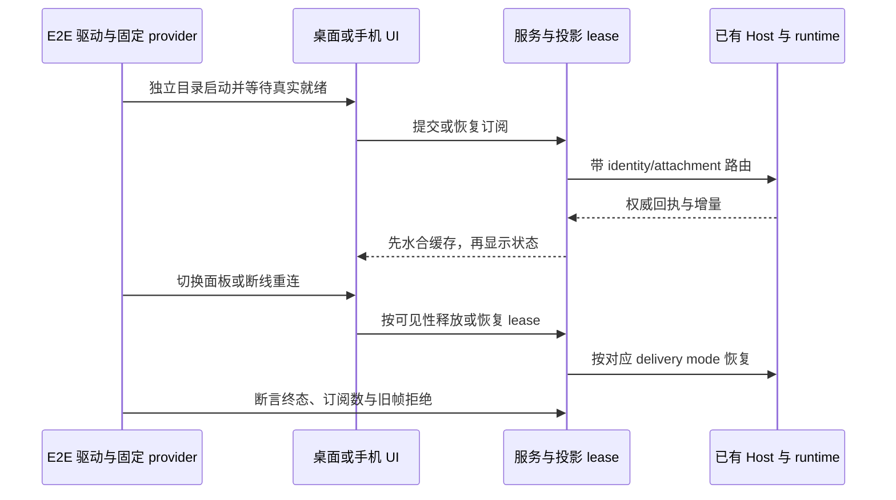

# 质量门禁、交互验证、发布与性能实施计划

U01 的 renderer 与 CLI 入口检查已在 CI 与 release verify 落地，剩余是统一入口与注入验证；接着按 U03、U04、U06 建立可重复的交互、产物和性能验收。

本文细化 [项目升级建议](../project-upgrade-recommendations-2026-10.md) 中的 U01、U03、U04、U06，是立项与实施依据；本文没有新增脚本、测试或流水线。
调查日期为 2026-10-09，细化时检出分支 `fix/cli-subagent-inheritance` 已不在当前仓库中，其证据不可复核。
本文已按 commit `f9ed8961`（`dev/0.0.7`，含 2026-10-08 审查修复批一+批二 `c453fca5`）复测并同步 U01 现状；其余各项仍是提案。
实施者在开始时重新记录 commit、工作区状态、工具链和本轮检查结果，避免混用分支证据。

## 共同实施规则

1. 先更新模块 spec，写明状态所有者、接口、事件顺序和下表中的验收场景。
2. 先添加能暴露目标缺口的测试或探针，再修改生产代码和门禁入口。
3. 检查由单一入口组合，本地、CI 和 release 调用相同规则，失败不得静默降级。
4. 每批提交保留命令、退出码、原始证据和未验证项，不用历史报告替代当前执行。
5. 发生失败先定位原因；只有实际恢复已验证契约的回滚才可解除阻断。

每份结果包含 commit、场景编号、OS/arch、Node/pnpm/Electron 版本、构建形态和开始/结束时间。
测试使用独立 workspace 与数据目录，不写入开发者凭据，不调用真实模型；真实 provider 实验另行标记。
证据目录应由流水线生成并上传；目录命名和 JSON schema 在实施时写入 spec，不在本文冒充已有接口。
失败日志先脱敏再保留，禁止录入密钥、完整授权 header、用户会话正文和真实内部地址。
当前命令以 [根 package.json](../../package.json)、各包脚本和 [mise.toml](../../mise.toml) 为准。
文中的“拟新增命令”和阈值均是提案，只有实现、执行并入库后才成为门禁。

## U01：完整类型门禁

目标是让 renderer 或 CLI 自身入口的类型错误能够阻断本地检查、CI 和发布；原估 4–8 人日，按 `f9ed8961` 复测后剩余 1–2 人日。

### 范围与当前证据

`c453fca5`（ARCH-03 / CLI-01）已把两条检查接进流水线：[ci.yml](../../.github/workflows/ci.yml) 第 66/69 行、[release.yml](../../.github/workflows/release.yml) verify job 第 76/79 行各有「Typecheck CLI entry」与「Typecheck Desktop renderer」独立步骤。
复测结果（Node `25.9.0`、pnpm `10.33.2`、commit `f9ed8961`）：renderer `--noEmit` 退出码 0，覆盖 414 个非 `node_modules` 文件；`pnpm --dir apps/acode-cli/packages/cli typecheck` 退出码 0；根 `pnpm typecheck` 退出码 0。
此前记录的 renderer 112 个诊断属历史快照，已修到 0，不再作为当前事实。
根 [package.json](../../package.json) 第 29 行的 `typecheck` 清单仍只有 `packages/*` 与 Desktop host/main/preload/scheduler；本地单跑该命令时 renderer 与 CLI 入口的错误不会红。
release.yml 的 `build`（第 295 行）与 `desktop`（第 372 行）job 只调用根 `pnpm typecheck`，没有那两条步骤。
[CLI 包](../../apps/acode-cli/packages/cli/package.json) 的 `tsc --noEmit` 与生产 build 的 esbuild 仍是两件事，后者不能替代类型检查。
本项只处理类型门禁与诊断，不借机重写 UI、迁移协议或调整运行时状态所有权。

### 所有者与接口

构建设施拥有检查集合和依赖顺序；包维护者负责修复本包声明、导入边界与真实类型错误。
拟定义一个统一组合入口，先生成被引用包所需声明，再检查所有生产入口，任一失败返回非零。
现有 `@acode/cli` 是 CLI 子包名；`apps/acode-cli` 的根包名是 `acode-cli`，两者脚本不可混写。
拟在构建门禁 spec 中列出入口清单及遗漏检测方法；具体脚本名在实现评审时确定。
生产 API 不因补检查而改变；禁止通过大面积 `any`、忽略诊断或关闭严格检查制造通过。

### 实施步骤

1. 把「根 typecheck + CLI 入口 + renderer」收敛成单一可复用入口，明确 sibling 声明生成顺序，任一失败返回非零。
2. 根 `pnpm typecheck` 与 release.yml 的 `build`、`desktop` job 改为调用该入口，删掉重复的内联命令。
3. 建立门禁覆盖测试，在临时副本中分别注入 renderer 与 CLI 类型错误，确认入口可重复暴露失败。
4. 在干净检出和有缓存工作区各运行一轮，校验注入失败、恢复通过和无额外产物污染。
5. 在 `mise.toml` 固定的 Node `24.14.0` 下复跑一次，更新构建门禁 spec 与 [技术债登记册](../tech-debt-backlog.md) 的入口清单。

诊断修复与入口接线已不需要单列步骤：`f9ed8961` 上三个入口诊断均为 0。

### 验收场景

| 编号 | 前置条件                         | 操作                            | 必须满足的断言                                  | 证据                    |
| ---- | -------------------------------- | ------------------------------- | ----------------------------------------------- | ----------------------- |
| T01  | 固定工具链、干净检出、依赖已安装 | 运行统一类型门禁                | renderer、CLI 和现有入口全部执行，退出码 0      | 入口清单及各检查退出码  |
| T02  | 临时副本，其余代码通过           | renderer 中注入明确赋值类型错误 | 共用门禁退出非零，定位到注入文件，CI 同样失败   | 注入 diff 与诊断        |
| T03  | 临时副本，sibling 声明可用       | CLI 自身入口注入类型错误        | 共用门禁退出非零，不能被 sibling build 通过掩盖 | 注入 diff 与诊断        |
| T04  | 清除构建声明和缓存               | 从干净状态重新检查              | 按正确依赖顺序生成声明，无缺失引用或缓存假通过  | 清理范围与执行日志      |
| T05  | 本地、PR CI、release 相同 commit | 对比三条流程                    | 调用同一检查实现；没有跳过 renderer/CLI 的旁路  | workflow 与入口调用记录 |

当前状态（`f9ed8961` 复测）：T01 的三个入口分别执行均退出码 0，但还没有「统一类型门禁」这一单一入口；T02、T03 的注入场景未执行，没有证据证明门禁会红；T04 未在清除声明与缓存后复跑；T05 不成立——release 的 `build` 与 `desktop` job 仍跳过 renderer/CLI。

### 完成门槛与失败处理

入口清单覆盖率必须为 100%，当前入口诊断为 0；不把 warning 与类型错误混成同一个计数。
两个注入场景必须全部失败，移除注入后全部通过；每个场景至少重复 2 次，覆盖干净与缓存状态。
节点工具链采用 `mise.toml` 的 Node `24.14.0` 与 pnpm `10.33.2`，升级时同步更新权威配置与工作流。
CI 与 release 在门禁失败后不得继续标记可发布；不得临时关闭新增入口以维持绿色状态。
若统一入口出现设施缺陷，可回滚该实现，但仍须单独运行 renderer/CLI 检查并保留阻断作用。
已有生产代码类型债务需要修复或明确拆批；登记债务不等于允许相关错误放行。

### 依赖、工作量与命令

诊断分类与类型修复已由 `c453fca5` 完成（原估 2.5–5 人日）；剩余统一入口约 0.5–1 人日，注入测试和三条流程验证 0.5–1 人日。
依赖 shared/ui/client 与 CLI sibling 的声明生成；不要求先完成 U03。
现有根命令：`pnpm typecheck`。
现有 renderer 命令：`pnpm exec tsc -p packages/desktop/tsconfig.renderer.json --noEmit`。
现有 CLI 命令：`pnpm --filter @acode/cli typecheck`，执行前满足 sibling 声明前置条件。
现有 CLI 聚合命令：`pnpm --dir apps/acode-cli typecheck`；child-main 校验为 `pnpm --dir apps/acode-cli child-main:check`。
统一入口和注入验证脚本是拟新增内容，实施完成前不要在 README 或 CI 说明中写成已有能力。

## U03：可重复的桌面与手机 Web E2E

目标是稳定验证用户可见状态及双链路恢复，预计 8–12 人日；不改变业务状态归属。

### 范围与当前证据

当前根和包测试主要是 Node 测试，尚无统一可执行的桌面与手机 UI E2E 门禁。
[未读 spec](../../packages/ui/specs/unread-single-source.md) 的 S3 需要验证蓝点、Dock badge 和恢复后的未读状态。
[隐藏面板 spec](../../packages/ui/specs/hidden-pane-subscription-release.md) 要求 lease/refCount 随可见性释放，30 秒保温后关闭。
隐藏不取消运行中的 turn、不丢失草稿；可见主面板和可见 split 面板必须保持订阅。
共享 [bridge 启用规则](../../packages/shared/src/e2e-test-bridge.ts) 要求 `VITE_ACODE_E2E_STORE_BRIDGE=1` 与非空 `ACODE_E2E_RUN_ID` 同时满足。
[UI bridge](../../packages/ui/src/lib/e2eStoreBridge.ts) 当前只检查 Vite 标志；实施时必须校准各表面的启用条件。
E2E bridge 只提供测试观察与受控夹具，不成为生产状态写入方；不使用真实模型、密钥或收费调用。
批二已落地开发态 Electron smoke [`packages/desktop/scripts/e2e-smoke.mjs`](../../packages/desktop/scripts/e2e-smoke.mjs)（`pnpm --filter @acode/desktop e2e:smoke`）：隔离身份启动、CDP 双通道发现（`DevToolsActivePort` 文件 + 按主进程 PID 扫监听端口）、CP1 存活 / CP2 CDP / CP3 首窗 / CP4 Host fork 与进程树及临时目录清理均已实测通过。
该脚本解决的是隔离启动与 CDP 发现，不含 UI 交互驱动与业务断言；本项在其之上加驱动，不另建一套启动器。

### 所有者、隔离与事件顺序

测试驱动拥有 fixture、独立目录和证据；服务/runtime 继续拥有 session、队列和权威终态。
`SessionDataLayer`/`ConversationProjectionStore` 继续管理 lease 与投影，测试检查其结果，不复制一套业务状态。
手机附着桌面已有 Host attachment，不能为了测试另起 Agent、Local Host 或远程会话。
采用本地确定性 provider fixture，通过真实协议与 runtime 路径输出固定 chunk、取消结果和错误。
每次运行设置 `ACODE_DATA_BASE_DIR`、`ACODE_DESKTOP_HOME_DIR`、`ACODE_DESKTOP_SESSION_DATA_DIR` 及独立 userData。
结合 [运行环境配置](../../packages/desktop/src/main/desktopRuntimeEnv.ts) 使用独立应用名，保留驱动给定 userData 与 DevTools 端口的一致性。
`pnpm dev:desktop:test` 仅选择 test 环境并构建，不等于业务与凭据数据已经全面隔离。

### 实施步骤

1. 更新未读、隐藏订阅及 E2E 设施 spec，固定双链路场景与 bridge 开启/关闭契约。
2. 复用 `e2e-smoke.mjs` 已验证的隔离启动、CDP 发现与清理逻辑作为启动器底座，再补 provider fixture；先验证测试数据、凭据、端口及进程不会进入开发者环境。
3. 先写发送/取消、未读水合、面板切换和手机断线场景，再校准必要的就绪与观察接口。
4. 按事件或可观察状态等待 readiness，使用受控时钟验证保温边界，禁止依赖盲目长 sleep。
5. 接入独立 CI job，生成失败截图、trace、脱敏协议和进程清理报告，完成重复性验收后再设为必需门禁。

### 验收场景

| 编号 | 前置条件                              | 操作                                 | 必须满足的断言                                                                   | 证据                      |
| ---- | ------------------------------------- | ------------------------------------ | -------------------------------------------------------------------------------- | ------------------------- |
| E01  | Desktop fixture 正常流式响应          | 发送后在流式过程中取消               | 只接受一次输入，只产生一个终态，取消后无新增有效 chunk                           | trace、commandId/终态计数 |
| E02  | 会话运行中，草稿未提交                | 隐藏面板，分别在 30 秒前后恢复       | 隐藏释放 lease；短期复用保温 store，超期走冷恢复；草稿和 turn 保留               | 可见性、lease 时间线      |
| E03  | 未读会话已有恢复数据                  | 启动、水合、打开会话、切换应用可见性 | query cache 先于 session store 水合；蓝点与 badge 来自同一事实源，操作后同步消除 | store 快照与 UI 截图      |
| E04  | 手机附着已有 Desktop Host             | 断线后继续产生事件，再恢复连接       | replayable 恢复无重复命令/消息，拒绝旧 generation；没有额外 Agent/Host           | attachment 与帧序列记录   |
| E05  | desktop-continuous 与 split pane 可见 | 重连、切换 split 可见性并退出应用    | 实时链路按其契约恢复，可见 pane 保持订阅，关闭后无残留进程或 lease               | 双模式结果、退出清单      |

### 定量门槛、环境与失败处理

桌面固定覆盖 1440×900、1280×720；手机固定覆盖 390×844、360×800，涉及方向变化时增加横屏。
默认固定中文/浅色主题，关键状态追加英文/深色样本；按钮文字无截断，主操作无重叠，移动端可点击。
完整核心场景在 3 次全新目录运行中全部通过；竞态场景各连续运行 10 次，失败或不确定结果为 0。
单次失败直接保留首次失败证据；自动重试可以收集诊断，不能把重试通过改写为首次通过。
E2E 专属 bridge 在正常构建中不可访问，开启需要明确测试配置；校准 UI 仅检查 Vite 标志的差异。
每次退出后孤儿进程、活跃测试 lease、测试目录外写入均为 0；清理失败也算测试失败。
就绪超时必须包含最后阶段与进程状态；不可通过扩大固定等待掩盖缺失事件或错误同步。

### 依赖、工作量与命令

spec 与设施设计 1–2 人日，隔离/fixture 2–3 人日，核心场景 3–4 人日，CI 与重复性验证 2–3 人日。
U01 已保证 renderer 与 CLI 入口可检查，本项不再等待类型门禁；U02 的固定执行夹具可复用，但 E2E 不应绕过 CommandInbox。
现有启动命令为 `pnpm dev:desktop:test`、`pnpm dev:web`；它们均不是完整 E2E 命令。
拟新增 `pnpm test:e2e:desktop`、`pnpm test:e2e:web-remote`，具体实现与选用驱动在设施 spec 中确定。
已有 [Main 覆盖率钩子](../../packages/desktop/src/main/e2eCoverage.ts) 可复用；覆盖率开启时需记录 JS/字节码执行形态。

## U04：跨平台发行产物启动门禁

目标是验证下载后的发行产物能够独立启动与退出，预计 4–7 人日；CLI tarball 与 Desktop 安装包分开验收。

### 范围与当前证据

[release](../../.github/workflows/release.yml) 已包含 macOS arm64/x64、Windows x64、Linux x64/arm64 五类 Desktop 目标。
当前流程主要验证源码、打包和上传，缺少每类产物的实际启动门禁；不要重复建设已有打包矩阵。
[distribution smoke](../../scripts/acode-distribution-smoke.mjs) 已验证仓库外 CLI tarball 的 help/version、TUI 和 Web，但未接入统一 CI。
该脚本清空 `NODE_PATH`/`NODE_OPTIONS` 并隔离业务数据，仍继承其余环境，进一步隔离属于待实施内容。
[产物审计](../../packages/desktop/scripts/audit-bundle-size.mjs) 已有 500 MiB 硬限制，可直接接入产物验证。
[字节码 spec](../../packages/desktop/specs/agent-bytecode-production.md) 已有 L1 与 JS fallback；本项验证真实发行形态，不重新实施字节码优化。
[child entry spec](../../apps/acode-cli/specs/workflow-child-entry-rendering.md) 仍需真实字节码发布形态的 workflow/snippet 验证，R04 承接该场景。
开发态 Desktop smoke 已存在（[`e2e-smoke.mjs`](../../packages/desktop/scripts/e2e-smoke.mjs)），本项复用它验证过的 CDP 发现与进程/临时目录清理方式，但验收对象换成发行产物，不把开发态通过当作产物通过。
本项不以 CLI TUI 启动作为 Desktop 的验收替代，也不把签名/公证问题与应用功能问题混为一类。

### 所有者与拟新增接口

发布设施拥有产物下载、hash、隔离运行、结果清单与公开发布条件；运行时保持现有 Host/Agent 所有权。
保留全部上传成功后才公开 draft 的机制，在公开前增加“全部目标 smoke 通过”的条件。
拟输出统一 JSON manifest：commit/version/platform/arch/artifact hash、检查名、退出码、就绪阶段及残留 pid。
CLI 清单和 Desktop 清单使用各自检查集合；缺失目标、缺失证据和未运行均不能标为通过。
实际安装、仅解包启动、签名校验分别记录；解包 smoke 不能声称完成安装器全流程。

### 实施步骤

1. 更新发行验证 spec，分别定义 CLI、Desktop、安装器和 OS 签名的检查范围及发布阻断规则。
2. 为现有 CLI smoke 添加调用入口与结构化结果，先补超时、清理失败及源码依赖泄漏的失败场景。
3. 添加 Desktop 产物驱动，等待应用、renderer、Host、Agent 的真实 readiness，验证结束后进程清理；CDP 发现沿用 `e2e-smoke.mjs` 的双通道方式——产物形态下 `DevToolsActivePort` 同样不会写入隔离 userData，只等固定端口必然超时。
4. 在现有五目标原生 runner 上执行发行 smoke，读取固定工具链，下载同一候选产物后在仓库外运行。
5. 汇总各目标 manifest 后决定是否公开 draft，演练一类产物失败阻断与修复后重跑流程。

### 验收场景

| 编号 | 前置条件                         | 操作                                                            | 必须满足的断言                                                           | 证据                       |
| ---- | -------------------------------- | --------------------------------------------------------------- | ------------------------------------------------------------------------ | -------------------------- |
| R01  | CLI tarball、无仓库模块可解析    | 执行 help/version 与 TUI，发送 Ctrl+C                           | 版本与 manifest 一致；native PTY 可用，TUI 初始渲染，正常退出            | stdout、exit、模块解析来源 |
| R02  | 同一 CLI tarball、独立 workspace | `--web --workspace ... --no-open`，请求页面/API，连接 WS 后关闭 | HTML 200，server-info workspace 正确，WS 可用，关闭后无服务残留          | HTTP/WS 结果与 pid         |
| R03  | 五类 Desktop 实际产物            | 分别解包或安装后启动、发送固定响应任务并退出                    | renderer/Host/Agent 都就绪，任务结束一次，退出后无孤儿进程               | 每目标 trace 与 manifest   |
| R04  | 生产字节码产物及受控不匹配副本   | 最小 workflow/snippet 执行，再测试声明的 JS fallback            | 原生路径成功，child entry 可执行；fallback 行为符合 spec，未引用仓库源码 | 执行形态、结果与加载来源   |
| R05  | 一类目标故意使 readiness 失败    | 运行候选发布流程                                                | draft 不公开；失败目标、阶段、退出码可定位；修复后重测对应产物           | 流水线发布状态与结果清单   |

### 定量门槛与平台约束

五类 Desktop 目标与 CLI tarball 的必需检查通过率均为 100%，所有 manifest 指向同一候选 commit/version。
每个产物 hash 必须与上传/下载记录一致；退出后孤儿进程为 0，业务及凭据数据只能写入隔离目录。
现有 CLI readiness 上限为 20 秒、TUI 退出上限为 8 秒；Desktop 拟设 readiness 60 秒、退出 15 秒，先校准再门禁化。
Desktop 体积按既有脚本执行 500 MiB 限制；体积通过不能替代启动或资源依赖验证。
Linux arm64 优先使用现有 `ubuntu-24.04-arm` 原生 runner；若改用模拟环境，明确标记未覆盖的原生行为。
macOS doctor 的 codesign/spctl 校验对未签名产物可能失败，必须按发布签名策略处理，不能篡改为功能通过。
Windows 路径、PTY/native module 的关键 smoke 使用原生 runner；系统交互提示与应用异常分别归档。

### 失败阻断、回滚与依赖

任一必需目标失败、缺失或超时都阻断公开发布；不得用源码开发模式通过替代发行产物失败。
若产物依赖仓库 `node_modules` 或源码路径，直接判定不可发行，不额外添加宿主环境 fallback。
重跑需要绑定原产物 hash；重新构建产生新 hash 时，各相关验收重新执行。
回滚到已验证版本必须保留旧产物与兼容性说明；本项不授权修改用户数据库或密钥来恢复启动。
依赖已存在的发布矩阵与 U01 的类型入口（注意 release `build`/`desktop` job 目前只跑根 typecheck）；U03 fixture 与启动驱动可复用，但发布检查使用最终构建形态。
spec 与 manifest 0.5–1 人日，CLI 接入 0.5–1 人日，Desktop 驱动 1.5–2.5 人日，五平台及失败演练 1.5–2.5 人日。

### 当前可执行命令

CLI 打包：`pnpm build:acode -- --version <version>`。
CLI 发行 smoke：`node scripts/acode-distribution-smoke.mjs <archive.tar.gz>`。
Desktop 打包：`pnpm bundle:desktop -- --os <mac|win|linux> --arch <x64|arm64>`。
Desktop 体积审计：`node packages/desktop/scripts/audit-bundle-size.mjs --artifact-path <path>`。
macOS 签名诊断：`pnpm doctor:macos-release -- <app-path>`。
开发态 Desktop smoke（已有，非产物级）：`pnpm --filter @acode/desktop e2e:smoke`。
Desktop 产物启动 smoke 入口与 manifest 尚待实现。

## U06：可复现的性能回归基线

目标是用可比较数据判断退化与优化效果，预计 3–5 人日；先建设实验，再决定性能改造。

### 范围与测量边界

[J5 报告](../j5-performance-baseline.md) 是 2026-10-01 的历史样本，不能作为当前分支与工具链的测量结果。
其探针引用仓库外 Temp 文件，真实 LLM、Host RSS、多窗口和多 workspace 尚未完成测量。
L1 字节码与 L4 token 估算已实现；暂缓的 L2/L3/L5 只有在新实验支持收益时才另行立项。
[renderer 预算](../../packages/ui/specs/renderer-memory-budget.md) 的正文 1200 行/32MB、索引 8000 项是数据缓存契约，不是总进程 RSS 上限。
[token 估算 spec](../../apps/acode-cli/specs/token-estimate-perf.md) 要求结果等价；性能收益不能换取估算语义变化。
本项采用固定 mock provider 建立回归；真实 provider 的网络与模型波动单独报告，不混入相同延迟结论。

### 实验所有者、样本与控制变量

性能设施拥有探针、fixture、结果 schema 和比较器；各进程继续由现有生产入口启动，不增加业务状态 owner。
基线与候选分别记录 commit；固定 OS/arch、CPU、电源模式、Node/Electron/V8、依赖版本、构建形态和 fixture hash。
同一机器交替执行匹配的 A/B 批次，先独立预热，再保留每组至少 20 个新进程启动样本。
“新进程启动”与“OS 冷缓存启动”分别标记，不能将重启进程写成磁盘冷启动。
记录每个角色及子进程 pid、采样时间、CPU/RSS/heap；RSS 相加可能重复计算共享页，只标为进程集合代理值。
启动拆分 spawn→handshake、storage ready、session ready、首个 UI render，旧未知 RPC 探针不等于 UI 就绪。
流式 fixture 固定 token 数、间隔与 burst；记录生产时间、投影接收与 UI 呈现时间，时钟基准一致。
测试 1/3 窗口及 1/3 workspace，长会话 100/1000/5000 行，并包含隐藏面板超过 30 秒与恢复场景。
稳态实验预热 2 分钟、采样 10 分钟；趋势实验运行 30 分钟，所有窗口和进程按角色记录。

### 实施步骤

1. 更新性能设施与缓存预算 spec，明确各就绪阶段、延迟定义、角色采样和实验有效性判据。
2. 将可复用探针与 fixture 入库，先添加采样完整性、结果 schema 和 token 输出等价检查。
3. 在固定机器生成两批独立基线，检查噪声；无足够稳定性时只输出数据，不启用阻断阈值。
4. 添加 A/B 比较器和 CI/manual 入口，覆盖 startup、stream、长会话及多窗口成本，不混用构建形态。
5. 校准下面拟议阈值并演练故意退化，确认可重复报警，再将适用场景接入相关变更门禁。

### 验收场景

| 编号 | 前置条件                                | 操作                                     | 必须满足的断言                                           | 证据                      |
| ---- | --------------------------------------- | ---------------------------------------- | -------------------------------------------------------- | ------------------------- |
| P01  | 相同机器与固定 metadata                 | 独立运行两批基线，各组至少 20 个启动样本 | 完整阶段数据可复现；样本数达标；可比性判定明确           | 原始 JSON 与 metadata     |
| P02  | 固定间隔与 burst fixture                | 每组采集至少 1000 次有效流式呈现样本     | 报告 p50/p95 与样本数，不将 mock 延迟当作真实模型延迟    | 时间戳及延迟分布          |
| P03  | 100/1000/5000 行历史                    | 打开、流式增长、隐藏超 30 秒、恢复       | 缓存守住 spec 预算，释放后的稳态与恢复耗时可测           | 行/字节预算与角色内存曲线 |
| P04  | 相同 commit/build，1/3 窗口与 workspace | 运行稳态和 30 分钟趋势采样               | 各角色及增量成本完整，进程集合 RSS 明确标记代理值        | 进程树、时序与增量表      |
| P05  | 候选刻意增加启动延迟或保留对象          | 比较器在两批独立 A/B 中运行              | 达到阈值时阻断；不可比样本输出无结论；不重写基线消除报警 | 退化 diff 与比较结果      |

### 拟议阈值与完成门槛

启动 p50 同时增加超过 10% 和 100ms，或 p95 同时超过 15% 和 150ms，视为候选退化。
流式呈现 p95 同时增加超过 15% 和 20ms，或稳态角色内存同时增加超过 10% 和 20MiB，视为候选退化。
上述数值需要首次校准；只有两批独立 A/B 都确认退化且实验有效，才升级为阻断。
两批同版本启动 p50 差异目标不超过 10%；超过时调查环境与样本，不直接提高退化阈值。
30 分钟趋势实验拟议门槛：后 10 分钟内存线性增长斜率不高于 1MiB/分钟；先排除 fixture 数据增长再作结论。
有效样本的 metadata 与阶段记录完整率为 100%；无效样本写明原因，禁止仅因数值难看删除离群点。
结果须同时报告样本数、p50/p95、原始数据与限制；真实 LLM、未覆盖平台及冷缓存情况继续标为未测量。

### 依赖、失败处理与命令

依赖 U03 的固定 provider 和隔离启动器；U04 提供最终产物测量形态，开发态数据不能替代发布态结论。
spec 与探针 1 人日，fixture/角色采样 1–2 人日，比较器与校准 1–2 人日。
采样缺失或 metadata 不可比时，不判通过或退化；阻断需要重新采样，不自动覆盖阈值或基线。
确认退化后先回滚对应改动或提出独立优化，再用同一实验验证；不在性能 PR 内无依据实施 L2/L3/L5。
现有等价性验证：`node --import tsx --test apps/acode-cli/tests/token-estimate-perf.test.mjs`。
现有构建命令可产生测量产物，但仓库尚无可复用的统一性能入口。
拟新增 `pnpm perf:baseline`、`pnpm perf:compare`；实现前由实验 spec 确定参数、结果 schema 与适用机器。

下一步：实现 U01 的单一类型检查入口，把根 `typecheck` 与 release.yml `build`/`desktop` 两个 job 接上去，并补 renderer、CLI 各一条注入测试。
