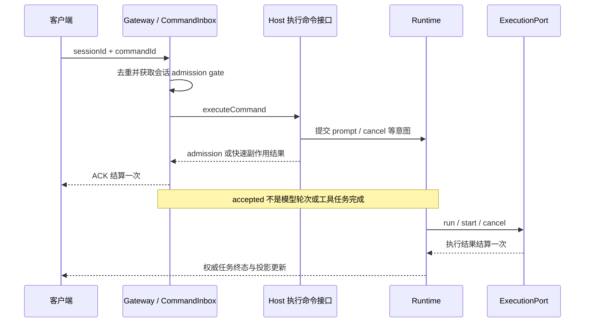
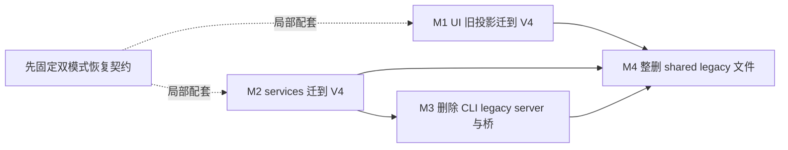
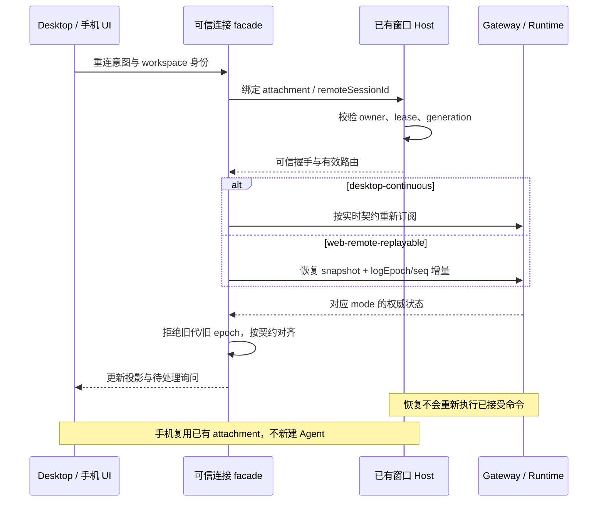
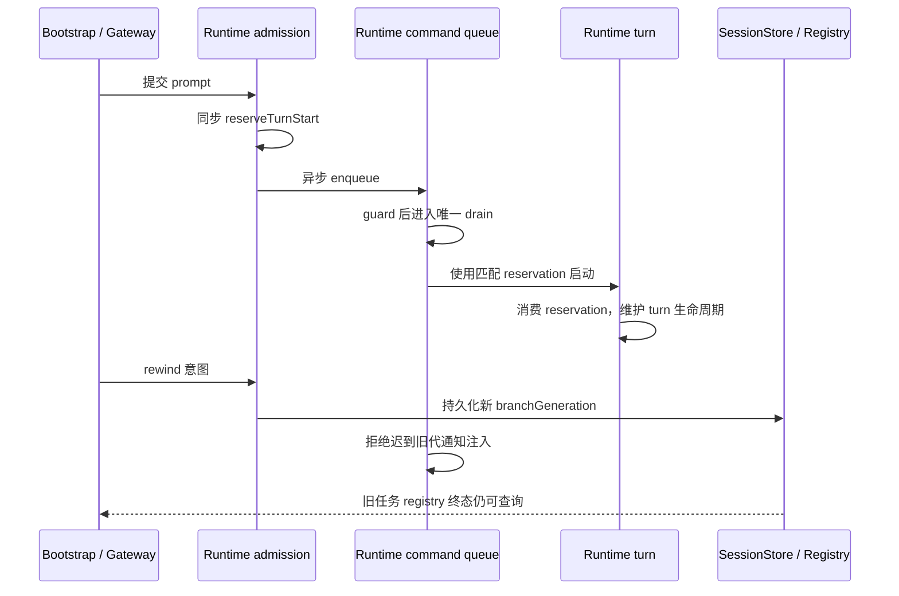

# Runtime、执行链路与协议升级实施意见（2026-10）

先实施 U02 的真实执行故障测试，再按既有 M1–M4 完成 U05；U10 以 Runtime 不变量测试为首批交付。

本文展开[总建议中的 U02、U05、U10](../project-upgrade-recommendations-2026-10.md)。这是实施意见，文中“拟新增”接口、测试和脚本尚未实现；已有接口的存在也不代表下列验收已经通过。

调查日期：2026-10-09；本轮检出 `fix/cli-subagent-inheritance`，commit `39880f8d2916`。实施时重新执行 `node scripts/check-workspace-freshness.mjs`，不要以本文替代新基线检查。

本轮只阅读源码、spec 与现有测试；没有运行真实子进程、模型、恢复链路或设备冒烟。统一类型、Lint 与架构检查结果由[总建议](../project-upgrade-recommendations-2026-10.md)记录。

## 1. 交付约定

1. 先更新对应 spec，写明所有者、接口、失败语义和下列编号场景，再提交会失败的行为测试。
2. 每批只收敛一个边界，使用真实被测对象与可控依赖；桩只能替代模型、存储、连接等外部端口。
3. 保存 commit、OS/arch、Node/pnpm 版本、场景编号和脱敏证据；跨平台结果分别登记。
4. 执行现有根命令 `pnpm typecheck`、`pnpm lint`、`pnpm test`、`pnpm architecture:check`；前两项失败不能记为通过。
5. 通过对应门禁后才删旧入口或收紧 baseline；新增脚本必须先进入 `package.json`，不能把建议命令写成现有能力。

测试中的超时只作为失败上界；异步顺序使用显式 barrier、ACK 或事件，不通过固定 sleep 构造正确性。人日包含 spec、测试、实现和证据整理，不包含等待平台 runner 或外部审核。

## 2. U02：真实执行与 V4 Gateway 故障注入

### 2.1 范围与事实依据

目标是验证取消、超时、输出限制、进程清理和命令结算的真实边界，补足已有 Inbox 不变量测试到真实执行入口之间的覆盖。

[ExecutionPort](../../apps/acode-cli/packages/contracts/src/interfaces/execution.port.ts) 已提供 `run`，以及可选 `start`、`getBackgroundTask`、`cancelBackgroundTask`、`close`；`ExecutionRunOptions` 已提供 `signal`、`onEvent`、`context`。

[运行路径](../../apps/acode-cli/packages/adapters/src/exec/node-execution-adapter-run.ts) 已处理异步准备、取消复查、spawn 和结果结算；[生命周期基类](../../apps/acode-cli/packages/adapters/src/exec/node-execution-adapter-base.ts) 已维护活动执行表和幂等关闭。

[进程停止实现](../../apps/acode-cli/packages/adapters/src/exec/node-execution-adapter-process.ts) 区分 Windows `taskkill /T /F` 与 POSIX 进程组；Bash 专用的后代枚举和两阶段清理，不能描述为所有通用执行都具有的能力。

[Gateway](../../apps/acode-cli/packages/bootstrap/src/acode-protocol-v4/v4-gateway.ts) 已通过 `host.executeCommand` 执行命令副作用；[CommandInbox](../../apps/acode-cli/packages/bootstrap/src/acode-protocol-v4/command-inbox.ts) 已维护 in-flight、live input 和每 session 512 条 settled LRU。

[Inbox 测试](../../apps/acode-cli/tests/command-inbox-invariants.test.mjs) 已覆盖锁序、并发去重、CAS 和 LRU。对当前测试目录的有界检索未见直接实例化 `NodeExecutionAdapter` 或 `ConversationV4Gateway` 的行为测试；这不是“整个链路没有测试”的结论。

本项不更换执行引擎，不把进程管理移入 Host/UI，不设计跨崩溃的无限恰好一次执行，也不扩大执行权限。

### 2.2 所有者与现有接口

| 边界                             | 唯一所有者                      | 对外事实与接口                                       | 实施限制                                             |
| -------------------------------- | ------------------------------- | ---------------------------------------------------- | ---------------------------------------------------- |
| 子进程、pipe、artifact、停止原因 | adapters 的执行适配器           | `ExecutionPort`、`ExecutionResult`、`ExecutionEvent` | Runtime 不能复制活动进程表；测试只跟踪自己创建的 PID |
| 命令 admission 与结算            | Gateway/CommandInbox            | 命令 ACK、查询回执、`host.executeCommand`            | Host 实现副作用，Gateway 不新增第二份业务状态        |
| turn、工具任务与已接受队列       | core/runtime                    | 权威任务事件、snapshot、现有 runtime 端口            | 已接受输入不转移给 Renderer 排队                     |
| 路由、显示与未提交草稿           | Host、services、UI 各自现有边界 | owner/lease、连接订阅、乐观 overlay                  | 不从 UI 状态推定任务终态                             |

若真实夹具需要注入异步准备 barrier，拟新增的是 adapters 内部测试装配点，不是 wire schema、UI 设置或新的公共执行协议。

### 2.3 实施步骤

1. 在 adapters/CLI 对应 spec 中区分 admission ACK、执行结果和 Runtime 任务终态；先登记 E01–E10 和停止原因优先级。
2. 新建受控 Node 子进程 fixture，使用 argv 和临时目录，提供 ready、输出、退出、后代 PID 与显式 barrier；先写真实 adapter 失败测试。
3. 实例化真实 Gateway，以假 Host 注入执行、查询、取消和观察者失败；保留 Inbox 的真实 gate、去重与 durable lookup。
4. 针对失败测试修正 adapters/Gateway 最小路径，补中文原因注释；固定 Bash 与通用 collector 各自的输出上限契约。
5. 在 Windows、macOS、Linux 运行同一场景集，记录受控进程退出与资源释放；接入现有测试入口并完成根门禁。

### 2.4 编号验收矩阵

| 编号 | 前置条件                                            | 操作                                             | 权威断言                                                                                             | 必留证据                                         |
| ---- | --------------------------------------------------- | ------------------------------------------------ | ---------------------------------------------------------------------------------------------------- | ------------------------------------------------ |
| E01  | 异步 prepare 停在 barrier，尚未 spawn               | 取消后释放 barrier                               | `run` 为 `cancelled`；没有 started/PID；执行结算一次                                                 | barrier 顺序、spawn 计数、结果和终态事件计数     |
| E02  | fixture ready 且持续运行                            | 取消同一 signal 两次                             | 用户取消与超时区分；受控进程退出；一份结果与一个终态事件                                             | PID、停止原因、事件序列、退出确认                |
| E03  | 可终止 fixture，短的测试专用 timeout                | 等待超时并注入迟到退出事件                       | `timed_out` 且 `timedOut=true`；迟到事件不能再次结算                                                 | 时间戳、stop reason、结果计数                    |
| E04  | 通用 stdout/stderr collector 设置小写盘预算         | 持续输出，分别开关 `killProcessOnPersistedLimit` | 每路硬上限符合契约；开启时 `error.type=output_limit`；关闭时不误停进程                               | 实际文件字节、truncated 标记、停止原因           |
| E05  | Bash 合并输出文件与小软阈值                         | 在受控环境跨过阈值                               | 按周期检测终止；不断言严格字节硬帽；前后台符合各自结果映射                                           | 文件大小、检测时间、Bash 结果与 failure type     |
| E06  | 正常退出、非零退出、无效 executable 三组 fixture    | 分别执行                                         | `completed`、`failed`、`spawn_error` 正确；spawn_error 用 failed 事件，其余用 completed 事件携带结果 | exitCode/error、事件和 Promise 结果              |
| E07  | root 退出，受控后代仍持有继承 pipe                  | 等待 drain 并执行停止/收尾                       | 被测路径不永久悬空；所有 fixture PID 在清理后退出；不扩大到任意逃逸进程                              | root/child PID、pipe teardown 和回收记录         |
| E08  | active 与 background 执行都已 ready                 | 并发调用两次 `close`，同时触发取消               | close 幂等；活动登记归零；执行结果不重复；后续工作按已有关闭契约处理                                 | 关闭 Promise、登记数、PID、文件句柄释放          |
| E09  | 同 session 命令处于 in-flight、live 或仍可回查状态  | 并发重发、settled churn、query                   | 同键副作用计数 1；回执一致；live 不被 LRU 淘汰；另一 session 可独立推进                              | command key、Host 调用计数、gate 顺序、查询结果  |
| E10  | admission/execute/observer/cancel 分别抛错的假 Host | 故障后查询并发下一条命令                         | 每条命令最终结算一次；observer 失败不阻塞结算；FIFO 释放；Runtime 终态另行对账                       | ACK 次数、error、下一条 admission、终态 snapshot |

E04/E05 不新增 `ExecutionStatus.output_limit`：当前状态只有 `completed | failed | timed_out | cancelled | spawn_error`，超限由 `ExecutionFailureType.output_limit` 说明。

E09 的键是所属 Gateway/runtime 内的 `(sessionId, commandId)`，空 session 使用现有全局桶；不能仅按 commandId 全局去重。settled 淘汰且无 durable 事实时，查询可以是 `unknown`。

CAS、stale 和 guard 拒绝通常不记 settled，允许同 commandId 修正重试；noop 才记住已成立的效果。测试必须分别证明这两类行为，不能把所有拒绝永久缓存。

Gateway 的 accepted ACK 证明 admission/快速副作用完成；异步 `sendPrompt` 后的模型轮次另有终态。验收必须分别计数“命令结算一次”“执行结果结算一次”“任务终态与 snapshot 一致”。

### 2.5 完成门禁与估算

| 门禁     | 定量标准                                                                                 |
| -------- | ---------------------------------------------------------------------------------------- |
| 场景覆盖 | E01–E10 全部登记；其中通用/Bash、foreground/background 和开关差异各有独立用例            |
| 稳定性   | 每个平台连续 20 次运行 0 次悬空、重复结算或 fixture PID 残留；平台缺失不能写“跨平台通过” |
| 失败上界 | 单个受控停止测试 watchdog 20 秒；只判定失败，不用它决定释放锁或完成业务                  |
| 回归     | 现有 Inbox、终态审计和 CLI 测试通过；根类型/Lint/测试/架构结果完整记录                   |

| 任务                        | 人日    | 依赖                                 |
| --------------------------- | ------- | ------------------------------------ |
| spec 与 fixture/barrier     | 1–1.5   | 固定 Node 工具链、临时目录隔离       |
| 真实 adapter 用例与最小修复 | 1.5–2.5 | ExecutionPort、可控平台进程环境      |
| Gateway 故障与去重回查用例  | 1–1.5   | 假 Host、真实 Inbox、durable fixture |
| 三平台运行和证据整理        | 0.5–1.5 | 三平台 runner；合计 4–7 人日         |

阻断条件：任一停止路径悬空、多个终态、残留 fixture 进程、取消原因误归类或 gate 不释放。观察者故障不能通过跳过结算掩盖。

回退边界：先可独立合入测试；行为修复可整体 revert 到原实现，但不能把失败测试标成通过。fixture 的 finally 只清理自身 PID/目录；不会保证清理应用之外自行脱离生命周期的进程。

## 3. U05：沿 M1–M4 退役 legacy，并固定恢复契约

### 3.1 范围与基线

唯一迁移顺序来自[既有 legacy 计划](../legacy-protocol-convergence-plan.md)，技术债跟踪继续使用[登记册](../tech-debt-backlog.md)。本文增加实施与验收细节，不另建删除时间表。

本轮文本检索得到 services legacy method/client 消费文件 6 个、UI `acodeSessionProjection` 消费文件 10 个、bootstrap legacy 目录 48 个文件。这是 2026-10-09 基线；旧计划的 7/8 属历史记录，实施前重查消费者及其用途。

[acodeAgentService](../../packages/services/src/acode-agent/acodeAgentService.ts) 仍混合 legacy sessionCreate 与 V4 command；[桥文件](../../apps/acode-cli/packages/bootstrap/src/acode-protocol/v4-bridge.ts) 位于旧目录，仍注入 legacy 钩子。

[连接 scope](../../packages/services/src/acode-agent/acodeAgentConnectionScope.ts)、[task adapter](../../packages/services/src/acode-agent/acodeTaskServiceAdapter.ts) 与[窗口 Host](../../packages/desktop/src/host/index.ts) 已表达可信连接、双 delivery mode、attachment 和 generation 边界。

[恢复测试](../../packages/services/test/importedClaudeRecovery.test.ts) 已参数化两种 mode；[非 CLI ACP 测试](../../packages/services/test/nonCliAcpRetirement.test.ts) 已固定有意差异，例如 desktop 不提供 `pendingElicitations`，手机恢复可提供空数组。

本项不改 ACP 对外协议，不把两种恢复语义合并，不为手机新建 Agent/Host，不把队列或 snapshot 移入 Main/relay，也不增加 legacy schema。

### 3.2 所有者与拟新增内部策略

| 事实                                   | 唯一所有者                       | 接口边界                                                                               |
| -------------------------------------- | -------------------------------- | -------------------------------------------------------------------------------------- |
| 命令/事件 wire schema 与运行时校验     | shared v4                        | 新增命令事件只进 `acode-protocol-v4/`，不回写 legacy                                   |
| 已接受输入、会话与队列事实             | CLI Gateway/CommandInbox/runtime | V4 command/query/snapshot，保留 durable 查询与 generation fencing                      |
| 可信 mode、握手与连接订阅              | services connection facade       | `createACodeAgentConnectionScope`、`createHello`、`deliveryProfileFor` 等现有入口      |
| attachment、owner/lease 和跨 Host 路由 | 窗口 Host 与连接注册表           | `workspaceIdentity`、`workspacePath`、`remoteSessionId`、runtime/attachment generation |
| 只读投影与未提交草稿                   | UI store/hooks                   | 通过服务接口订阅；无独立已接受队列和执行终态                                           |

拟新增 delivery/recovery policy 是 services 从可信握手产生的有限内部类型，集中说明 mode 能力与有意差异；当前没有要求此名称的公共接口，不新增可由 UI 任意选择的模式开关。

policy 先随局部消费者迁移收口；不能要求 M1/M2 等待一次总重写。trusted facade 继续清除调用方伪造的 mode/profile/connection 字段。

### 3.3 实施步骤

1. 更新现有协议/恢复 spec，先补 P01–P13；生成 UI、services、bridge 钩子和 shared 承重类型清单，标明调用与状态所有者。
2. M1 将 UI 旧投影读迁到现有 V4 snapshot/query；M2 将 services 调用迁到 `V4_METHODS`，退役 `acodeProtocolClient.ts` 并更新 node 装配；二者可并行。
3. M3 在 M2 完成后，将仍复用的纯函数/必要钩子迁入 V4，再删除旧 bootstrap 目录与桥；执行 ACP、Desktop 对话和会话恢复冒烟。
4. M4 在 M1+M2+M3 完成后，整删 `packages/shared/src/acode-protocol/index.ts`，分类迁移或独立命名承重 legacy types，同步清理文档与技能引用。
5. 每个里程碑先通过消费者归零、双模式验收和根门禁，再收紧实际下降的 baseline；保存可发布的兼容 peer 集合。

M4 不逐个删除表面零消费的 schema 导出；它们可能是存活 schema 联合的内部依赖，仍以宿主文件整体退役为边界。

### 3.4 双模式事件顺序

### 3.5 编号验收矩阵

P01–P13 均运行 `desktop-continuous` 与 `web-remote-replayable` 两种配置；某模式不支持的行为用 spec 规定的拒绝/省略作为断言，不人为统一结果。

| 编号 | 前置条件                                    | 操作                                  | 权威断言                                                                            | 必留证据                                      |
| ---- | ------------------------------------------- | ------------------------------------- | ----------------------------------------------------------------------------------- | --------------------------------------------- | ---------------------------------- | ------------------------------------- |
| P01  | 会话正在流式响应且已有已接受输入            | 断线再重连                            | 实时模式按实时契约重订阅；回放模式按 snapshot/logEpoch/seq 恢复；不重执行已接受输入 | 两条连接 trace、runtime 执行计数、投影对账    |
| P02  | 已有 snapshot 和若干 delta                  | 交换到达顺序并重复帧                  | 按现有 mode 契约处理；重复 seq 不重复效果，缺口不会静默伪装成完整状态               | 注入帧序列、游标、最终 snapshot               |
| P03  | 待处理 permission 与 input 各一条           | 断线后恢复并重复提交答复              | exact ID 绑定原询问；处理一次；已结算询问不复活；有意的 pending 字段差异保留        | inquiry ID、answer 次数、两模式字段           |
| P04  | runtime 有旧 generation 和日志 epoch        | 重启 runtime 后送入旧帧               | 新投影只接受对应 generation/epoch；旧帧不改游标/任务事实                            | 新旧 generation/logEpoch、拒绝原因、投影 diff |
| P05  | workspacePath 相同、workspaceIdentity 不同  | 同 commandId 向两身份提交与查询       | admission、缓存、队列和订阅隔离；身份不按路径折叠                                   | identity、缓存 key、Host 路由与结果           |
| P06  | 本地 workspace 没有显式 identity            | 提交、绑定与恢复                      | key 保持 `workspaceIdentity?.trim()                                                 |                                               | workspacePath`；文件/cwd 使用 path | binding key、执行 cwd、无远程格式手写 |
| P07  | remoteSessionId A/B 与相同路径              | 用 B attachment 查询/答复 A 的对象    | mismatch 或 stale attachment 按契约拒绝；identity 与 session 贯穿链路               | route envelope、拒绝回执、对象零变更          |
| P08  | UI 调用参数包含伪造 mode/profile/connection | 创建可信 scope 后发送                 | facade 清除或覆盖伪造值；wire 上只有可信握手确定的 mode                             | 清洗前后 fixture、hello 与 transport metadata |
| P09  | 非 owner Host 或 lease 已过期               | 尝试执行，另用合法跨 Host 路由对照    | 前者拒绝；合法 owner 路由成功；不通过删 guard 让两者同时通过                        | owner/lease、route receipt、执行计数          |
| P10  | 旧 attachment、stale row/action target      | 切换会话/代际后提交迟到动作与分支通知 | 旧动作不能修改新事实；旧分支注入拒绝但 registry 终态仍可查询                        | target ID、generation、registry/query 对账    |
| P11  | 两个连接共享 Host attachment                | dispose 一个连接                      | 只释放自己的 subscriptions；另一连接仍能接收；重复 dispose 幂等                     | 各订阅计数、残存连接事件、attachment 数       |
| P12  | 手机已配对到 Desktop attachment             | 重连手机并发送/取消                   | 复用现有运行时；无额外 Agent/Local Host；Main/relay 无业务队列或 snapshot           | Agent/Host 实例计数、命令与终态证据           |
| P13  | 完成某里程碑的 consumer 清单                | 运行对应 grep、类型和真实入口冒烟     | 对应消费者归零；会话创建/恢复、ACP 与两条交付链路仍可用                             | grep 输出、测试报告、ACP/Desktop 录像或 trace |

### 3.6 删除门禁、依赖与估算

| 里程碑 | 数量门禁                                                                | 额外验收                                             |
| ------ | ----------------------------------------------------------------------- | ---------------------------------------------------- | ---------------------------------------------------- |
| M1     | `rg acodeSessionProjection packages/ui/src` 无命中；退出码 1 表示无匹配 | UI 包测试；只迁读路径，不混入组件拆分                |
| M2     | `rg 'acodeProtocolMethods                                               | acodeProtocolClient' packages/services/src` 无命中   | services/Desktop 测试，双模式真实冒烟，node 装配收口 |
| M3     | legacy server 目录和其中 `v4-bridge.ts` 均不存在；V4 不反向依赖 legacy  | CLI 测试、ACP 冒烟、Desktop 一轮对话和恢复           |
| M4     | shared legacy 宿主文件删除；分类清单无未处理项；指令/技能残留清零       | 全仓测试/类型/架构；knip 相关 backlog 按实际结果下降 |

每个里程碑另执行根 `pnpm lint`，双模式 P01–P13 不能缺项；无法运行的真实入口标为阻断该里程碑完成。grep 是必要条件，不能替代行为验收。

| 任务                                | 人日 | 依赖                                    |
| ----------------------------------- | ---- | --------------------------------------- |
| spec、消费者清单和双模式 fixture    | 3–4  | 现有恢复测试；交互证据设施可复用 U03    |
| M1 与 M2、局部可信 policy           | 5–9  | 可并行；U02 为命令/执行故障提供回归基础 |
| M3、复用代码迁移及 ACP/Desktop 回归 | 4–6  | M2；可运行 Desktop/ACP 环境             |
| M4、承重类型与引用清理              | 3–6  | M1+M2+M3；合计 15–25 人日               |

阻断条件：identity/remoteSessionId 断链、跨 Host 路由失效、owner/lease 绕过、旧代污染、恢复重执行，或任一消费者仍需要即将删除的入口。

回退边界：M1/M2 在持久化 schema 不变时可整批代码回退；M3/M4 需作为兼容的客户端/服务端集合发布，不能混用已删 server 与旧 consumer。公开发布前停止该里程碑并回到上一兼容集合。

本计划不引入自动 legacy fallback、双写或恢复已删除模块。若发现必须迁移持久化数据，另写迁移 spec、备份验证和可逆范围；该部分不在当前 15–25 人日承诺中。

## 4. U10：Runtime 写入边界与不变量

### 4.1 范围和现有保护

[状态所有权 spec](../../apps/acode-cli/specs/runtime-state-ownership.md) 已将 Runtime 类型分成七簇；[internal.ts](../../apps/acode-cli/packages/core/src/runtime/internal.ts) 仍组合为扁平字段，[methods 安装入口](../../apps/acode-cli/packages/core/src/runtime/methods/index.ts) 仍使用 prototype 注入。

[prompt admission](../../apps/acode-cli/packages/core/src/runtime/methods/prompt-admission.ts)、[reservation](../../apps/acode-cli/packages/core/src/runtime/methods/steering.ts)、[drain](../../apps/acode-cli/packages/core/src/runtime/methods/runtime-command-queue.ts) 和[generation fencing](../../apps/acode-cli/packages/core/src/runtime/methods/runtime-command-generation.ts) 已有保护。本项强化测试和写入口，不据此断言当前存在双 turn bug。

[旧分支终态测试](../../apps/acode-cli/tests/stale-branch-terminal-observability.test.mjs) 已固定“丢通知注入、不丢 registry 终态”；[重启提醒测试](../../apps/acode-cli/tests/runtime-restart-task-reminder.test.mjs) 已覆盖辅助逻辑与部分源码接线。本项增加真实 Runtime 行为证据。

Runtime 首批不重写整体对象、不改变公开协议、不搬迁业务状态；UI 大组件拆分依赖 U03，沿[既有 UI 计划](../../packages/ui/specs/god-component-split-plan.md)单独估算和交付。

### 4.2 不变量、所有者与拟新增接口

| 不变量         | 唯一写入方                       | 必须保留的精确定义                                                                                                                         |
| -------------- | -------------------------------- | ------------------------------------------------------------------------------------------------------------------------------------------ |
| I1 reservation | core/runtime admission/turn 编排 | 同步建立 reservation 后才进入异步窗口；最多一个 active reservation/turn admission；正常排队输入仍允许                                      |
| I2 drain       | core/runtime command queue 编排  | `runtimeCommandDrainActive` 为 true 时不再进入 drain 工作；finally 释放；正常入队触发 guard 返回不是违规                                   |
| I3 generation  | core/runtime branch lifecycle    | 活动分支生命周期单调，rewind 增代；新 Runtime resume 从持久化 `session.revert?.branchGeneration ?? 0` 初始化，不能要求跨冷实例全局计数单调 |
| I4 once flags  | 每个 flag 的 Runtime 消费点      | 按各自资格语义消费；同 Runtime 不 true→false；新 Runtime 自然初始化，不复用旧进程旗标                                                      |

拟新增内部 turn/lifecycle 写入接口只服务 core/runtime，限制 reservation、drain、generation 与 once flag 的写路径；实际名称在 spec 中确定，不扩展 shared 公共 API。

bootstrap 继续提交命令并读取回执，不能获得 Runtime 字段 setter。一次收敛一簇，字段、事件和依赖所有者保持现有方向。

### 4.3 实施步骤

1. 更新 ownership spec，逐字段登记写入点、I1–I4 和 R01–R10；补充 resume、once flag 与 registry 终态例外。
2. 先以真实 Runtime、桩模型/SessionStore/ExecutionPort 写 barrier 测试；同时保留已有 Inbox、stale branch 与重启提醒测试。
3. 在测试能捕获破坏后增加 dev-only 断言，区分正常 guard 返回与实际重入；生产路径不因诊断抛出新异常。
4. 先收窄 turn 簇，再收窄 lifecycle/generation 写入点；用内部接口替代散落赋值，每批只迁一簇。
5. 完成根门禁、确定性重复运行与依赖检查，按实际消除的违规收紧 baseline；UI 拆分留待 U03 稳定后另批实施。

### 4.4 编号验收矩阵

| 编号 | 前置条件                                        | 操作                              | 权威断言                                                                                       | 必留证据                                          |
| ---- | ----------------------------------------------- | --------------------------------- | ---------------------------------------------------------------------------------------------- | ------------------------------------------------- |
| R01  | prompt A 停在 enqueue 的异步 barrier            | 并发提交 B 后释放 A               | A 在 barrier 前已 reservation；active 最大为 1；B 按当前准入规则排队或拒绝，非第二 active turn | reservation/turn ID、admission 顺序、模型启动计数 |
| R02  | turn ready，多个正常输入入队                    | 多次请求 drain，执行完成后继续    | 同时运行的 drain 最大为 1；顺序符合 FIFO；finally 后可继续，无丢输入                           | queue ID、drain 深度、入队/出队/完成 trace        |
| R03  | dev fixture 故意绕过 guard 进入嵌套 drain 工作  | 触发违规路径并对照正常 enqueue    | dev 断言捕获实际重入；正常 guard 返回不误报；production fixture 无诊断性崩溃                   | 两种调度 trace、dev/production 构建开关           |
| R04  | 旧代任务延迟通知，rewind 已增代                 | 释放旧通知与 task terminal        | 旧注入不写 transcript/provider；registry 完成态和 waitForTerminal 仍可读                       | generation、持久化计数、registry/waiter 结果      |
| R05  | SessionStore 持久化 generation=7；另组无 revert | 新建 Runtime 并 resume，再 rewind | 分别初始化 7/0；rewind 增加；本生命周期不回退；不比较无关冷实例的全局大小                      | persisted revert、初始化值、每次写入值            |
| R06  | 无孤儿任务，提醒 flag 初始 false                | 进入评估点两次                    | 第一次评估后 flag=true，空结果无提醒；第二次不重新评估                                         | 检测计数、flag、provider payload                  |
| R07  | 有孤儿任务，模型/输出观察者随后失败             | 重试进入同 Runtime turn           | 提醒按 spec 消费一次且不落 session；失败不复位；新 Runtime 可重新评估                          | 消费计数、payload、session 写入、两 Runtime ID    |
| R08  | 标题输入不合格或 runtime headers 需 defer       | 调用标题入口，随后满足资格再调用  | 不合格/defer 不消费 flag；符合资格后先置 true 再 async；失败不复位                             | flag、eligibility、barrier 与 sidecar 次数        |
| R09  | admission、工具和子 turn 有既有 trace context   | 执行队列、标题 sidecar 或子任务   | 保留同因果 traceId 和独立 span/turn ID；跨异步 causation 不丢；不把日志正文当 trace            | 脱敏 trace、parent/link、command/turn/task ID     |
| R10  | 已迁移一簇写接口                                | 执行全部场景并静态查询写入点      | 簇外无未登记写入；bootstrap 无 setter；公共 API 和协议不因内部重组膨胀                         | 写入清单、dep/架构结果、公开导出 diff             |

### 4.5 完成门禁、工时与回退

| 门禁   | 定量标准                                                                                   |
| ------ | ------------------------------------------------------------------------------------------ |
| 不变量 | I1–I4 各有真实 Runtime 行为测试；R01–R10 无缺项；dev-only 断言均有破坏对照                 |
| 确定性 | barrier 调度场景连续 100 次运行，0 双 active、0 drain 重入、0 stale 注入、0 once flag 回退 |
| 写入口 | 首批 turn/lifecycle 目标字段 100% 登记；簇外未登记写入 0；无新增跨层依赖或 baseline 放宽   |
| 回归   | 相关 CLI/Runtime 测试及根类型/Lint/测试/架构通过；生产行为与 trace 契约保持                |

| 任务                      | 人日    | 依赖                                          |
| ------------------------- | ------- | --------------------------------------------- |
| spec 和写入审计           | 1–1.5   | 当前 ownership spec、各 flag 独立 spec        |
| 真实 Runtime barrier 测试 | 1.5–2.5 | 桩模型/存储/执行端口；可复用 U02 fixture 思路 |
| dev 断言与分簇写入口收窄  | 1.5–2.5 | 先有失败测试；每批一簇                        |
| 回归、trace 和架构证据    | 1–1.5   | 合计 5–8 人日；UI 工时不包含在内              |

阻断条件：断言只检查源码字符串、正常排队被误判为双 turn、guard 返回触发误报、resume 代际被重置，或旧任务终态因 fencing 消失。遇到所有权设计缺陷先对齐 spec，不能持续增加兜底路径。

回退边界：按簇整批回退内部接口迁移，保留不变量测试；dev 断言可独立关闭，但不能因此忽略失败。只要 persisted schema 和公开端口未变，回退不需迁移数据；发现 schema 变更则停止本批并单独设计迁移。

下一步：为 U02 建立 spec 与 E01/E02 的真实 adapter fixture，先验证取消路径和一次结算，再扩大故障矩阵。
