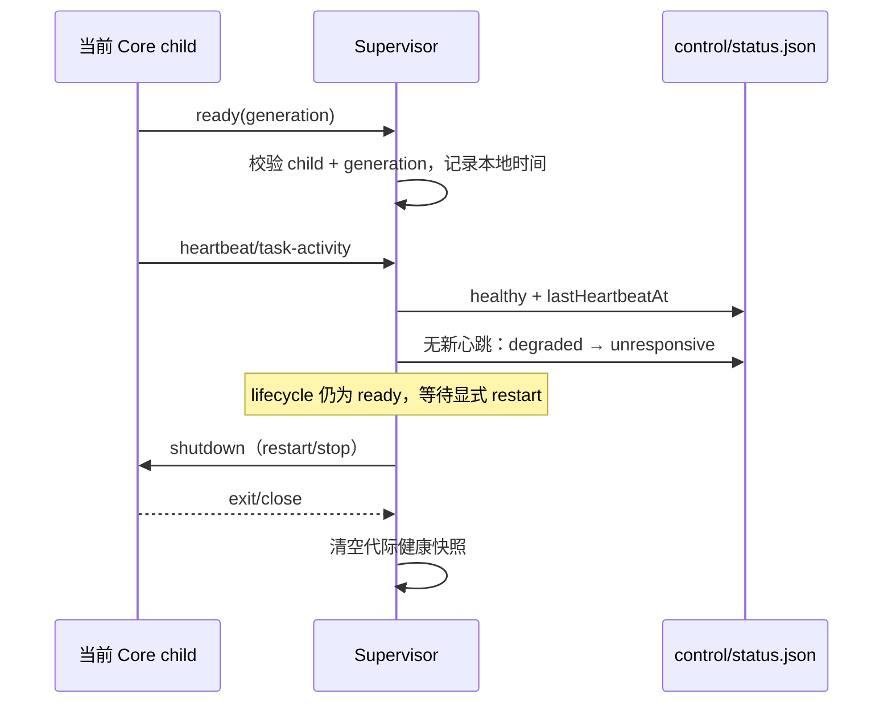

# Supervisor Core 健康与失联契约

## 状态所有者

- `Supervisor` 是 Core lifecycle、generation 和 `coreHealth` 的唯一写入方。
- Core 每 10 秒发送 heartbeat；`task-activity` 也可证明 IPC 仍在工作。
- Supervisor 使用本地接收时间记录 `lastHeartbeatAt`，不信任 Core payload 的时钟。

## 规则

1. Core 发送 `ready` 后健康为 `healthy`，并记录本地接收时间。
2. 最后一次 heartbeat 超过 `timeout / 2` 时健康为 `degraded`，超过 `timeout` 时为 `unresponsive`。
3. `status` 即使健康检查定时器尚未 tick，也必须按当前时间重新计算健康状态。
4. 只接纳当前 child 的消息；ready 必须匹配当前 generation。heartbeat/task-activity 只在 ready 阶段更新健康与任务计数，启动前或停止中的消息不能刷新状态。停止或 Core 终态会清除计时器和心跳快照。
5. 失联只暴露健康状态，不自动终止可能仍在运行的任务；显式 restart 或 Core exit/crash budget 负责恢复，避免以单次 IPC 延迟破坏任务。
6. 缺失新字段的旧 status snapshot 解析为 `coreHealth: unknown` 和 `lastHeartbeatAt: null`，保持升级兼容。
7. status 查询只是新鲜度投影，不消费健康变化的持久化通知；定时监控仍需写入状态变更。status.json 复用公共原子写入，在 Windows 临时共享冲突时有界重试；最终写入失败仍报告 warn，下一次生命周期写入不被阻塞。
8. crash 自动重启使用与普通 CLI/更新相同的 15 秒 ready 上界（测试可注入
   coreReadyTimeoutMs）。从未 ready 的替代 Core 先 shutdown 并等待 OS 终态，再计入
   既有 crash budget；无法证明已退出则保留 child 与锁并进入 stop-failed，不能另起 Core。
   超时收口经同一 lifecycle gate，停止、更新、迟到 ready 与旧 generation 不能越过该 gate。
   该 deadline 只管理自动重启的 starting 阶段，不杀死已经 ready 的失联任务。

## 验收场景

- 未 ready 的 Core 为 `unknown`。
- ready 后在半个 timeout 内为 `healthy`，跨过半窗口变为 `degraded`，跨过完整窗口变为 `unresponsive`。
- heartbeat 恢复后立即回到 `healthy`。
- 重置后不再保留旧 heartbeat；旧 snapshot 可由 schema 默认值读取。
- 真实 Core 子进程 + control socket：健康退化可由 status 查询和 status.json 观察；本地接收时间不受 child 的 at 字段影响。
- 显式 restart 后旧 child 消息无效；stop 后 PID、heartbeat 和任务计数清空。
- 普通 CLI 启动沿用 cli.ts 的 15 秒 ready deadline，失败后 stop 收口；健康失联不会自动重复启动任务。
- 真实 child：第一次 ready 后 crash，替代 Core 不发送 ready；deadline 后旧 PID 必须先退出，
  再开始下一次预算内恢复。显式 stop 取消尚未到期的 deadline，旧 ready 不复活 stopped。

