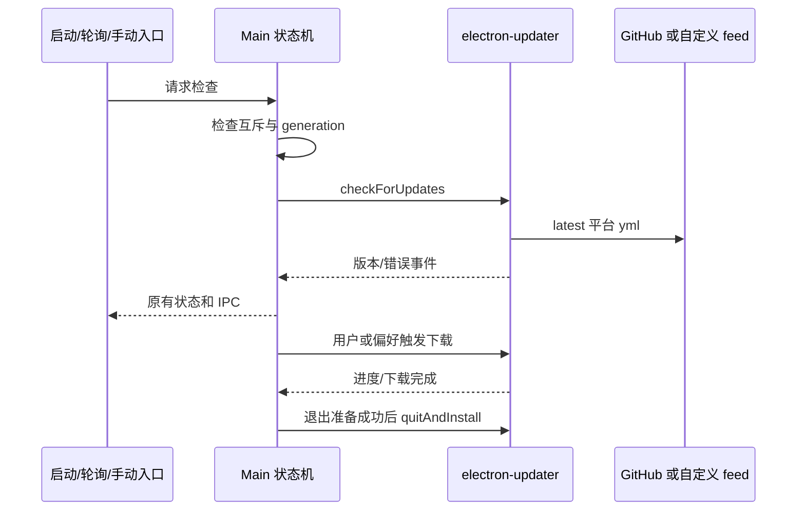

# ACode 桌面更新

## 规则与边界

- Main `autoUpdater.ts` 是更新状态、检查互斥、下载取消和安装调度的唯一所有者；UI 和 IPC 载荷不变。
- 生产更新走 electron-updater 内置 GitHub provider，`owner`/`repo` 为 `Curl-007/ACode`（本仓库），走 Releases API；本地开发与自定义源可用 generic provider 覆盖根地址。
- 读取 latest.yml、latest-mac.yml、latest-linux.yml（非 x64 Linux 使用 updater 原生架构后缀）；元数据中的文件路径、校验和与下载安装由 updater 处理。macOS 自动更新需要发布 ZIP 等原生 updater 所需资源，不能只有 DMG。
- 启动参数 `--acode-update-feed-url` 优先于 `ACODE_UPDATE_FEED_URL`，覆盖为 generic feed 根目录。**仅开发构建生效**：打包发行版（`app.isPackaged`）忽略这两个覆盖入口，恒走内置 GitHub provider（安全加固 P1-7；`resolveUpdateFeedSourceFromStartupConfig` 收到 `isPackaged:true` 时直接返回 undefined）。覆盖不再接受旧官方 manifest API 语义。
- 默认只发布 latest 稳定通道，preview 偏好不会切换到官方接口或请求 preview.yml；版本跳过归属 stable。保留现有 preview 产品禁用更新的边界。
- 删除自定义 ManifestUpdateProvider 与更新链路对官方 endpoint/device ID 的依赖。保留启动检查、每小时轮询、手动入口、原生下载与安装流程。
- `maybeBlockStartupForForceUpdate` 保留签名及调用点，直接返回 `{ blocked: false }`；不读取配置、不调用注入的 fetch、不展示弹窗、不触发回调。
- `requestForceAutoUpdate` 保留签名及 disposer，成为无副作用 no-op。
- 元数据缺失、网络失败及校验错误沿用现有错误状态，不回退官方服务。登录、分享、反馈等连接不在本轮范围。

## 事件顺序

不新增持久化所有者，不改 Host/mobile stream 协议。检查 generation、取消 token 和安装互斥沿用现有状态机。

## 验收

- 执行真实更新模块的边界替身测试：默认 generic URL、开发构建覆盖优先级（`isPackaged` 非 true 时 env/argv 覆盖生效）、**打包构建忽略覆盖**（`isPackaged:true` 时 `resolveUpdateFeedSourceFromStartupConfig` 返回 undefined）、启动/手动检查、更新事件及下载/安装 IPC 保持可用。
- 执行内置 GenericProvider，验证各平台 yml 请求和相对安装包 URL 解析。
- 守卫在注入会抛错的网络/阻塞回调时仍返回不阻塞；强制更新入口无网络、无状态回调。
- `pnpm typecheck`、`pnpm lint`、架构检查通过；真实签名安装包升级需发布后另行验证。
