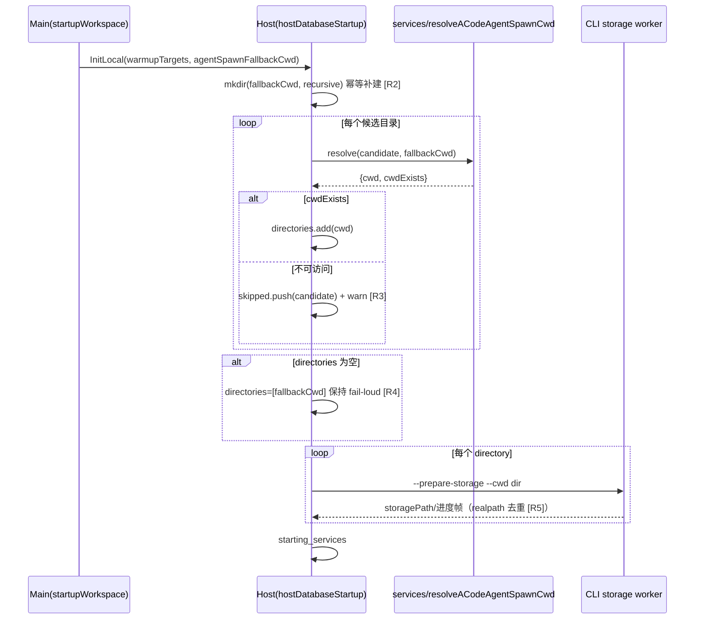

# Host 存储启动的 cwd 选择与失效目录降级

## 背景与问题

Host 存储启动（`hostDatabaseStartup.ts`）按 warmup 候选目录逐个 spawn
session-storage worker（`prepareSessionStorage`），worker 侧 CLI bundle 对 `--cwd`
做严格可访问校验，不可访问即非零退出且不发任何控制帧，宿主侧表现为
`transport_closed`，整个数据库启动阶段失败，窗口硬阻断。

两个实证（2026-10-05，dev/0.0.3 debug 构建）：

1. 隔离冒烟：设置文件泄漏真实 `setting.json`（另案已修，b7434f8），最后激活
   workspace `Desktop\apk` 已被删除，worker 收到死 `--cwd` → `transport_closed` →
   `failedPhase: preparing_session_storage` 硬阻断。
2. 真实域启动：同一台机器 settings 仍指向已删除的 `apk`，但 fallback conversation
   目录（`~/.acode/workspace/default`）存在，`resolveACodeAgentSpawnCwd` 正确回退
   （日志 `cwdSource:"workspace-fallback"`），启动成功。

结论：硬阻断的成立条件是「warmup 候选含已删除目录」且「fallback 不可用」。
fallback 不可用的现实路径：main 只在部分启动分支创建 conversation backing
workspace（无会话分支、active 不可用分支），deep-link 显式 bootstrap 与
「导入设置且 active 会话可用」的分支都不创建；host 侧原实现拿到不可访问的
resolved cwd 后仍直接塞给 worker，与 `hostDatabaseStartup` 内既有注释宣示的
意图（“历史项目 ENOTDIR/无权限不是数据库失败”）相矛盾。

## 产品规则

- **R1** 已删除/不可访问的历史 workspace 不得阻断 host 存储启动，也不得拖累其他
  存活候选目录的准备。
- **R2** `agentSpawnFallbackCwd`（conversation backing workspace）是 host 存储启动
  的常驻兜底（main 侧契约注释已宣示“fallback 必须跟随 local Host 生命周期常驻”）。
  host 存储启动是兜底的最终消费方，使用前必须幂等补建该目录，不依赖 main 的
  某个启动分支恰好建过；补建失败只留痕，继续走 R3/R4 降级。
- **R3** 候选经 `resolveACodeAgentSpawnCwd` 解析后 cwd 仍不可访问（`cwdExists:false`，
  即 fallback 也不可用的极端场景）→ 跳过该候选并 warn 留痕。
- **R4** 全部候选被跳过时不得静默不准备——仍以 fallback cwd 进入一次
  `prepareSessionStorage`，保持 fail-loud：宁可显式 `transport_closed` 暴露存储
  不可用，也不能让会话库未经迁移准备就进入服务。
- **R5** 会话库本体按 homedir 绝对路径解析，候选 cwd 只影响 worker 的启动目录与
  相对 `sessionDbPath` 配置的解析基准；跳过死候选不改变目标数据库。“同一个库”
  的判定仍以 worker 上报 `startup/storagePath` + realpath + `preparedPaths` 去重
  协议为唯一事实源，本规则不引入第二套判定。

## 状态所有者

| 关切 | 唯一所有者 |
| --- | --- |
| UI bootstrap 语义、conversation 目录的首启创建 | `main/startupWorkspace.ts`（不变） |
| fallback 常驻保障（补建）+ 候选降级裁决 | `host/hostDatabaseStartup.ts` |
| cwd 选择规则本体（回退语义、`cwdExists` 契约） | `services/acodeAgentSpawnCwd.ts`（不改） |
| `--cwd` 可访问性硬校验 | CLI worker（不改，保持 fail-loud） |
| 降级选择纯函数 | `host/sessionStorageStartupDirectories.ts`（新增叶子模块，零跨包依赖，resolver 注入） |

## 接口

```ts
// host/sessionStorageStartupDirectories.ts
resolveSessionStorageStartupDirectories(options: {
  candidates: readonly string[];
  fallbackCwd: string;
  resolveCwd: (candidate: string) => Promise<{
    cwd: string; usedFallback: boolean; cwdExists: boolean;
  }>;
}): Promise<{ directories: string[]; skipped: string[] }>;

// createHostDatabaseStartup options 新增（可选，不破坏既有调用方）：
warn?: (message: string, details?: unknown) => void;
```

## 事件顺序



## 验收场景

1. 候选 = [已删除, 存活]，fallback 缺失 → `directories=[存活]`、`skipped=[已删除]`，
   存活库照常准备，不硬阻断。
2. 候选 = [已删除]，fallback 可用 → resolver 回退，`directories=[fallback]`、
   `skipped=[]`（与 2026-10-05 真实域实测行为一致）。
3. 候选全部失效且 fallback 失效 → `directories=[fallbackCwd]`（进入
   prepareSessionStorage 显式失败），不得返回空列表静默跳过准备。
4. 两个候选解析到同一 cwd → 去重后只准备一次。
5. host 存储启动前对 fallback cwd 执行幂等 `mkdir(recursive)`；mkdir 失败仅 warn，
   不改变后续裁决。

## 已知边界与回滚

- 不触碰 schema、协议帧与 `DatabaseStartupState` 错误码枚举；纯 host 侧行为加固，
  `warn` 为可选参数，旧调用方零改动兼容。
- resolver「无可用备用目录时保留原路径供正常启动报错」的契约不改——本 spec 只在
  存储启动消费侧裁决跳过与否，Agent spawn 消费侧维持 fail-loud 原语义。
- 回滚 = revert 对应提交，无数据迁移。
